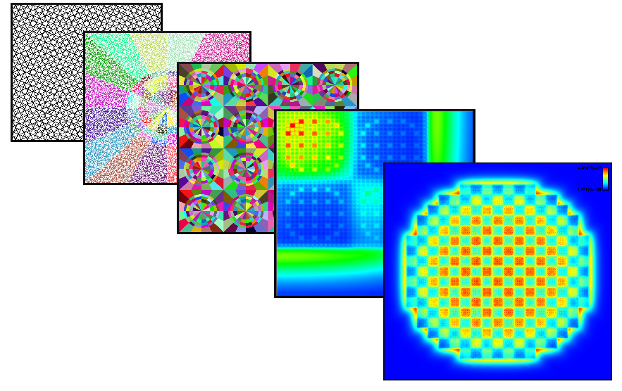

==========================================
The OpenMOC Method of Characteristics Code
==========================================

OpenMOC is a Method of Characteristics (MOC) neutral particle transport code for reactor physics criticality calculations. The OpenMOC project aims to be the first publicly available MOC code platform for full-core 3D reactor physics analysis. At the present time, it is capable of simulating 2D assembly and full-core reactor models based on constructive solid geometry with second-order surfaces. High-performance parallel solvers for multi-core CPUs and GPUs are actively pursued as part of the OpenMOC project. In addition, continued development of algorithmic acceleration techniques such as coarse mesh finite difference (CMFD) acceleration, are a focus of the OpenMOC project.

OpenMOC was originally developed by members of the `Computational Reactor Physics
Group`_ at the `Massachusetts Institute of Technology`_ starting
in 2012. For more information on OpenMOC, feel free to send a message to the User's Group `mailing list`_.

.. _Computational Reactor Physics Group: http://crpg.mit.edu
.. _Massachusetts Institute of Technology: http://web.mit.edu
.. _mailing list: https://groups.google.com/forum/?hl=en#!forum/openmoc-users

--------
Contents
--------

.. toctree::
    :maxdepth: 1

    quickinstall
    releasenotes/index
    methods/index
    usersguide/index
    devguide/index
    doxygen/api
    publications
    developers
    license

