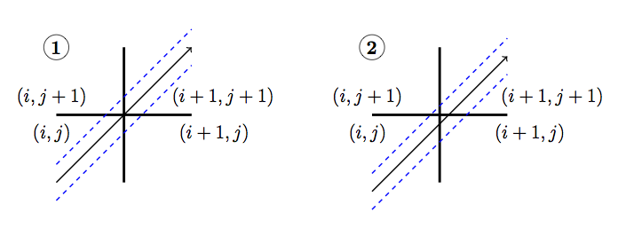
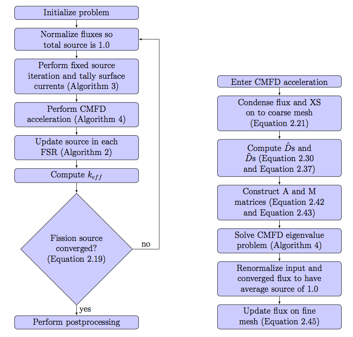

.. _cmfd:

==========================================
Coarse Mesh Finite Difference Acceleration
==========================================

While MOC offers many benefits including treatment of complex geometries and amenability to parallelization, it suffers from slow convergence which necessitates the use of acceleration methods. Numerous acceleration schemes have been proposed for MOC such as CMFD [Smith-1983]_, coarse mesh rebalance (CMR) [Yamamoto-2002]_, [Yamamoto-2005]_, [Yamamoto-2008]_, [Lewis]_, and low order transport operator acceleration [Li]_ with CMFD being the most widely adopted due to its simplicity and acceleration performance. OpenMOC uses the CMFD nonlinear diffusion acceleration (NDA) scheme to reduce the number of iterations required for convergence. Acceleration schemes, such as NDA, are necessary when solving full-core problems which require thousands of power iterations in LWR problems that tend to have high dominance ratios. CMFD was first proposed by Smith [Smith-1983]_ and has been widely used in accelerating neutron diffusion and transport problems for many years. In particular, it has been shown that CMFD acceleration gives :math:`>` 100x speedups on large LWR problems [Smith-2002]_.

CMFD acceleration functions by using the solution of a coarse mesh diffusion problem to accelerate the convergence of a fine mesh transport problem. It is implemented by overlaying a 2D (or 3D) cartesian mesh over an FSR mesh. :ref:`Figure 1 <figure-fsr-mesh-regions>` gives an illustration of the FSR mesh layout and coarse mesh layout used for solving a 17 x 17 PWR assembly problem.

.. _figure-fsr-mesh-regions:

   **Figure 1**: Flat source region (left) and CMFD (right) mesh layout for a 17 x 17 PWR assembly where each colored cell denotes a different region.

To derive the CMFD equations, we begin with the 2D, steady state multi-group neutron diffusion equation:

.. math::
   :label: dif-eqn

    - \nabla \cdot D_{\mathbf{g}} (x,y) \nabla \phi_{\mathbf{g}} (x,y) + \varSigma^A_{\mathbf{g}} (x,y) \phi_{\mathbf{g}} (x,y) + \sum_{\substack{{\mathbf{g}} \prime = 1 \\ {\mathbf{g}} \prime \neq {\mathbf{g}}}}^{\mathbf{G}} \varSigma^S_{{\mathbf{g}} \rightarrow {\mathbf{g}} \prime} (x,y) \phi_{\mathbf{g}} (x,y) = \frac{\chi_{\mathbf{g}} (x,y)}{k_{eff}} \sum_{{\mathbf{g}} \prime = 1}^{\mathbf{G}} \nu \varSigma^F_{{\mathbf{g}} \prime} (x,y) \phi_{{\mathbf{g}} \prime} (x,y) + \sum_{\substack{{\mathbf{g}} \prime = 1 \\ {\mathbf{g}} \prime \neq {\mathbf{g}}}}^{\mathbf{G}} \varSigma^S_{{\mathbf{g}} \prime \rightarrow {\mathbf{g}}} (x,y) \phi_{{\mathbf{g}} \prime} (x,y)

Where the terms in equation :eq:`dif-eqn` are defined as:

.. _table-dif-eqn-terms:

=========================================  =============================  ===================  =============================
Variable                                   Description                    Variable             Description
=========================================  =============================  ===================  =============================
:math:`D`                                  Diffusion coefficient          :math:`\phi`         Scalar flux on coarse mesh
:math:`\varSigma^A`                        Coarse mesh absorption XS      :math:`\chi`         Fission spectrum
:math:`\varSigma^S`                        Coarse mesh scattering XS      :math:`k_{eff}`      Neutron multiplication factor
:math:`\varSigma^F`                        Coarse mesh fission XS         :math:`\nu`          Neutrons per fission
:math:`{\mathbf{g}}, {\mathbf{g}} \prime`  Energy group index             :math:`x, y`         Position variable
=========================================  =============================  ===================  =============================

.. _gen-coarse-mesh:

Cross Section Generation
========================

The cross sections for the CMFD diffusion equation are generated by energy-condensation and area-averaging of the cross sections from the fine mesh as shown in equation :eq:`xs-condensation`. The diffusion coefficient is computed by spatially condensing the flux-volume weighted transport cross section for an MOC group and then energy-condensing the diffusion coefficient for the CMFD cell. The energy group structure of the CMFD diffusion equation does not have to be the same as the energy group structure used in MOC. For example, :ref:`Figure 2 <figure-coarse-group-CMFD>` shows the various ways to formulate the CMFD group structure to accelerate a three group MOC problem.

.. _figure-coarse-group-CMFD:

.. figure:: ../../img/cmfd-gs.png
   :align: center
   :figclass: align-center
   :width: 700 px

   **Figure 2**: Illustration of possible CMFD energy group structures for a three group MOC calculation.

where energy groups in MOC are denoted with :math:`g` and energy groups in CMFD are denoted with :math:`\mathbf{g}`. The generalized equations for computing cross sections on the coarse mesh are then described by :eq:`xs-condensation`.

**Cross section condensation equations**

.. math::
   :label: xs-condensation

    \varSigma^{A,i,j}_{\mathbf{g}} = \frac{\displaystyle\sum\limits_{g \in \mathbf{g}} \displaystyle\sum\limits_{r \in (i,j)} \Sigma^{A}_{r,g} \Phi_{r,g} A_r}{\displaystyle\sum\limits_{g \in \mathbf{g}} \displaystyle\sum\limits_{r \in (i,j)} \Phi_{r,g} A_r}

.. math::

    \varSigma^{F,i,j}_{\mathbf{g}} = \frac{\displaystyle\sum\limits_{g \in \mathbf{g}} \displaystyle\sum\limits_{r \in (i,j)} \Sigma^{F}_{r,g} \Phi_{r,g} A_r}{\displaystyle\sum\limits_{g \in \mathbf{g}} \displaystyle\sum\limits_{r \in (i,j)} \Phi_{r,g} A_r}

.. math::

    \nu \varSigma^{F,i,j}_{\mathbf{g}} = \frac{\displaystyle\sum\limits_{g \in \mathbf{g}} \displaystyle\sum\limits_{r \in (i,j)} \nu \Sigma^{F}_{r,g} \Phi_{r,g} A_r}{\displaystyle\sum\limits_{g \in \mathbf{g}} \displaystyle\sum\limits_{r \in (i,j)} \Phi_{r,g} A_r}

.. math::

    \varSigma^{S,i,j}_{\mathbf{g} \rightarrow \mathbf{g} \prime} = \frac{\displaystyle\sum\limits_{g \in \mathbf{g}} \displaystyle\sum\limits_{g \prime \in \mathbf{g} \prime} \displaystyle\sum\limits_{r \in (i,j)} \Sigma^S_{r,g \rightarrow g \prime} \Phi_{r,g} A_r}{\displaystyle\sum\limits_{g \in \mathbf{g}} \displaystyle\sum\limits_{r \in (i,j)} \Phi_{r,g} A_r}

.. math::

    \varSigma^{tr,i,j}_{g} = \frac{\displaystyle\sum\limits_{r \in (i,j)} \Sigma^{tr}_{r,g} \Phi_{r,g} A_r}{\displaystyle\sum\limits_{r \in (i,j)} \Phi_{r,g} A_r}

.. math::

    D_{\mathbf{g}}^{i,j} = \frac{\displaystyle\sum\limits_{g \in \mathbf{g}} \frac{1}{3 \Sigma^{tr,i,j}_{g}} \phi^{i,j}_{g}}{\phi^{i,j}_{\mathbf{g}}}

.. math::

    \chi_{\mathbf{g}}^{i,j} = \frac{\displaystyle\sum\limits_{g \in \mathbf{g}} \displaystyle\sum\limits_{r \in (i,j)} \displaystyle\sum\limits_{g \prime = 1}^G \chi_{r,g} \nu \Sigma^F_{r,g \prime} \Phi_{r,g \prime} A_r}{\displaystyle\sum\limits_{r \in (i,j)} \displaystyle\sum\limits_{g \prime = 1}^G \displaystyle\sum\limits_{g \prime \prime = 1}^G \chi_{r,g \prime \prime} \nu \Sigma^{F}_{r,g \prime} \Phi_{r,g \prime} A_r}

.. math::

    \phi_{g}^{i,j} = \frac{\displaystyle\sum\limits_{r \in (i,j)} \Phi_{r,g} A_r}{\displaystyle\sum\limits_{r \in (i,j)} A_r}

.. math::

    \phi_{\mathbf{g}}^{i,j} = \displaystyle\sum\limits_{g \in \mathbf{g}} \phi_{g}^{i,j}

where :math:`i` and :math:`j` denote the mesh cell indices in the x and y directions, respectively.

Applying the Finite Difference Approximation
============================================

The diffusion operator in :eq:`dif-eqn` can be expanded to yield:

.. math::
   :label: dif-eqn-expand-1

    - \frac{\partial}{\partial x} D_{\mathbf{g}} (x,y) \frac{\partial}{\partial x} \phi_{\mathbf{g}} (x,y) - \frac{\partial}{\partial y} D_{\mathbf{g}} (x,y) \frac{\partial}{\partial y} \phi_{\mathbf{g}} (x,y) + \varSigma^R_{\mathbf{g}} (x,y) \phi_{\mathbf{g}} (x,y) = \frac{\chi_{\mathbf{g}} (x,y)}{k_{eff}} \sum_{\mathbf{g} \prime = 1}^{\mathbf{G}} \nu \varSigma^F_{\mathbf{g} \prime} (x,y) \phi_{\mathbf{g} \prime} (x,y) + \sum_{\substack{\mathbf{g} \prime = 1 \\ \mathbf{g} \prime \neq \mathbf{g}}}^{\mathbf{G}} \varSigma^S_{\mathbf{g} \prime \rightarrow \mathbf{g}} (x,y) \phi_{\mathbf{g} \prime} (x,y)

where the removal cross section, :math:`\varSigma^R_{\mathbf{g}}` is defined as:

.. math::
   :label: emoval-xs

    \varSigma^R_{\mathbf{g}} \equiv \varSigma^A_{\mathbf{g}} + \sum_{\substack{\mathbf{g} \prime = 1 \\ \mathbf{g} \prime \neq \mathbf{g}}}^{\mathbf{G}} \varSigma^S_{\mathbf{g} \rightarrow \mathbf{g} \prime}

In cases where axial buckling is specified the removal cross section takes the following form:

.. math::
   :label: removal-xs-2

   \varSigma^R_{\mathbf{g}} \equiv D_{\mathbf{g}} B_z^2 + \varSigma^A_{\mathbf{g}} + \sum_{\substack{\mathbf{g} \prime = 1 \\ \mathbf{g} \prime \neq \mathbf{g}}}^{\mathbf{G}} \varSigma^S_{\mathbf{g} \rightarrow \mathbf{g} \prime}

We can integrate :eq:`dif-eqn-expand-1` over a mesh cell to get the neutron balance in that cell. Performing the integration on cell :math:`(i,j)` and simplifying we get:

.. math::

    - \int_{i-\frac{1}{2}}^{i+\frac{1}{2}} \int_{j-\frac{1}{2}}^{j+\frac{1}{2}} \frac{\partial}{\partial x} D_{\mathbf{g}}^{i,j} \frac{\partial}{\partial x} \phi_{\mathbf{g}}^{i,j} dx dy - \int_{i-\frac{1}{2}}^{i+\frac{1}{2}} \int_{j-\frac{1}{2}}^{j+\frac{1}{2}} \frac{\partial}{\partial y} D_{\mathbf{g}}^{i,j} \frac{\partial}{\partial y} \phi_{\mathbf{g}}^{i,j} dx dy + \Delta x^{i,j} \Delta y^{i,j} \varSigma_{{\mathbf{g}}}^{R,i,j} \phi_{\mathbf{g}}^{i,j} = \Delta x^{i,j} \Delta y^{i,j} \frac{\chi_{\mathbf{g}}^{i,j}}{k_{eff}} \sum_{{\mathbf{g}} \prime = 1}^{\mathbf{G}} \nu \varSigma_{{\mathbf{g}} \prime}^{F,i,j} \phi_{{\mathbf{g}} \prime}^{i,j} + \Delta x^{i,j} \Delta y^{i,j} \sum_{\substack{{\mathbf{g}} \prime = 1 \\ {\mathbf{g}} \prime \neq {\mathbf{g}}}}^{\mathbf{G}} \varSigma_{{\mathbf{g}} \prime \rightarrow {\mathbf{g}}}^{S,i,j} \phi_{{\mathbf{g}} \prime}^{i,j}

Where :math:`\Delta x^{i,j}` and :math:`\Delta y^{i,j}` denote the width and height of cell (i,j), respectively. Using the Divergence Theorem, we can reduce the volume integrals of the streaming terms to surface integrals over the bounding surfaces of a cell. The surface integrals will then represent currents across the surfaces of a cell. Using streaming in the x-direction as an example, we can rewrite the volume integral of the streaming term in the x-direction as:

.. math::

    - \int_{i-\frac{1}{2}}^{i+\frac{1}{2}} \int_{j-\frac{1}{2}}^{j+\frac{1}{2}} \frac{\partial}{\partial x} D_{\mathbf{g}}^{i,j} \frac{\partial}{\partial x} \phi_{\mathbf{g}}^{i,j} dx dy = \Delta y^{i,j} (J_{\mathbf{g}}^{i+\frac{1}{2},j} - J_{\mathbf{g}}^{i-\frac{1}{2},j})

Where :math:`J_{\mathbf{g}}^{i+\frac{1}{2},j}` and :math:`J_{\mathbf{g}}^{i-\frac{1}{2},j}` represent the surface-averaged net current across the right surface and across the left surface, respectively. An analogous equation can be written for streaming in the y direction.

As an example, we will now solve for the currents on the right surface of a cell :math:`(i,j)` with neighboring cell :math:`(i + 1, j)` as illustrated in :ref:`Figure 3 <figure-cmfd-example>`.

.. _figure-cmfd-example:

   **Figure 3**: Illustration of terms required to solve for streaming of neutrons from cell :math:`(i,j)` to :math:`(i+1,j)` in CMFD diffusion.

To solve for the current at cell boundaries, we can perform finite difference approximations of the flux at a surface using the flux in the adjacent cells:

.. math::

    J_{\mathbf{g}}^{i+\frac{1}{2},j,+} = \left. - D_{\mathbf{g}}^{i+1,j} \frac{d \phi_{\mathbf{g}}^{i+\frac{1}{2},j}}{d x} \right|_{x^{i+\frac{1}{2},j,+}} = - D_{\mathbf{g}}^{i+1,j} \frac{\phi_{\mathbf{g}}^{i+1,j} - \phi_{\mathbf{g}}^{i+\frac{1}{2},j}}{\frac{\Delta x^{i+1,j}}{2}}\\ \nonumber
    J_{\mathbf{g}}^{i+\frac{1}{2},j,-} = \left. - D_{\mathbf{g}}^{i,j} \frac{d \phi_{\mathbf{g}}^{i+\frac{1}{2},j}}{d x} \right|_{x^{i+\frac{1}{2},j,-}} = - D_{\mathbf{g}}^{i,j} \frac{\phi_{\mathbf{g}}^{i+\frac{1}{2},j} - \phi_{\mathbf{g}}^{i,j}}{\frac{\Delta x^{i,j}}{2}}

Where :math:`J_{\mathbf{g}}^{i+\frac{1}{2},j,+}` and :math:`J_{\mathbf{g}}^{i+\frac{1}{2},j,-}` are the surface-averaged partial currents as approximated using a backward difference approximation from the cell at :math:`(i,j)` and a forward difference approximation from the cell at :math:`(i+1,j)`, respectively. Equating these representations of the current we can solve for the flux at the surface:

.. math::

    \phi_{\mathbf{g}}^{i+\frac{1}{2},j} = \frac{D_{\mathbf{g}}^{i,j} \phi_{\mathbf{g}}^{i,j} \Delta x^{i+1,j} + D_{\mathbf{g}}^{i+1,j} \phi_{\mathbf{g}}^{i+1,j} \Delta x^{i,j}}{D_{\mathbf{g}}^{i,j}\Delta x^{i+1,j} + D_{\mathbf{g}}^{i+1,j} \Delta x^{i,j}}

The net current across the surface at :math:`(i+\frac{1}{2},j)` is then:

.. math::
   :label: eqn-alg-net-current

    J_{\mathbf{g}}^{i+\frac{1}{2},j} = - \hat{D}_{\mathbf{g}}^{i+\frac{1}{2},j} (\phi_{\mathbf{g}}^{i+1,j} - \phi_{\mathbf{g}}^{i,j})

Where:

.. math::
   :label: eqn-surf-dif-coef

    \hat{D}_{\mathbf{g}}^{i+\frac{1}{2},j} = \frac{2 D_{\mathbf{g}}^{i,j} D_{\mathbf{g}}^{i+1,j}}{D_{\mathbf{g}}^{i,j} \Delta x^{i+1,j} + D_{\mathbf{g}}^{i+1,j} \Delta x^{i,j}}

The neutron balance equation in a cell then becomes:

.. math::
   :label: eqn-dif-eqn-simple

    \Delta y^{i,j} (J_{\mathbf{g}}^{i+\frac{1}{2},j} - J_{\mathbf{g}}^{i-\frac{1}{2},j}) + \Delta
    x^{i,j} (J_{\mathbf{g}}^{i,j+\frac{1}{2}} - J_{\mathbf{g}}^{i,j-\frac{1}{2}}) + \Delta x^{i,j}
    \Delta y^{i,j} \varSigma_{\mathbf{g}}^{R,i,j} \phi_{\mathbf{g}}^{i,j} = \Delta x^{i,j} \Delta y^{i,j} \frac{\chi_{\mathbf{g}}^{i,j}}{k_{eff}} \sum_{{\mathbf{g}} \prime = 1}^{\mathbf{G}} \nu \varSigma_{{\mathbf{g}} \prime}^{F,i,j} \phi_{{\mathbf{g}} \prime}^{i,j} + \Delta x^{i,j} \Delta y^{i,j} \sum_{\substack{{\mathbf{g}} \prime = 1 \\ {\mathbf{g}} \prime \neq {\mathbf{g}}}}^{\mathbf{G}} \varSigma_{{\mathbf{g}} \prime \rightarrow {\mathbf{g}}}^{S,i,j} \phi_{{\mathbf{g}} \prime}^{i,j}

Note that :eq:`eqn-alg-net-current` is the algebraic net current based on the finite difference approximation being applied across the surface of two neighboring cells and not the actual net current in the MOC problem. The actual current from the MOC problem is computed by accumulating the current contribution from every segment that crosses a surface as will be shown in the :ref:`Section 7.3 <nonlinear-dif-coef>`.

.. _nonlinear-dif-coef:

Introduction to nonlinear diffusion correction factors
======================================================

In order to conserve neutron balance between the CMFD and MOC problems, the net currents across the coarse mesh cell surfaces must be equal. The surface diffusion coefficient expression in :eq:`eqn-surf-dif-coef` results in a neutron current close to the actual current produced via the MOC solve, but there is no guarantee the currents will be equal. To compute the currents from MOC, the net currents are tallied during a transport sweep by summing the current contributions from each track that intersects a surface. For example, :eq:`eqn-surf-avg-tallied-current` represents the net current tally expression for surface :math:`(i + \frac{1}{2}, j)`.

.. math::
   :label: eqn-surf-avg-tallied-current

    \tilde{J}_{\mathbf{g}}^{i + \frac{1}{2}, j} = \sum_{k \cap (i+\frac{1}{2},j)} \sum_{g \in \mathbf{g}} 2 \pi \omega_{m(k)} \tilde{\omega}_k \omega_p \sin \theta_p \Psi_{k,g,p} \cdot \hat{n}

Where :math:`\hat{n}` is the unit surface normal and :math:`\tilde{\omega}_k` is the length of surface crossed by the track, as illustrated in :ref:`Figure 4 <figure-current-tally>`. The first sum in :eq:`eqn-surf-avg-tallied-current` is over all tracks that cross the surface between mesh cells :math:`(i,j)` and :math:`(i+1,j)`.

.. _figure-current-tally:

.. figure:: ../../img/current-tally.png
   :align: center
   :figclass: align-center
   :width: 400 px

   **Figure 4**: Angular flux from track :math:`k` with energy group :math:`g` and polar angle :math:`p` crossing surface :math:`(i+\frac{1}{2}, j)`.

The length of surface crossed by the track is defined as:

.. math::
   :label: eqn-surf-len-track

   \tilde{\omega}_k = \frac{\omega_k}{\cos \theta_k}

Inserting :eq:`eqn-surf-len-track` into :eq:`eqn-surf-avg-tallied-current` gives us:

.. math::
   :label: eqn-surf-avg-tallied-current-2

    \tilde{J}_{\mathbf{g}}^{i + \frac{1}{2}, j} = \sum_{k \cap (i+\frac{1}{2},j)} \sum_{g \in \mathbf{g}} 2 \pi \omega_{m(k)} \frac{\omega_k}{\cos \theta_k} \omega_p \sin \theta_p \Psi_{k,g,p} \cdot \hat{n}

When we apply the scalar product between the track azimuthal angle with the unit surface normal of the track, we get :math:`\cos \theta_k`, which reduces :eq:`eqn-surf-avg-tallied-current-2` to:

.. math::
   :label: eqn-surf-avg-tallied-current-3

    \tilde{J}_{\mathbf{g}}^{i + \frac{1}{2}, j} = \sum_{k \cap (i+\frac{1}{2},j)} \sum_{g \in \mathbf{g}} 2 \pi \omega_{m(k)} \omega_k \omega_p \sin \theta_p \Psi_{k,g,p}

In order for the tallied net currents to equal the net current expression, a nonlinear diffusion coefficient term is added to :eq:`eqn-alg-net-current`:

.. math::
   :label: eqn-alg-net-current-cor

    \frac{\tilde{J}_{\mathbf{g}}^{i+\frac{1}{2},j}}{\Delta y^{i,j}} = - \hat{D}_{\mathbf{g}}^{i+\frac{1}{2},j} (\phi_{\mathbf{g}}^{i+1,j} - \phi_{\mathbf{g}}^{i,j}) - \tilde{D}_{\mathbf{g}}^{i+\frac{1}{2},j} (\phi_{\mathbf{g}}^{i+1,j} + \phi_{\mathbf{g}}^{i,j})

Where :math:`\tilde{D}` is the nonlinear diffusion coefficient correction factor. Note that current expression on the right hand side of :eq:`qn-alg-net-current-cor` computes the surface-averaged net current whereas the current tallied from MOC has not been averaged over the surface; therefore, in :eq:`eqn-alg-net-current-cor` the net current tallied from MOC has been divided by the length of the surface that is being crossed. :math:`\tilde{D}` is computed to make :eq:`eqn-alg-net-current-cor` valid for the tallied net surface current in MOC for the most recent transport sweep:

.. math::
   :label: eqn-dif-cor-factor

    \tilde{D}_{\mathbf{g}}^{i+\frac{1}{2},j} = \frac{- \hat{D}_{\mathbf{g}}^{i+\frac{1}{2},j} (\phi_{\mathbf{g}}^{i+1,j} - \phi_{\mathbf{g}}^{i,j}) - \frac{\tilde{J}_{\mathbf{g}}^{i+\frac{1}{2},j}}{\Delta y^{i,j}}}{(\phi_{\mathbf{g}}^{i+1,j} + \phi_{\mathbf{g}}^{i,j})}

.. _optically-thick:

Treatment of optically thick regions
====================================

As shown in :ref:`Figure 1 <figure-fsr-mesh-regions>` the CMFD mesh is often applied at the pin cell level with cells on the order of 1-2 cm. By conserving reaction and leakage rates within cells, CMFD guarantees preservation of area-averaged scalar fluxes and net surface currents from the MOC fixed source iteration if the CMFD equations can be converged. However, when the fine mesh cell size becomes significantly larger than the neutron mean free path in that cell, the step characteristics no longer preserve the linear infinite medium solution to the transport equation [Larsen]_. While the nonlinear diffusion correction term in CMFD is guaranteed to preserve reaction rates and surface net currents for any choice of diffusion coefficient, convergence (and convergence rate) of the nonlinear iteration acceleration of CMFD is affected by the choice of diffusion coefficient. All flat source methods, when applied for thick optical meshes, artificially distribute neutrons in space. This is the reason that Larsen's effective diffusion coefficient is useful in assuring that the CMFD acceleration equations have a diffusion coefficient (on the flux gradient term) that is consistent, not with the physical transport problem, but with the transport problem that is being accelerated by the CMFD equations. Larsen's effective diffusion coefficient is precisely this term in the one-dimensional limit. The effective diffusion coefficient in the x-direction for cell :math:`(i,j)` can be expressed as:

.. math::
   :label: eqn-optic-thick-d

    D_{\mathbf{g}}^{i,j,eff,x} = D_{\mathbf{g}}^{i,j} \bigg(1 + \frac{\Delta x^{i,j} \rho_{\mathbf{g}}^{i,j,x}}{2 D_{\mathbf{g}}^{i,j}} \bigg) \\
    \rho_{\mathbf{g}}^{i,j,x} = \frac{\displaystyle\sum\limits_{p = 1}^P \cos (\theta_p) \omega_p \alpha_{{\mathbf{g}},p}^{i,j,x}}{\displaystyle\sum\limits_{p = 1}^{P} \omega_p} \\
    \alpha_{{\mathbf{g}},p}^{i,j,x} = \left( \frac{1 + exp[-\gamma^{i,j,x}_{\mathbf{g},p}]}{1 - exp[-\gamma^{i,j,x}_{\mathbf{g},p}]} \right) - \frac{2}{\gamma^{i,j,x}_{\mathbf{g},p}} \\
    \gamma^{i,j,x}_{\mathbf{g},p} = \frac{\Delta x^{i,j}}{3 D_{\mathbf{g}}^{i,j} \cos (\theta_p)}

Note that the effective diffusion coefficient depends on the width of the cell and is therefore directional in a 2D (or 3D) mesh. :eq:`eqn-optic-thick-d` can also be used to compute the effective diffusion coefficient in the y-direction, which will differ from the effective diffusion coefficient in the x-direction if the cell is not square. As the size of the cell approaches zero and the optical thickness of the cell approaches the optically thin limit, the effective diffusion coefficient will approach the material diffusion coefficient. For simplicity, we continue to use the surface diffusion coefficient terms in the rest of this thesis without the "eff" superscript.

.. _corner-crossings:

Treatment of coarse mesh cell corner crossings
==============================================

In the CMFD formalism introduced in the previous sections, we only treat transport to adjacent cells. However, MOC produces tracks that directly and indirectly intersect mesh cell corners. A direct crossing is defined as a crossing where the centerline of a track directly intersects a mesh cell corner. An indirect crossing is defined as a crossing where the track sweeps through a corner but the track centerline does not directly cross through it. Illustrations of these two crossing types are shown in :ref:`Figure 5 <figure-corner-crossing>`.

.. _figure-corner-crossing:

   **Figure 5**: Illustration of direct (1) and indirect (2) track corner crossings.

There are three main approximations to treat corner crossings:

1. Consistently tallying the current from direct corner crossings to only one of the surfaces. This approximation effectively moves the tracks that directly cross through a corner far enough to one side such that the entire segment crosses a single surface. In order to maintain neutron balance, tracks must be consistently moved to the same side for tracking forward and backwards along a track. Indirect crossings are ignored.
2. Split the current from direct corner crossings to each of the neighboring surfaces. This approximation effectively splits the track into two half-weighted segments and moves them to either side of the corner such that each new half-weighted track only sweeps across one surface. Indirect crossings are ignored. This is essentially a special case of approximation 3 where only direct crossings are treated.
3. Split the current from direct and indirect corner crossings to each of the neighboring surfaces and weight the current contribution to each surface based on the length of surfaces swept through by the track.

Note that tracks are not physically moved in any of these cases; rather, we make the assumption that they are moved when we tally the surface currents. In OpenMOC we have implemented approximation 2 where only direct corner crossings are treated; indirect crossings are tallied only on the surface that is directly crossed by a track. While applying approximation 3 would be more accurate, this would incur additional storage requirements as each segment that crosses a surface needs to know which surface(s) it crosses and a weight for splitting the current contribution to each surface crossed. Illustrations of the approximations applied to direct and indirect surface crossings are illustrated in :ref:`Figure 6 <figure-corner-crossing-2>`.

.. _figure-corner-crossing-2:

.. figure:: ../../img/corner-crossing-2.png
   :align: center
   :figclass: align-center
   :width: 800 px

   **Figure 6**: Illustration of approximations applied to direct (above) and indirect (below) corner crossings. The approximation applied is denoted by the number in the circle. The blue dashed lines bound the track sweeping area and the red dashed lines separate partially weighted tracks.

The tallies for a track that crosses from cell :math:`(i,j)` to :math:`(i+1,j+1)` with approximation 1 include a tally on the surface between cell :math:`(i,j)` to :math:`(i+1,j)` and on the surface between cells :math:`(i+1,j)` to :math:`(i+1,j+1)`. The current must be tallied on the second surface in order to preserve neutron balance ensure that neutrons traveling on the track get transferred from cell :math:`(i,j)` to :math:`(i+1,j+1)`. It is also important that the track be assigned to the same surface for both forward and reverse tracking.

The tallies with approximation 2 are simply half-weighted tallies for tracks that pass on either side of the corner:

.. math::
   :label: eqn-corner-crossing

    \tilde{J}_{\mathbf{g}}^{i + \frac{1}{2},j} += \frac{1}{2} \sum_{k \cap (i+\frac{1}{2},j+\frac{1}{2})} \sum_{g \in \mathbf{g}} \epsilon_{k,g,p} \\
    \tilde{J}_{\mathbf{g}}^{i,j + \frac{1}{2}} += \frac{1}{2} \sum_{k \cap (i+\frac{1}{2},j+\frac{1}{2})} \sum_{g \in \mathbf{g}} \epsilon_{k,g,p} \\
    \tilde{J}_{\mathbf{g}}^{i + 1, j + \frac{1}{2}} += \frac{1}{2} \sum_{k \cap (i+\frac{1}{2},j+\frac{1}{2})} \sum_{g \in \mathbf{g}} \epsilon_{k,g,p} \\
    \tilde{J}_{\mathbf{g}}^{i + \frac{1}{2}, j + 1} += \frac{1}{2} \sum_{k \cap (i+\frac{1}{2},j+\frac{1}{2})} \sum_{g \in \mathbf{g}} \epsilon_{k,g,p}

where:

.. math::
   :label: eqn-corner-tally-flux

    \epsilon_{k,g,p} = 2 \pi \omega_{m(k)} \omega_k \omega_p \sin \theta_p \Psi_{k,g,p}

The first summation in :eq:`eqn-corner-crossing` is over the tracks that directly cross through corner :math:`(i+\frac{1}{2},j+\frac{1}{2})`. Like the tallies in approximation 1, the tallies used in approximation 2 include tallies for the surface of the adjacent cell to the diagonal cell. The tallies with approximation 3 are slightly more complicated as they include the position at which the track crosses the surface and the position of the corner. Let's assume that a track crosses the surface between cells :math:`(i,j)` and cell :math:`(i+1,j)` at point :math:`(x_k, y_k)` and the corner of interest is at point :math:`(x_{i+\frac{1}{2}}, y_{j+\frac{1}{2}})` as shown in :ref:`Figure 7 <figure-corner-crossing-3>`.

.. _figure-corner-crossing-3:

   **Figure 7**: Illustration of an indirect corner crossing with labeled surface intersections and corner point.

The tallies for tracks that directly or indirectly intersect the corner illustrated in :ref:`Figure 7 <figure-corner-crossing-3>` and described in :eq:`eqn-corner-crossing-3`.

.. math::
   :label: eqn-corner-crossing-3

    \tilde{J}_{\mathbf{g}}^{i + \frac{1}{2},j} += \sum_{k \cap (i+\frac{1}{2},j+\frac{1}{2})} \sum_{g \in \mathbf{g}} \bigg(0.5 - \frac{\sqrt{(x_{k} - x_{i+\frac{1}{2}})^2}}{\tilde{\omega_k}} + \frac{\sqrt{(y_{k} - y_{j+\frac{1}{2}})^2}}{\tilde{\omega_k}}\bigg) \epsilon_{k,g,p} \\
    \tilde{J}_{\mathbf{g}}^{i,j + \frac{1}{2}} += \sum_{k \cap (i+\frac{1}{2},j+\frac{1}{2})} \sum_{g \in \mathbf{g}} \bigg(0.5 + \frac{\sqrt{(x_{k} - x_{i+\frac{1}{2}})^2}}{\tilde{\omega_k}} - \frac{\sqrt{(y_{k} - y_{j+\frac{1}{2}})^2}}{\tilde{\omega_k}}\bigg) \epsilon_{k,g,p} \\
    \tilde{J}_{\mathbf{g}}^{i + 1, j + \frac{1}{2}} += \sum_{k \cap (i+\frac{1}{2},j+\frac{1}{2})} \sum_{g \in \mathbf{g}} \bigg(0.5 - \frac{\sqrt{(x_{k} - x_{i+\frac{1}{2}})^2}}{\tilde{\omega_k}} + \frac{\sqrt{(y_{k} - y_{j+\frac{1}{2}})^2}}{\tilde{\omega_k}}\bigg) \epsilon_{k,g,p} \\
    \tilde{J}_{\mathbf{g}}^{i + \frac{1}{2}, j + 1} += \sum_{k \cap (i+\frac{1}{2},j+\frac{1}{2})} \sum_{g \in \mathbf{g}} \bigg(0.5 + \frac{\sqrt{(x_{k} - x_{i+\frac{1}{2}})^2}}{\tilde{\omega_k}} - \frac{\sqrt{(y_{k} - y_{j+\frac{1}{2}})^2}}{\tilde{\omega_k}}\bigg) \epsilon_{k,g,p}

where the summation is over the tracks that directly and indirectly cross through corner :math:`(i+\frac{1}{2},j+\frac{1}{2})`. All other surface crossings are treated with :eq:`eqn-surf-avg-tallied-current-3`.

.. _cmfd-matrix-form:

Matrix form of CMFD method
==========================

Going back to :eq:`eqn-dif-eqn-simple` and inserting the nonlinear diffusion coefficients from :eq:`eqn-dif-cor-factor`, the finite difference form of the diffusion equation over a mesh cell becomes:

.. math::
   :label: eqn-dif-matrix-1

    \Delta y^{i,j} (\hat{D}_{\mathbf{g}}^{i-\frac{1}{2},j} [\phi_{\mathbf{g}}^{i,j} - \phi_{\mathbf{g}}^{i-1,j}] + \tilde{D}_{\mathbf{g}}^{i-\frac{1}{2},j} [\phi_{\mathbf{g}}^{i,j} + \phi_{\mathbf{g}}^{i-1,j}]) - \Delta y^{i,j} (\hat{D}_{\mathbf{g}}^{i+\frac{1}{2},j} [\phi_{\mathbf{g}}^{i+1,j} - \phi_{\mathbf{g}}^{i,j}] + \tilde{D}_{\mathbf{g}}^{i+\frac{1}{2},j} [\phi_{\mathbf{g}}^{i+1,j} + \phi_{\mathbf{g}}^{i,j}]) + \Delta x^{i,j} (\hat{D}_{\mathbf{g}}^{i,j-\frac{1}{2}} [\phi_{\mathbf{g}}^{i,j} - \phi_{\mathbf{g}}^{i,j-1}] + \tilde{D}_{\mathbf{g}}^{i,j-\frac{1}{2}} [\phi_{\mathbf{g}}^{i,j} + \phi_{\mathbf{g}}^{i,j-1}]) - \\
    \Delta x^{i,j} (\hat{D}_{\mathbf{g}}^{i,j+\frac{1}{2}} [\phi_{\mathbf{g}}^{i,j+1} - \phi_{\mathbf{g}}^{i,j}] + \tilde{D}_{\mathbf{g}}^{i,j+\frac{1}{2}} [\phi_{\mathbf{g}}^{i,j+1} + \phi_{\mathbf{g}}^{i,j}]) + \Delta x^{i,j} \Delta y^{i,j} \varSigma_{\mathbf{g}}^{R,i,j} \phi_{\mathbf{g}}^{i,j} = \Delta x^{i,j} \Delta y^{i,j} \frac{\chi_{\mathbf{g}}^{i,j}}{k_{eff}} \sum_{{\mathbf{g}} \prime = 1}^{\mathbf{G}} \nu \varSigma_{{\mathbf{g}} \prime}^{F,i,j} \phi_{{\mathbf{g}} \prime}^{i,j} + \Delta x^{i,j} \Delta y^{i,j} \sum_{\substack{{\mathbf{g}} \prime = 1 \\ {\mathbf{g}} \prime \neq {\mathbf{g}}}}^{\mathbf{G}} \varSigma_{{\mathbf{g}} \prime \rightarrow {\mathbf{g}}}^{S,i,j} \phi_{{\mathbf{g}} \prime}^{i,j}

We can condense the CMFD diffusion equations down to matrix form to get the following generalized non-hermitian eigenvalue problem:

.. math::
   :label: eqn-dif-matrix-2

   A \phi = \frac{1}{k_{eff}} M \phi

The matrices can be arranged in either a group-wise or cell-wise ordering. The CMFD implementation in OpenMOC uses a cell-wise order where the A matrix is composed of a block diagonal with blocks of size G x G and four off-diagonals (six in 3D) for transport to neighboring cells as shown in :ref:`Figure 8 <figure-cmfd-matrix>`.

.. _figure-cmfd-matrix:

   **Figure 8**: CMFD mesh layout (left) and spy of CMFD A matrix (right) for a 2D 4 x 4 infinite lattice pin-cell problem with 7 energy group cross sections.

In :ref:`Section 7.7 <cmfd-accel-moc>` we discuss how this matrix equation will be solved and used to accelerate the solution of the MOC solve.

.. _cmfd-accel-moc:

CMFD Accelerated MOC Algorithm
==============================

The general flowchart for MOC algorithm and CMFD acceleration are shown in :ref:`Figure 6 <figure-cmfd-accel-moc>`.

.. _figure-cmfd-accel-moc:

   **Figure 6**: The solution procedure for CMFD accelerated MOC.

CMFD acceleration is implemented in OpenMOC by overlaying a regular grid on top of the unstructured flat source region mesh as shown in :ref:`Figure 1 <figure-fsr-mesh-regions>`. During an MOC fixed source iteration, OpenMOC tallies the net currents across the surfaces of each mesh cell. The fixed source iteration algorithm then becomes :ref:`Algorithm 1 <alg-transport-sweep-CMFD>`.

.. _alg-transport-sweep-CMFD:

   **Algorithm 1**: Fixed source iteration for CMFD accelerated OpenMOC.

At the end of the fixed source iteration, OpenMOC proceeds to condense the cross sections, flux, and diffusion coefficients according to :eq:`xs-condensation`. The diffusion coefficient coupling terms that link neighboring cells, :math:`\hat{D}` and :math:`\tilde{D}`, are then computed using :eq:`eqn-surf-dif-coef` and :eq:`eqn-dif-cor-factor`. There are two subtle points in computing the nonlinear coupling coefficients :math:`\tilde{D}`. First, the condition :math:`|\tilde{D}| < |\hat{D}|` must be met in order to guarantee the diagonal dominance in the destruction matrix, A. If this condition is not met, the surface diffusion coefficients will be re-computed such that they are equal in magnitude and satisfy :eq:`eqn-alg-net-current-cor`. Secondly, under-relaxation of the nonlinear correction factor is used to accelerate and maintain stability of the eigenvalue convergence rate for large, heterogeneous geometries. OpenMOC does so by applying a fixed damping factor on the :math:`\tilde{D}` terms. The nonlinear diffusion coefficients are initially set to zero and modified according to :eq:`eqn-nldif-damp`.

.. math::
   :label: eqn-nldif-damp

    \tilde{D}^{i+\frac{1}{2},j,(n)}_{\mathbf{g}} = (1 - \omega_d) \tilde{D}^{i+\frac{1}{2},j,(n-1)}_{\mathbf{g}} + \omega_d \frac{- \hat{D}^{i+\frac{1}{2},j,(n)}_{\mathbf{g}} (\phi^{i+1,j,(n)}_{\mathbf{g}} - \phi^{i,j,(n)}_{\mathbf{g}}) - \frac{\tilde{J}_{\mathbf{g}}^{i+\frac{1}{2},j,(n)}}{\Delta y^{i,j}}}{(\phi_{\mathbf{g}}^{i+1,j,(n)} + \phi^{i,j,(n)}_{\mathbf{g}})}

Where :math:`\omega_d` is the under-relaxation dampening factor and :math:`(n)` is the fixed source iteration. OpenMOC uses power iterations to solve the generalized non-Hermitian eigenvalue problem as shown in :ref:`Algorithm 2 <alg-CMFD-solve>`. In each power iteration, the linear system is solved using a parallel (red-black) implementation of the successive over-relaxation method as shown in :ref:`Figure 9 <alg-SOR-solve>`. Upon convergence of the CMFD diffusion problem, OpenMOC performs prolongation by multiplying each FSR's scalar flux by the ratio of the converged coarse mesh scalar flux to the initial coarse mesh scalar flux in the acceleration step:

.. math::
   :label: eqn-cmfd-prolongation

   \Phi_{r,g} = \Phi_{r,g} \frac{\phi^{i,j,new}_{\mathbf{g}}}{\phi^{i,j,old}_{\mathbf{g}}}  \qquad \forall \quad r \in (i,j)

where :math:`\phi^{i,j,old}_{\mathbf{g}}` is the coarse mesh scalar flux computed using equation :eq:`xs-condensation` and :math:`\phi^{i,j,new}_{\mathbf{g}}` is the converged CMFD coarse mesh scalar flux.

.. _alg-cmfd-solve:

.. figure:: ../../img/cmfd-solve-alg.png
   :align: center
   :figclass: align-center
   :width: 800 px

   **Algorithm 2**: Power Iteration Outer Loop Source Iteration.

Instead of splitting the corner currents during the MOC fixed source iteration, OpenMOC tallies the corner currents as independent surfaces and then splits the corner currents between their neighboring surfaces in step 2 of :ref:`Figure 8 <alg-CMFD-solve>`. With the corner currents accounted for, the surface diffusion coefficients are then computed just prior to the power method eigenvalue solve. The first step in the power method inner loop iteration is to solve a linear fixed fission source problem. The SOR method is used to solve the linear system with the SOR relaxation factor denoted as :math:`\omega_r` as described by :ref:`Figure 9 <alg-SOR-solve>`. While more computationally efficient methods exist for solving generalized non-Hermitian eigenvalue problems like Krylov-subspace methods, we chose the power method for its simplicity and stability. Additionally, more computationally efficient methods exist for solving the linear system like Generalized Minimum Residual (GMRES) and stabilized biconjugate gradient (BiCGStab), but these methods are conceptually more challenging and difficult to implement. In our analysis we found the power method with SOR performs sufficiently well for most problems that will be studied.

.. _alg-SOR-solve:

   **Figure 9**: Successive over-relaxation numerical flux inversion.

.. _cmfd-quadratic-axial:

Quadratic axial interpolation
=============================

For LWR problems, the flux variations in the axial directions are usually rather smooth, as the geometries are somewhat homogeneous in that direction. The CMFD can take advantage of this fast and use a quadratic fit for the update ratio, which can reduce the number of iterations to convergence by as much as 20%. The quadratic shape is created using the update ratios for the cells directly above and directly below the current cell, and every FSR in the current cell get a different flux update ratio based on that fit. Currently, there are two options implemented, the update ratio can either be evaluated at the FSR centroid location, or the update ratio can be chosen so that the integral of the flux is conserved over the FSR.

.. _axial-interp:

.. figure:: ../../img/cmfd-axial-interpolation.png
   :align: center
   :figclass: align-center
   :width: 600 px

   **Figure 10**: Quadratic interpolation of the update ratio, on the black curve. The quadratic shapes are created using the top and bottom neighbor CMFD cells.

.. _domain-decomposition:

Domain decomposition
====================

When running OpenMOC with multiple MPI processes handling each a different part of the computation domain, the CMFD solver is also domain decomposed. The CMFD matrices are created by each process for that domain only, and the linear solver solves the linear system on the process' domain. Since domains are coupled together, the CMFD matrix construction involves communicating currents and diffusion coefficients in border cells, and each linear solve involves the communication of fluxes in the boundary cells.

References
==========

.. [Smith-1983] K. Smith, "Nodal Method Storage Reduction by Non-linear Iteration." *Transactions of the American Nuclear Society*, **44**, (1983).

.. [Yamamoto-2002] A. Yamamoto, "Cell Based CMFD Formulation for Acceleration of Whole-Core Method of Characteristics Calculations." *Journal of the Korean Nuclear Society*, **34**, pp. 250-258 (2002).

.. [Yamamoto-2005] A. Yamamoto, "Generalized Coarse-Mesh Rebalance Method for Acceleration of Neutron Transport Calculations." *Journal of Nuclear Science and Engineering*, **151**, pp. 274-281 (2005).

.. [Yamamoto-2008] A. Yamamoto, "Implementation of Two-Level Coarse Mesh Finite Difference Acceleration in an Arbitrary Geometry, Two-Dimensional Discrete Ordinates Transport Method." *Journal of Nuclear Science and Engineering*, **158**, pp. 289-298 (2008).

.. [Lewis] E. Lewis and W. Miller, Jr., "Computational Methods of Neutron Transport." *John Wiley \& Sons* (1984).

.. [Li] L. Li, "A Low Order Acceleration Scheme for Solving the Neutron Transport Equation." M.S. Thesis, Massachusetts Institute of Technology (2013).

.. [Smith-2002] K. Smith and J. D. Rhodes, "Full-Core, 2-D, LWR Core Calculations with CASMO-4E." *Proceedings of PHYSOR*, Seoul, South Korea (2002).

.. [Larsen] E. Larsen, "Infinite Medium Solutions to the Transport Equation, :math:`S_n` Discretization Schemes, and the Diffusion Approximation. " *Proceedings of the Joint International Topical Meeting on Mathematics and Computation and Supercomputing in Nuclear Applications*, Salt Lake City, UT, USA (2001).
