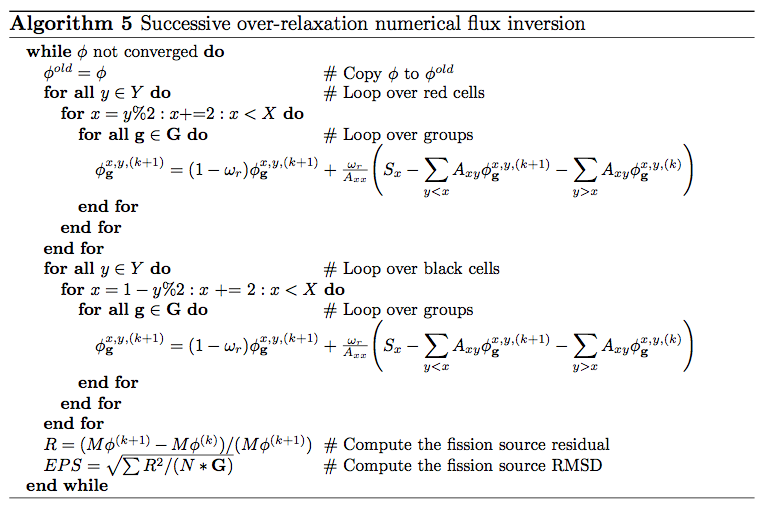

.. _cmfd:

==========================================
Coarse Mesh Finite Difference Acceleration
==========================================

While MOC offers many benefits including treatment of complex geometries and amenability to parallelization, it suffers from slow convergence which necessitates the use of acceleration methods. Numerous acceleration schemes have been proposed for MOC such as CMFD [1]_, coarse mesh rebalance (CMR) [2_, 3_], and low order transport operator acceleration [4]_ with CMFD being the most widely adopted due to its simplicity and acceleration performance. OpenMOC uses the CMFD nonlinear diffusion acceleration (NDA) scheme to reduce the number of iterations required to converge the neutron transport problem. Acceleration schemes, such as NDA, are necessary when solving full-core problems which require thousands of power iterations due to a high dominance ratio. CMFD was first proposed by Smith [1]_ and has been widely used in accelerating neutron diffusion and transport problems for many years [5_, 6_]. In particular, it has been shown that CMFD acceleration gives >100x speedups on large LWR problems [7]_.

CMFD acceleration functions by using the solution of a coarse mesh diffusion problem to accelerate the convergence of a fine mesh transport problem. It is implemented by overlaying a 2D rectangular mesh over a structured or unstructured FSR mesh. :ref:`Figure 1 <figure-fsr-mesh-regions>` gives an illustration of the FSR mesh layout and coarse mesh layout used for solving a 17 x 17 PWR assembly problem.

.. _figure-fsr-mesh-regions:

.. figure:: ../../img/fig-fsr-mesh-regions.png
   :align: center
   :figclass: align-center
   :width: 700 px

   **Figure 1**: Flat source region (left) and CMFD (right) mesh layout for a 17 x 17 PWR assembly where each colored cell denotes a different region.

To derive the CMFD equations, we begin with the 2D, steady state multi-group neutron diffusion equation:

.. math::
   :label: dif-eqn

    - \nabla \cdot D_{\mathbf{g}} (x,y) \nabla \phi_{\mathbf{g}} (x,y) + \varSigma^A_{\mathbf{g}} (x,y) \phi_{\mathbf{g}} (x,y) + \sum_{\substack{{\mathbf{g}} \prime = 1 \\ {\mathbf{g}} \prime \neq {\mathbf{g}}}}^{\mathbf{G}} \varSigma^S_{{\mathbf{g}} \rightarrow {\mathbf{g}} \prime} (x,y) \phi_{\mathbf{g}} (x,y) = \frac{\chi_{\mathbf{g}} (x,y)}{k_{eff}} \sum_{{\mathbf{g}} \prime = 1}^{\mathbf{G}} \nu \varSigma^F_{{\mathbf{g}} \prime} (x,y) \phi_{{\mathbf{g}} \prime} (x,y) + \sum_{\substack{{\mathbf{g}} \prime = 1 \\ {\mathbf{g}} \prime \neq {\mathbf{g}}}}^{\mathbf{G}} \varSigma^S_{{\mathbf{g}} \prime \rightarrow {\mathbf{g}}} (x,y) \phi_{{\mathbf{g}} \prime} (x,y) 
    
Where the terms in equation :eq:`dif-eqn` are defined as:

.. _table-dif-eqn-terms:

=========================================  =============================  ===================  =============================
Variable                                   Description                    Variable             Description         
=========================================  =============================  ===================  =============================
:math:`D`                                  Diffusion coefficient          :math:`\phi`         Scalar flux on coarse mesh
:math:`\varSigma^A`                        Coarse mesh absorption XS      :math:`\chi`         Fission spectrum
:math:`\varSigma^S`                        Coarse mesh scattering XS      :math:`k_{eff}`      Neutron multiplication factor
:math:`\varSigma^F`                        Coarse mesh fission XS         :math:`\nu`          Neutrons per fission
:math:`{\mathbf{g}}, {\mathbf{g}} \prime`  Energy group index             :math:`x, y`         Position variable
=========================================  =============================  ===================  =============================

.. _gen-coarse-mesh

Cross Section Generation
========================

The cross sections for the CMFD diffusion equation are generated by energy-condensation and area-averaging of the cross sections from the fine mesh as shown in equation :eq:`xs-condensation`. The energy group structure of the CMFD diffusion equations does not necessarily have to be the same as the energy group structure used in MOC. For example, :ref:`Figure 2 <figure-coarse-group-CMFD>` shows the various ways to formulate the CMFD group structure to accelerate a three group MOC problem. When the CMFD group structure differs from the MOC group structure, we rename it coarse group coarse mesh finite difference (CGCMFD).

.. _figure-coarse-group-CMFD:

   **Figure 2**: Schemes for condensing the energy group structure in forming the CMFD diffusion equations.

**Cross section condensation equations**

.. math::
   :label: xs-condensation

   \varSigma^{A,i,j}_{\mathbf{g}} = \frac{\displaystyle\sum\limits_{g \in \mathbf{g}} \displaystyle\sum\limits_{r \in (i,j)} \Sigma^{A}_{r,g} \Phi_{r,g} A_r}{\displaystyle\sum\limits_{g \in \mathbf{g}} \displaystyle\sum\limits_{r \in (i,j)} \Phi_{r,g} A_r}

.. math::

   \varSigma^{F,i,j}_{\mathbf{g}} = \frac{\displaystyle\sum\limits_{g \in \mathbf{g}} \displaystyle\sum\limits_{r \in (i,j)} \Sigma^{F}_{r,g} \Phi_{r,g} A_r}{\displaystyle\sum\limits_{g \in \mathbf{g}} \displaystyle\sum\limits_{r \in (i,j)} \Phi_{r,g} A_r}

.. math::

   \nu \varSigma^{F,i,j}_{\mathbf{g}} = \frac{\displaystyle\sum\limits_{g \in \mathbf{g}} \displaystyle\sum\limits_{r \in (i,j)} \nu \Sigma^{F}_{r,g} \Phi_{r,g} A_r}{\displaystyle\sum\limits_{g \in \mathbf{g}} \displaystyle\sum\limits_{r \in (i,j)} \Phi_{r,g} A_r}

.. math::

   \varSigma^{S,i,j}_{\mathbf{g} \rightarrow \mathbf{g} \prime} = \frac{\displaystyle\sum\limits_{g \in \mathbf{g}} \displaystyle\sum\limits_{r \in (i,j)} \Sigma^S_{r,g \rightarrow g \prime} \Phi_{r,g} A_r}{\displaystyle\sum\limits_{g \in \mathbf{g}} \displaystyle\sum\limits_{r \in (i,j)} \Phi_{r,g} A_r}

.. math::

   D_{\mathbf{g}}^{i,j} = \frac{\displaystyle\sum\limits_{g \in \mathbf{g}} \displaystyle\sum\limits_{r \in (i,j)} \frac{1}{3 \Sigma^T_{r,g}} \Phi_{r,g} A_r}{\displaystyle\sum\limits_{g \in \mathbf{g}} \displaystyle\sum\limits_{r \in (i,j)} \Phi_{r,g} A_r}

.. math::

   \chi_{\mathbf{g}}^{i,j} = \frac{\displaystyle\sum\limits_{g \in \mathbf{g}} \displaystyle\sum\limits_{r \in (i,j)} \displaystyle\sum\limits_{g \prime = 1}^G \chi_{r,g} \nu \Sigma^F_{r,g \prime} \Phi_{r,g \prime} A_r}{\displaystyle\sum\limits_{r \in (i,j)} \displaystyle\sum\limits_{g \prime = 1}^G \displaystyle\sum\limits_{g \prime \prime = 1}^G \chi_{r,g \prime \prime} \nu \Sigma^{F}_{r,g \prime} \Phi_{r,g \prime} A_r}

.. math::

   \phi_{\mathbf{g}}^{i,j} = \frac{\displaystyle\sum\limits_{g \in \mathbf{g}} \displaystyle\sum\limits_{r \in (i,j)} \Phi_{r,g} A_r}{\displaystyle\sum\limits_{r \in (i,j)} A_r}

Where :math:`i` and :math:`j` denote the mesh cell indices in the x and y directions, respectively. By condensing the cross sections in this way, we require reaction rates to be conserved. In our derivation of MOC we have assumed isotropic scattering in the lab system which makes the total cross section, :math:`\Sigma^T`, equal to the transport cross section, :math:`\Sigma^{tr}`. This allows us to approximate the diffusion coefficient on the fine mesh as :math:`\frac{1}{3 \Sigma^T}` instead of its' defined value of :math:`\frac{1}{3 \Sigma^{tr}}`. Approximating the diffusion coefficient in this manner works well for optically thin regions, but induces significant error where the width of a region is much greater than the neutron mean free path (i.e. the region is optically thick). Modifications to the diffusion coefficient for optically thick regions will be discussed in :ref:`Section 7.5 <optically-thick>`.

.. _section-fd-approx:

Applying the Finite Difference Approximation
============================================
    
The diffusion operator in :eq:`dif-eqn` can be expanded to yield:    

.. math::
   :label: dif-eqn-expand-1

    - \frac{\partial}{\partial x} D_{\mathbf{g}} (x,y) \frac{\partial}{\partial x} \phi_{\mathbf{g}} (x,y) - \frac{\partial}{\partial y} D_{\mathbf{g}} (x,y) \frac{\partial}{\partial y} \phi_{\mathbf{g}} (x,y) + \varSigma^A_{\mathbf{g}} \phi_{\mathbf{g}} (x,y) + \sum_{\substack{{\mathbf{g}} \prime = 1 \\ {\mathbf{g}} \prime \neq {\mathbf{g}}}}^{\mathbf{G}} \varSigma^S_{s,{\mathbf{g}} \rightarrow {\mathbf{g}} \prime} (x,y) \phi_{\mathbf{g}} (x,y) = \frac{\chi_{\mathbf{g}} (x,y)}{k_{eff}} \sum_{{\mathbf{g}} \prime = 1}^{\mathbf{G}} \nu \varSigma^F_{{\mathbf{g}} \prime} (x,y) \phi_{{\mathbf{g}} \prime} (x,y) + \sum_{\substack{{\mathbf{g}} \prime = 1 \\ {\mathbf{g}} \prime \neq {\mathbf{g}}}}^{\mathbf{G}} \varSigma^S_{{\mathbf{g}} \prime \rightarrow {\mathbf{g}}} (x,y) \phi_{{\mathbf{g}} \prime} (x,y)

We can integrate :eq:`dif-eqn-expand-1` over a mesh cell to get the neutron balance in that cell. Performing the integration on cell :math:`(i,j)` and simplifying we get: 

.. math::
   
    - \int_{i-\frac{1}{2}}^{i+\frac{1}{2}} \int_{j-\frac{1}{2}}^{j+\frac{1}{2}} \frac{\partial}{\partial x} D_{\mathbf{g}}^{i,j} \frac{\partial}{\partial x} \phi_{\mathbf{g}}^{i,j} dx dy - \int_{i-\frac{1}{2}}^{i+\frac{1}{2}} \int_{j-\frac{1}{2}}^{j+\frac{1}{2}} \frac{\partial}{\partial y} D_{\mathbf{g}}^{i,j} \frac{\partial}{\partial y} \phi_{\mathbf{g}}^{i,j} dx dy + \Delta x^{i,j} \Delta y^{i,j} \varSigma_{\mathbf{g}}^{A,i,j} \phi_{\mathbf{g}}^{i,j} + \Delta x^{i,j} \Delta y^{i,j} \sum_{\substack{{\mathbf{g}} \prime = 1 \\ {\mathbf{g}} \prime \neq {\mathbf{g}}}}^{\mathbf{G}} \varSigma_{{\mathbf{g}} \rightarrow {\mathbf{g}} \prime}^{S,i,j} \phi_{\mathbf{g}}^{i,j} = \Delta x^{i,j} \Delta y^{i,j} \frac{\chi_{\mathbf{g}}^{i,j}}{k_{eff}} \sum_{{\mathbf{g}} \prime = 1}^{\mathbf{G}} \nu \varSigma_{{\mathbf{g}} \prime}^{F,i,j} \phi_{{\mathbf{g}} \prime}^{i,j} + \Delta x^{i,j} \Delta y^{i,j} \sum_{\substack{{\mathbf{g}} \prime = 1 \\ {\mathbf{g}} \prime \neq {\mathbf{g}}}}^{\mathbf{G}} \varSigma_{{\mathbf{g}} \prime \rightarrow {\mathbf{g}}}^{S,i,j} \phi_{{\mathbf{g}} \prime}^{i,j} 

Where :math:`\Delta x^{i,j}` and :math:`\Delta y^{i,j}` denote the width and height of cell (i,j), respectively. Using the Divergence Theorem, we can reduce the volume integrals of the streaming terms to surface integrals over the bounding surfaces of a cell. The surface integrals will then represent currents across the surfaces of a cell. Using streaming in the x-direction as an example, we can rewrite the volume integral of the streaming term in the x-direction as:
  
.. math::

    - \int_{i-\frac{1}{2}}^{i+\frac{1}{2}} \int_{j-\frac{1}{2}}^{j+\frac{1}{2}} \frac{\partial}{\partial x} D_{\mathbf{g}}^{i,j} \frac{\partial}{\partial x} \phi_{\mathbf{g}}^{i,j} dx dy = - \Delta y^{i,j} (J_{\mathbf{g}}^{i+\frac{1}{2},j} - J_{\mathbf{g}}^{i-\frac{1}{2},j})
    
Where :math:`J_{\mathbf{g}}^{i+\frac{1}{2},j}` and :math:`J_{\mathbf{g}}^{i-\frac{1}{2},j}` represent the surface-averaged net current across the right surface and across the left surface, respectively. An analogous equation can be written for streaming in the y direction. 

As an example, we will now solve for the currents on the right surface of a cell :math:`(i,j)` with neighboring cell :math:`(i, j + 1)` as illustrated in :ref:`Figure 3 <figure-cmfd-example>`. 

.. _figure-cmfd-example:

.. figure:: ../../img/cmfd-example.png
   :align: center
   :figclass: align-center
   :width: 400 px

   **Figure 3**: Illustration of terms required to solve for streaming of neutrons from cell :math:`(i,j)` to :math:`(i+1,j)` in CMFD diffusion.

To solve for the current at cell boundaries, we can perform finite difference approximations of the flux at a surface using the flux in the adjacent cells:

.. math::

    J_{\mathbf{g}}^{i+\frac{1}{2},j,+} = \left. - D_{\mathbf{g}}^{i+1,j} \frac{d \phi_{\mathbf{g}}^{i+\frac{1}{2},j}}{d x} \right|_{x^{i+\frac{1}{2},j,+}} = - D_{\mathbf{g}}^{i+\frac{1}{2},j} \frac{\phi_{\mathbf{g}}^{i+1,j} - \phi_{\mathbf{g}}^{i+\frac{1}{2},j}}{\frac{\Delta x^{i+1,j}}{2}}\\ \nonumber
    J_{\mathbf{g}}^{i+\frac{1}{2},j,-} = \left. - D_{\mathbf{g}}^{i,j} \frac{d \phi_{\mathbf{g}}^{i+\frac{1}{2},j}}{d x} \right|_{x^{i+\frac{1}{2},j,-}} = - D_{\mathbf{g}}^{i,j} \frac{\phi_{\mathbf{g}}^{i+\frac{1}{2},j} - \phi_{\mathbf{g}}^{i,j}}{\frac{\Delta x^{i,j}}{2}}
    
Where :math:`J_{\mathbf{g}}^{i+\frac{1}{2},j,+}` and :math:`J_{\mathbf{g}}^{i+\frac{1}{2},j,-}` are the surface-averaged partial currents as approximated using a backward difference approximation from the cell at :math:`(i,j)` and a forward difference approximation from the cell at :math:`(i+1,j)`, respectively. Equating these representations of the current we can solve for the flux at the surface:

.. math::

    \phi_{\mathbf{g}}^{i+\frac{1}{2},j} = \frac{D_{\mathbf{g}}^{i,j} \phi_{\mathbf{g}}^{i,j} \Delta x^{i+1,j} + D_{\mathbf{g}}^{i+1,j} \phi_{\mathbf{g}}^{i+1,j} \Delta x^{i,j}}{D_{\mathbf{g}}^{i,j}\Delta x^{i+1,j} + D_{\mathbf{g}}^{i+1,j} \Delta x^{i,j}}
    
The net current across the surface at :math:`(i+\frac{1}{2},j)` is then:

.. math::
   :label: eqn-alg-net-current

    J_{\mathbf{g}}^{i+\frac{1}{2},j} = - \hat{D}_{\mathbf{g}}^{i+\frac{1}{2},j} (\phi_{\mathbf{g}}^{i+1,j} - \phi_{\mathbf{g}}^{i,j})
    
Where:

.. math::
   :label: eqn-surf-dif-coef

    \hat{D}_{\mathbf{g}}^{i+\frac{1}{2},j} = \frac{2 D_{\mathbf{g}}^{i,j} D_{\mathbf{g}}^{i+1,j}}{D_{\mathbf{g}}^i\Delta x^{i+1,j} + D_{\mathbf{g}}^{i+1,j} \Delta x^{i,j}}
    
The neutron balance equation in a cell then becomes:

.. math::
   :label: eqn-dif-eqn-simple

    - \Delta y^{i,j} (J_{\mathbf{g}}^{i+\frac{1}{2},j} - J_{\mathbf{g}}^{i-\frac{1}{2},j}) - \Delta x^{i,j} (J_{\mathbf{g}}^{i,j+\frac{1}{2}} - J_{\mathbf{g}}^{i,j-\frac{1}{2}}) + \Delta x^{i,j} \Delta y^{i,j} \varSigma_{\mathbf{g}}^{A,i,j} \phi_{\mathbf{g}}^{i,j} + \Delta x^{i,j} \Delta y^{i,j} \sum_{\substack{{\mathbf{g}} \prime = 1 \\ {\mathbf{g}} \prime \neq {\mathbf{g}}}}^{\mathbf{G}} \varSigma_{{\mathbf{g}} \rightarrow {\mathbf{g}} \prime}^{S,i,j} \phi_{\mathbf{g}}^{i,j} = \Delta x^{i,j} \Delta y^{i,j} \frac{\chi_{\mathbf{g}}^{i,j}}{k_{eff}} \sum_{{\mathbf{g}} \prime = 1}^{\mathbf{G}} \nu \varSigma_{{\mathbf{g}} \prime}^{F,i,j} \phi_{{\mathbf{g}} \prime}^{i,j} + \Delta x^{i,j} \Delta y^{i,j} \sum_{\substack{{\mathbf{g}} \prime = 1 \\ {\mathbf{g}} \prime \neq {\mathbf{g}}}}^{\mathbf{G}} \varSigma_{{\mathbf{g}} \prime \rightarrow {\mathbf{g}}}^{S,i,j} \phi_{{\mathbf{g}} \prime}^{i,j} 

Note that :eq:`eqn-alg-net-current` is the algebraic net current based on the finite difference approximation being applied across the surface of two neighboring cells and not the actual net current in the MOC problem. The actual current from the MOC problem is computed by accumulating the current contribution from every segment that crosses a surface as will be shown in the :ref:`Section 7.3 <nonlinear-dif-coef>`.

.. _nonlinear-dif-coef

Nonlinear Diffusion Correction Factors
======================================

In order to conserve neutron balance between the CMFD and MOC problems, the net currents across the coarse mesh cell surfaces must be equal. The surface diffusion coefficient expression in :eq:`eqn-surf-dif-coef` results in a neutron current close to the actual current produced via the MOC solve, but there is no guarantee the currents will be equal. To compute the currents from MOC, the net currents are tallied during a transport sweep by summing the current contributions from each track that intersects a surface. For example, :eq:`eqn-surf-avg-tallied-current` represents the net current tally expression for surface :math:`(i + \frac{1}{2}, j)`.

.. math::
   :label: eqn-surf-avg-tallied-current

    \tilde{J}_{\mathbf{g}}^{i + \frac{1}{2}, j} = \displaystyle\sum\limits_{g \in {\mathbf{g}}} \displaystyle\sum\limits_{k \cap (i+\frac{1}{2},j)} \Psi_{k,g,p} \frac{\omega_p \tilde{\omega}_k}{2 \pi} \sin \theta_p \cdot \hat{n}

Where :math:`\hat{n}` is the unit surface normal and :math:`\tilde{\omega}_k` is the length of surface crossed by the track, as illustrated in :ref:`Figure 4 <figure-current-tally>`.
    
.. _figure-current-tally:

   **Figure 4**: Angular flux from track :math:`k` with energy group :math:`g` and polar angle :math:`p` crossing surface :math:`(i+\frac{1}{2}, j)`.
    
The length of surface crossed by the track is defined as:

.. math::
   :label: eqn-surf-len-track
   
   \tilde{\omega}_k = \frac{\omega_k}{\cos \theta_k}

Inserting :eq:`eqn-surf-len-track` into :eq:`eqn-surf-avg-tallied-current` gives us:

.. math::
   :label: eqn-surf-avg-tallied-current-2

    \tilde{J}_{\mathbf{g}}^{i + \frac{1}{2}, j} = \displaystyle\sum\limits_{g \in {\mathbf{g}}} \displaystyle\sum\limits_{k \cap (i+\frac{1}{2},j)} \Psi_{k,g,p} \frac{\omega_p \omega_k}{2 \pi \cos \theta_k} \sin \theta_p \cdot \hat{n}

When we dot the track azimuthal angle with the unit surface normal of the track, we get :math:`\cos \theta_k`, which reduces :eq:`eqn-surf-avg-tallied-current-2` to: 

.. math::
   :label: eqn-surf-avg-tallied-current-3

    \tilde{J}_{\mathbf{g}}^{i + \frac{1}{2}, j} = \displaystyle\sum\limits_{g \in {\mathbf{g}}} \displaystyle\sum\limits_{k \cap (i+\frac{1}{2},j)} \Psi_{k,g,p} \frac{\omega_p \omega_k}{2 \pi} \sin \theta_p

In order for the tallied net currents to equal the net current expression, a nonlinear diffusion coefficient term is added to :eq:`eqn-alg-net-current`: 

.. math::
   :label: eqn-alg-net-current-cor

    \frac{\tilde{J}_{\mathbf{g}}^{i+\frac{1}{2},j}}{\Delta y^{i,j}} = - \hat{D}_{\mathbf{g}}^{i+\frac{1}{2},j} (\phi_{\mathbf{g}}^{i+1,j} - \phi_{\mathbf{g}}^{i,j}) - \tilde{D}_{\mathbf{g}}^{i+\frac{1}{2},j} (\phi_{\mathbf{g}}^{i+1,j} + \phi_{\mathbf{g}}^{i,j})
    
Where :math:`\tilde{D}` is the nonlinear diffusion coefficient correction factor. Note that current expression computes the surface-averaged net current whereas the current tallied from MOC has not been averaged over the surface; therefore, in :eq:`eqn-alg-net-current-cor` the net current tallied from MOC has been divided by the length of the surface that is being crossed. :math:`\tilde{D}` is computed to make :eq:`eqn-alg-net-current-cor` valid for the tallied net surface current in MOC for the most recent transport sweep:

.. math::
   :label: eqn-dif-cor-factor

    \tilde{D}_{\mathbf{g}}^{i+\frac{1}{2},j} = \frac{- \hat{D}_{\mathbf{g}}^{i+\frac{1}{2},j} (\phi_{\mathbf{g}}^{i+1,j} - \phi_{\mathbf{g}}^{i,j}) - \frac{\tilde{J}_{\mathbf{g}}^{i+\frac{1}{2},j}}{\Delta y^{i,j}}}{(\phi_{\mathbf{g}}^{i+1,j} + \phi_{\mathbf{g}}^{i,j})}

.. _corner-crossings

Coarse Mesh Cell Corner Crossings
=================================

In the CMFD formalism introduced in the previous sections, we only treat transport to adjacent cells. However, MOC produces tracks that directly and indirectly intersect mesh cell corners. A direct crossing is defined as a crossing where the centerline of a track directly intersects a mesh cell corner. An indirect crossing is defined as a crossing where the track sweeps through a corner but the track centerline does not directly cross through it. Illustrations of these two crossing types are shown in :ref:`Figure 5 <figure-corner-crossing>`.

.. _figure-corner-crossing:

.. figure:: ../../img/corner-crossing.png
   :align: center
   :figclass: align-center
   :width: 800 px

   **Figure 5**: Illustration of direct (1) and indirect (2) track corner crossings.

There are three main approximations to treat corner crossings:

1. Consistently tallying the current from direct corner crossings to only one of the surfaces. This approximation effectively moves the tracks that directly cross through a corner far enough to one side such that the entire segment crosses a single surface. In order to maintain neutron balance, tracks must be consistently moved to the same side for tracking forward and backwards along a track. Indirect crossings are ignored.   
2. Split the current from direct corner crossings to each of the neighboring surfaces. This approximation effectively splits the track into two half-weighted segments and moves them to either side of the corner such that each new half-weighted track only sweeps across one surface. Indirect crossings are ignored. This is essentially a special case of approximation 3 where only direct crossings are treated. 
3. Split the current from direct and indirect corner crossings to each of the neighboring surfaces and weight the current contribution to each surface based on the length of surfaces swept through by the track.

Note that tracks are not physically moved in any of these cases; rather, we make the assumption that they are moved when we tally the surface currents. In OpenMOC we have implemented approximation 2 where only direct corner crossings are treated; indirect crossings are tallied only on the surface that is directly crossed by a track. While applying approximation 3 would be more accurate, this would incur additional storage requirements as each segment that crosses a surface needs to know which surface(s) it crosses and the current contribution to each surface.

The tallies for a track that crosses from cell :math:`(i,j)` to :math:`(i+1,j+1)` with approximation 1 or 2 include a tally on the surface between cell :math:`(i,j)` to :math:`(i+1,j)` and on the surface between cells :math:`(i+1,j)` to :math:`(i+1,j+1)`. The current must be tallied on the second surface in order to preserve neutron balance ensure that neutrons traveling on the track get transferred from cell :math:`(i,j)` to :math:`(i+1,j+1)`. It is also important that the track be assigned to the same surface for both forward and reverse tracking. 

The tallies with approximation 2 are simply half-weighted tallies for tracks that pass on either side of the corner: 

.. math::
   :label: eqn-corner-crossing

   \tilde{J}_{\mathbf{g}}^{i + \frac{1}{2},j} = \frac{1}{2} \displaystyle\sum\limits_{g \in \mathbf{g}} \displaystyle\sum\limits_{k \cap (i+\frac{1}{2},j+\frac{1}{2})} \Psi_{k,g,p} \frac{\omega_p \omega_k}{2 \pi} \sin \theta_p \\
   \tilde{J}_{\mathbf{g}}^{i,j + \frac{1}{2}} = \frac{1}{2} \displaystyle\sum\limits_{g \in \mathbf{g}} \displaystyle\sum\limits_{k \cap (i+\frac{1}{2},j+\frac{1}{2})} \Psi_{k,g,p} \frac{\omega_p \omega_k}{2 \pi} \sin \theta_p \\
   \tilde{J}_{\mathbf{g}}^{i + 1, j + \frac{1}{2}} = \frac{1}{2} \displaystyle\sum\limits_{g \in \mathbf{g}} \displaystyle\sum\limits_{k \cap (i+\frac{1}{2},j+\frac{1}{2})} \Psi_{k,g,p} \frac{\omega_p \omega_k}{2 \pi} \sin \theta_p \\
   \tilde{J}_{\mathbf{g}}^{i + \frac{1}{2}, j + 1} = \frac{1}{2} \displaystyle\sum\limits_{g \in \mathbf{g}} \displaystyle\sum\limits_{k \cap (i+\frac{1}{2},j+\frac{1}{2})} \Psi_{k,g,p} \frac{\omega_p \omega_k}{2 \pi} \sin \theta_p

Where the summation is over the tracks that cross a specific corner denoted :math:`(i + \frac{1}{2}, j + \frac{1}{2})`. Note that the current is tallied on both the surfaces that bound cell :math:`(i,j)` *and* on surfaces :math:`(i+\frac{1}{2},j+1)` and :math:`(i+1,j+\frac{1}{2})` in order to preserve neutron balance between all four cells.

.. _optically-thick:

Optically Thick Regions
=======================

As shown in :ref:`Figure 1 <figure-fsr-mesh-regions>` the CMFD mesh is often applied at the pin cell level with cells on the order of 1-2 cm. For some problems, such was BWR bundles with large water pins, the rectilinear pin cell lattice might not be maintained, requiring the CMFD mesh to be coarsened to the assembly level. By conserving reaction and leaking rates within cells, CMFD guarantees to preserve the area-averaged scalar fluxes and net surface currents from the MOC transport sweep if the CMFD equations can be converged. However, when the coarse mesh cell size becomes significantly larger than the neutron mean free path in that cell, the step characteristics no longer preserve the linear infinite medium solution to the transport equation [8]_. Using the approximation of the diffusion coefficient as :math:`\frac{1}{3 \Sigma^{T}}` results is an unphysically large diffusion coefficient. Put in other words, the large diffusion coefficient suggests that the region is optically thin when it is actually optically thick. Due to this inconsistency in approximating the diffusion coefficient for optically thick cells, an "effective" diffusion coefficient was derived in [8]_. The effective diffusion coefficient in the x-direction for cell :math:`(i,j)` can be expressed as:

.. math::
   :label: eqn-optic-thick-d

   D_{\mathbf{g}}^{i,j,eff,x} = D_{\mathbf{g}}^{i,j} \bigg(1 + \frac{\Delta x^{i,j} \rho_{\mathbf{g}}^{i,j,x}}{2 D_{\mathbf{g}}^{i,j}} \bigg) \\
   \rho_{\mathbf{g}}^{i,j,x} = \frac{\displaystyle\sum\limits_{k = 1}^K \omega_p \omega_{m(k)} \alpha_{{\mathbf{g}},k}^{i,j,x}}{\displaystyle\sum\limits_{k = 1}^{K} \omega_{m(k)}} \\
   \alpha_{{\mathbf{g}},k}^{i,j,x} = \left( \frac{1 + e^{-\frac{\Delta x^{i,j}}{3 D_{\mathbf{g}}^{i,j} \omega_{m(k)}}}}{1 - e^{-\frac{\Delta x^{i,j}}{3 D_{\mathbf{g}}^{i,j} \omega_{m(k)}}}} \right) - \frac{2 \omega_{m(k)}}{\Delta x^{i,j}}

Note that the effective diffusion coefficient depends on the width of the cell and is therefore directional in a 2D mesh. Equation :eq:`eqn-optic-thick-d` can also be used to computed the effective diffusion coefficient in the y-direction, which will differ from the effective diffusion coefficient in the x-direction if the cell if the cell is not a square. As the size of the cell approaches zero and the optical thickness of the cell approaches the optically thin limit, the effective diffusion coefficient will approach the material diffusion coefficient. For simplicity, we continue to use the surface diffusion coefficient terms in the rest of this description without the "eff" superscript. In OpenMOC we apply the correction for optically thick regions only if the average CMFD cell size for a given problem is over 10 :math:`cm^2`.

.. _cmfd-matrix-form:

Matrix Equations
================

Going back to :eq:`eqn-dif-eqn-simple` and inserting the nonlinear diffusion coefficients from :eq:`eqn-dif-cor-factor`, the finite difference form of the diffusion equation over a mesh cell becomes:

.. math::
   :label: eqn-dif-matrix-1

   \Delta y^{i,j} (\hat{D}_{\mathbf{g}}^{i-\frac{1}{2},j} [\phi_{\mathbf{g}}^{i,j} - \phi_{\mathbf{g}}^{i-1,j}] + \tilde{D}_{\mathbf{g}}^{i-\frac{1}{2},j} [\phi_{\mathbf{g}}^{i,j} + \phi_{\mathbf{g}}^{i-1,j}]) - \Delta y^{i,j} (\hat{D}_{\mathbf{g}}^{i+\frac{1}{2},j} [\phi_{\mathbf{g}}^{i+1,j} - \phi_{\mathbf{g}}^{i,j}] + \tilde{D}_{\mathbf{g}}^{i+\frac{1}{2},j} [\phi_{\mathbf{g}}^{i+1,j} - \phi_{\mathbf{g}}^{i,j}]) + \Delta x^{i,j} (\hat{D}_{\mathbf{g}}^{i,j-\frac{1}{2}} [\phi_{\mathbf{g}}^{i,j} - \phi_{\mathbf{g}}^{i,j-1}] + \tilde{D}_{\mathbf{g}}^{i,j-\frac{1}{2}} [\phi_{\mathbf{g}}^{i,j} + \phi_{\mathbf{g}}^{i,j-1}]) \\
   - \Delta x^{i,j} (\hat{D}_{\mathbf{g}}^{i,j-\frac{1}{2}} [\phi_{\mathbf{g}}^{i,j+1} - \phi_{\mathbf{g}}^{i,j}] + \tilde{D}_{\mathbf{g}}^{i,j-\frac{1}{2}} [\phi_{\mathbf{g}}^{i,j+1} + \phi_{\mathbf{g}}^{i,j}]) + \Delta x^{i,j} \Delta y^{i,j} \varSigma_{\mathbf{g}}^{A,i,j} \phi_{\mathbf{g}}^{i,j} + \Delta x^{i,j} \Delta y^{i,j} \sum_{\substack{{\mathbf{g}} \prime = 1 \\ {\mathbf{g}} \prime \neq {\mathbf{g}}}}^{\mathbf{G}} \varSigma_{{\mathbf{g}} \rightarrow {\mathbf{g}} \prime}^{S,i,j} \phi_{\mathbf{g}}^{i,j} = \Delta x^{i,j} \Delta y^{i,j} \frac{\chi_{\mathbf{g}}^{i,j}}{k_{eff}} \sum_{{\mathbf{g}} \prime = 1}^G \nu \varSigma_{{\mathbf{g}} \prime}^{F,i,j} \phi_{{\mathbf{g}} \prime}^{i,j} + \Delta x^{i,j} \Delta y^{i,j} \sum_{\substack{{\mathbf{g}} \prime = 1 \\ {\mathbf{g}} \prime \neq {\mathbf{g}}}}^{\mathbf{G}} \varSigma_{{\mathbf{g}} \prime \rightarrow {\mathbf{g}}}^{S,i,j} \phi_{{\mathbf{g}} \prime}^{i,j} 

We can collapse the spatial dependence and write this equation in matrix form as:

.. math::
   :label: eqn-dif-matrix-1

    A_{streaming} \phi + A_{removal} \phi = \frac{1}{k_{eff}} M \phi + A_{gain} \phi
    
Where:

.. _table-dif-mat-terms:

=====================   =================================================================
Variable                Description                                                     
=====================   =================================================================
:math:`A_{streaming}`   NG x NG matrix with 4 diagonals for cell to cell transport      
:math:`A_{removal}`     NG x NG matrix with G diagonals for absorption and outscattering
:math:`M`               NG x NG matrix with G diagonals for generation by fission
:math:`A_{gain}`        NG x NG matrix with G diagonals for inscattering
:math:`\phi`            NG length vector for the flux
:math:`N`               The number of coarse mesh cells, I x J
:math:`G`               The number of energy groups
:math:`k_{eff}`         Multiplication factor
=====================   =================================================================
    
We can combine the difference :math:`A` matrices to get the more recognizable CMFD diffusion eigenvalue equation:

.. math::
   :label: eqn-diffusion-matrix-form

    A \phi = \frac{1}{k_{eff}} M \phi
 
In :ref:`Section 7.7 <cmfd-accel-moc>` we discuss how this matrix equation will be solved and used to accelerate the solution of the MOC solve.

.. _cmfd-accel-moc:

CMFD Accelerated MOC Algorithm
==============================

The general flowchart for CMFD accelerated MOC in :ref:`Figure 6 <figure-cmfd-accel-moc>`.

.. _figure-cmfd-accel-moc:

.. figure:: ../../img/cmfd-accel-moc.png
   :align: center
   :figclass: align-center
   :width: 600 px

   **Figure 6**: The solution procedure for CMFD accelerated MOC.

CMFD acceleration is implemented in OpenMOC by overlaying a Cartesian coarse mesh on top of the unstructured flat source region mesh as shown in :ref:`Figure 1 <fsr-mesh-regions>`. During a MOC transport sweep, OpenMOC tallies the net currents across the surfaces of each mesh cell. The transport sweep algorithm then becomes :ref:`Figure 7 <alg-transport-sweep-CMFD>`. 

.. _alg-cmfd-accel-moc:

   **Figure 7**: The solution procedure for CMFD accelerated MOC.

At the end of the transport sweep, OpenMOC proceeds to condense the cross sections, flux, and diffusion coefficients according to :eq:`xs-condensation`. The diffusion coefficient coupling terms that link neighboring cells, :math:`\hat{D}` and :math:`\tilde{D}`, are then computed using :eq:`eqn-surf-dif-coef` and :eq:`eqn-dif-cor-factor`. There are two subtle points in computing the nonlinear coupling coefficients :math:`\tilde{D}`. First, the condition :math:`|\tilde{D}| < |\hat{D}|` must be met in order to guarantee the diagonal dominance in the destruction matrix, A. If this condition is not met, the surface diffusion coefficients will be re-computed such that they are equal in magnitude and satisfy :eq:`eqn-alg-net-current-cor`. Secondly, under-relaxation of the nonlinear correction factor is used to accelerate and maintain stability of the eigenvalue convergence rate for large, heterogeneous geometries. OpenMOC does so by applying a fixed damping factor on the :math:`\tilde{D}` terms. The nonlinear diffusion coefficients are initially set to zero and modified according to :eq:`eqn-nldif-damp`.

.. math::
   :label: eqn-nldif-damp

    \tilde{D}^{i+\frac{1}{2},j,(n)}_{\mathbf{g}} = (1 - \omega_d) \tilde{D}^{i+\frac{1}{2},j,(n-1)}_{\mathbf{g}} + \omega_d \frac{- \hat{D}^{i+\frac{1}{2},j,(n)}_{\mathbf{g}} (\phi^{i+1,j,(n)}_{\mathbf{g}} - \phi^{i,j,(n)}_{\mathbf{g}}) - \frac{\tilde{J}_{\mathbf{g}}^{i+\frac{1}{2},j,(n)}}{\Delta y^{i,j}}}{(\phi_{\mathbf{g}}^{i+1,j,(n)} + \phi^{i,j,(n)}_{\mathbf{g}})}

Where :math:`\omega_d` is the under-relaxation dampening factor and :math:`(n)` is the transport sweep iteration. Within each CMFD iteration, OpenMOC uses power iterations to solve the generalized non-Hermitian eigenvalue problem as shown in :ref:`Figure 8 <alg-CMFD-solve>`. In each power iteration, the linear system is solved using a parallel (red-black) implementation of the successive over-relaxation method as shown in :ref:`Figure 9 <alg-SOR-solve>`. Upon convergence of the CMFD diffusion problem, OpenMOC performs prolongation by multiplying each FSR's scalar flux by the ratio of the converged coarse mesh scalar flux to the initial coarse mesh scalar flux in the acceleration step:

.. math::
   :label: eqn-cmfd-prolongation

   \Phi_{r,g} = \Phi_{r,g} \frac{\phi^{i,j,new}_{\mathbf{g}}}{\phi^{i,j,old}_{\mathbf{g}}}  \qquad \forall \quad r \in (i,j)

where :math:`\phi^{i,j,old}_{\mathbf{g}}` is the coarse mesh scalar flux computed using equation :eq:`xs-condensation` and :math:`\phi^{i,j,new}_{\mathbf{g}}` is the converged CMFD coarse mesh scalar flux.
    

.. _alg-cmfd-solve:

   **Figure 8**: Power Iteration Outer Loop Source Iteration.

Instead of splitting the corner currents during the MOC transport sweep, OpenMOC tallies the corner currents as independent surfaces and then splits the corner currents between their neighboring surfaces in step 2 of :ref:`Figure 8 <alg-CMFD-solve>`. With the corner currents accounted for, the surface diffusion coefficients are then computed just prior to the power method eigenvalue solve. The first step in the power method inner loop iteration is to solve a linear fixed fission source problem. The SOR method is used to solve the linear system with the SOR relaxation factor denoted as :math:`\omega_r` as described by :ref:`Figure 9 <alg-SOR-solve>`. While more computationally efficient methods exist for solving generalized non-Hermitian eigenvalue problems like Krylov-subspace methods, we chose the power method for its simplicity and stability. Additionally, more computationally efficient methods exist for solving the linear system like Generalized Minimum Residual (GMRES) and stabilized biconjugate gradient (BiCGStab), but these methods are conceptually more challenging and difficult to implement. In our analysis we found the power method with SOR performs sufficiently well for most problems that will be studied. 

.. _alg-SOR-solve:

   **Figure 9**: Successive over-relaxation numerical flux inversion.

References
==========

.. [1] K. Smith, "Nodal Method Storage Reduction by Non-linear Iteration." *Transactions of the American Nuclear Society*, **44**, (1983).

.. [2] A. Yamamoto, "Generalized Coarse-Mesh Rebalance Method for Acceleration of Neutron Transport Calculations." *Journal of Nuclear Science and Engineering*, **151**, pp. 274-281 (2005).

.. [3] E. Lewis and W. Miller, Jr., "Computational Methods of Neutron Transport." *John Wiley \& Sons* (1984).

.. [4] L. Li, "A Low Order Acceleration Scheme for Solving the Neutron Transport Equation." M.S. Thesis, Massachusetts Institute of Technology (2013).

.. [5] A. Yamamoto, "Cell Based CMFD Formulation for Acceleration of Whole-Core Method of Characteristics Calculations." *Journal of the Korean Nuclear Society*, **34**, pp. 250-258 (2002).

.. [6] A. Yamamoto, "Implementation of Two-Level Coarse Mesh Finite Difference Acceleration in an Arbitrary Geometry, Two-Dimensional Discrete Ordinates Transport Method." *Journal of Nuclear Science and Engineering*, **158**, pp. 289-298 (2008).

.. [7] K. Smith and J. D. Rhodes, "Full-Core, 2-D, LWR Core Calculations with CASMO-4E." *Proceedings of PHYSOR*, Seoul, South Korea (2002).

.. [8] E. Larsen, "Infinite Medium Solutions to the Transport Equation, :math:`S_n` Discretization Schemes, and the Diffusion Approximation. " *Proceedings of the Joint International Topical Meeting on Mathematics and Computation and Supercomputing in Nuclear Applications*, Salt Lake City, UT, USA (2001).
