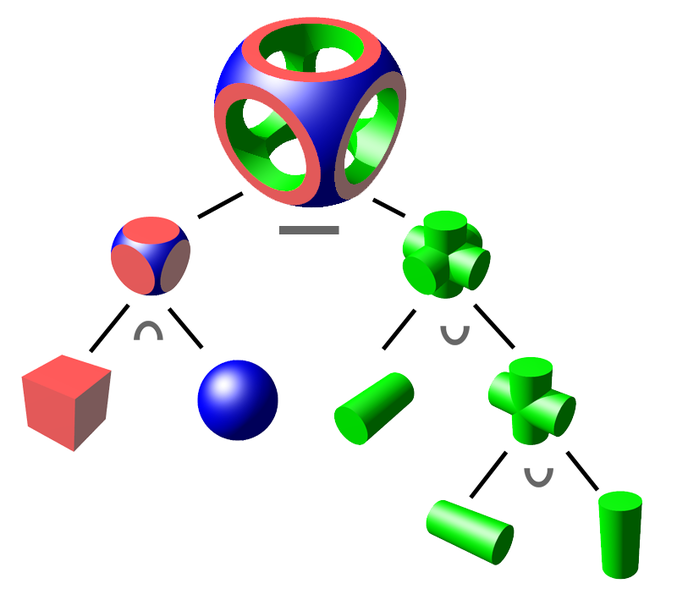
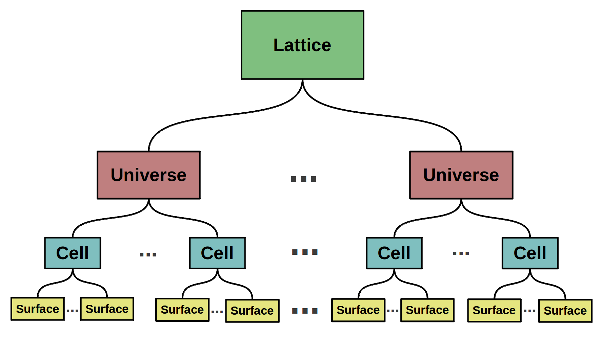
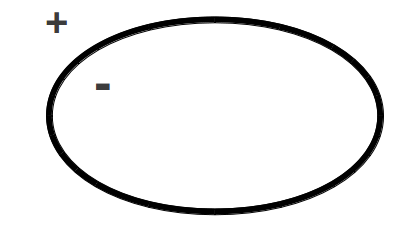
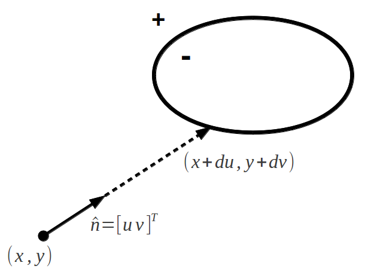
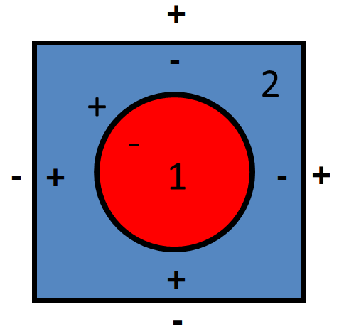
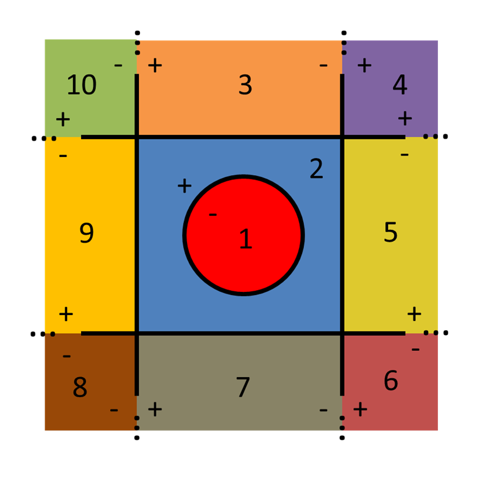
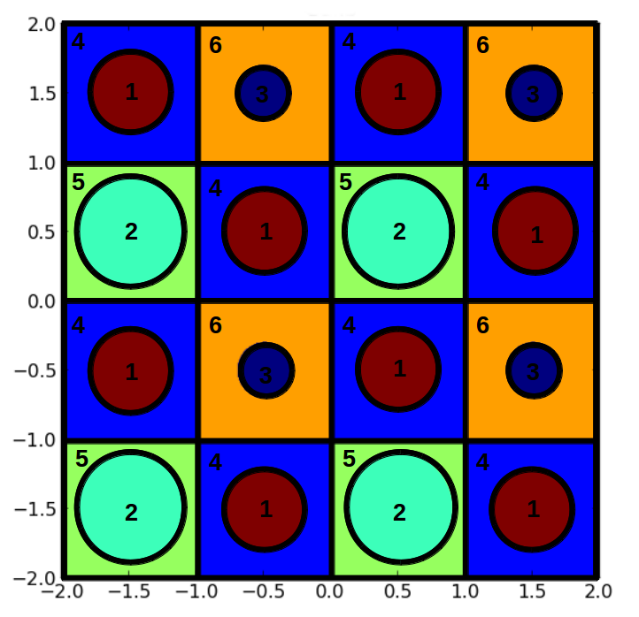

.. _constructive_solid_geometry:

===========================
Constructive Solid Geometry
===========================

OpenMOC uses `constructive solid geometry`_ (CSG) to represent complex reactor models in software. The constructive solid geometry formulation is the method of choice for many advanced modeling software packages, including some Computer-aided Design (CAD) implementations. CSG allows complex spatial models to be built using boolean operations - such as intersections and unions - of simple surfaces and building blocks termed *primitives*, as illustrated in :ref:`Figure 1 <figure-csg-tree>` [Wikipedia]_. The constructive solid geometry approach is well suited for reactor models which typically are highly structured and contain repeating patterns. This is the case for commercial PWRs and BWRs whose cores are built out of a rectangular lattice of fuel assemblies, each of which is a rectangular lattice of fuel pins. 

.. _figure-csg-tree:

   **Figure 1**: A binary tree of CSG primitives.

There are a number of benefits to using the CSG formulation. First, CSG enables simulation codes to significantly reduce the memory footprint required to model the geometry. For example, rather than representing each fuel pin explicitly in memory, a *fuel pin primitive* is represented by a single data structure. A second major benefit to the CSG formulation is that it is a general and extensible approach which allows for ray tracing routines to be written in an abstract fashion that is independent of the primitives themselves.

:ref:`Section 3.2 <source-update-algorithm>`

OpenMOC's implementation of the routines and data structures for CSG are in large part inspired by those used in the OpenMC code. The following sections describe the primitives and algorithms used for CSG modeling in OpenMOC.

.. _csg-formulation:

CSG Formulation
===============

The constructive solid geometry formulation in OpenMOC is predicated upon the use of several key objects which allow one to construct a spatial model from simple primitives in a hierarchical fashion. The following sections describe each of these fundamental objects in order of increasing complexity. The reader should note that the CSG formulation in OpenMOC is capable of describing the full 3D space, but defining a 2D geometry for a 2D case is fairly straightforward.

:ref:`Section 4.1.1 <surfaces-halfspaces>` develops the formulation for *surfaces* which are used to divide space into separate unique *halfspaces*. :ref:`Section 4.1.2 <universes>` describes *universes* which represent the entirety of 2D (or 3D) space and provide a "clean pallet" upon which one can build a simple structure of *cells*. :ref:`Section 4.1.3 <cells>` describes *cells*, of which the *region* attribute contains one or more *surfaces* that bound a subset of space filled by either a material or a *universe*. :ref:`Section 4.1.4 <lattices>` describes *lattices* which are used to create a bounded union of universes through a series of coordinate transformations. A typical hierarchy for the way in which surfaces, universes, cells and lattices are constructed to represent a reactor model in OpenMOC is illustrated in :ref:`Figure 2 <figure-csg-primitives-hierarchy>`.

.. _figure-csg-primitives-hierarchy:

   **Figure 2**: A hierarchy of OpenMOC primitives (omitting *region* between *cell* and *surface*).

.. _surfaces-halfspaces:

-----------------------
Surfaces and Halfspaces
-----------------------

The fundamental primitive in OpenMOC is a *surface*. A 3D surface in the :math:`xy`-plane is defined as the set of points that satisfy :math:`f(x,y,z) = 0` for some function :math:`f` that will henceforth be termed the *potential function* of the surface. The potential divides the :math:`xy`-plane into two *halfspaces*. The set of coordinates for which :math:`f(x,y,z) < 0` is called the *positive halfspace* while those coordinates for which :math:`f(x,y,z) > 0` collectively form the *negative halfspace*. :ref:`Figure 3 <figure-halfspace>` illustrates the concepts of halfspaces for an arbitrary elliptical surface.

.. _figure-halfspace:

   **Figure 3**: An elliptical surface primitive and its halfspaces.

For a surface primitive to be incorporated into the OpenMOC CSG framework, the ray tracing routines require the primitive to include a method to find the intersection point(s) on the surface along some unit trajectory vector :math:`\hat{n} = [u \; v]^T` originating from any point :math:`(x,y)`. A depiction of this is given in :ref:`Figure 4 <figure-surface-intersection>` for the parametrized distance :math:`d` between :math:`(x,y)` and the surface.

.. _figure-surface-intersection:

   **Figure 4**: A trajectory's intersection point with a surface.

Presently, OpenMOC includes surface primitive types that are most useful for constructing LWR models. These surfaces are from a subset of potential functions called *quadratic surfaces* as discussed in the following section.

.. _csg-quadratic-surfaces:

Quadratic Surfaces
------------------

A generalized quadratic surface in 3D is a second order surface with following form:

.. math::
   :label: general-quadratic-surface

   f(x,y) = Ax^2 + By^2 + Cz^2+ Fxy + Gxz + Hyz + Px + Qy + Rz + D = 0

Quadratic surfaces include planes, cylinders and ellipsoids. The quadratic surface primitives available in OpenMOC at the date of this writing are displayed in :ref:`Table 1 <table-openmoc-surface-primitives>`.

.. _table-openmoc-surface-primitives:

+----------------------+------------+------------------------------------------+-------------------------+
| Surface              | Class      | Potential Equation                       | Parameters              |
+======================+============+==========================================+=========================+
| Arbitrary plane      | Plane      | :math:`Px + Qy +Rz + D = D`              | :math:`{P\;Q\;R\D}`     |
+----------------------+------------+------------------------------------------+-------------------------+
| Plane perpendicular  | XPlane     | :math:`x - x_0 = 0`                      | :math:`{x_0}`           |
| to :math:`x`-axis    |            |                                          |                         |
+----------------------+------------+------------------------------------------+-------------------------+
| Plane perpendicular  | YPlane     | :math:`y - y_0 = 0`                      | :math:`{y_0}`           |
| to :math:`y`-axis    |            |                                          |                         |
+----------------------+------------+------------------------------------------+-------------------------+
| Plane perpendicular  | ZPlane     | :math:`z - z_0 = 0`                      | :math:`{z_0}`           |
| to :math:`z`-axis    |            |                                          |                         |
+----------------------+------------+------------------------------------------+-------------------------+
| Circle in the        | ZCylinder  | :math:`(x-x_0)^2 + (y-y_0)^2 - R^2 = 0`  | :math:`{x_0, y_0, R}`   |
| :math:`xy`-plane     |            |                                          |                         |
+----------------------+------------+------------------------------------------+-------------------------+

**Table 1**: Quadratic surface primitives in OpenMOC.

The following sections develop the methodology used in OpenMOC to compute the distance from any point :math:`(x,y)` in the :math:`xy`-plane to each of the surfaces in :ref:`Table 1 <table-openmoc-surface-primitives>`.

.. _arbitrary-plane:

Arbitrary Plane
---------------

An arbitrary plane is described by the following potential equation:

.. math::
   :label: arbitrary-plane-potential

   f(x,y,z) = Px + Qy + Rz + D = 0

To find the intersection point along some trajectory with a Plane, substitute the intersection point on the surface :math:`(x+du, y+dv, z+dw)` into the potential equation and rearrange to find the following parametrized distance :math:`d`:

.. math::
   :label: arbitrary-plane-distance

   f(x+du, y+dv, z+dw) = P(x+du) + Q(y+dv) R(z+dw) + D = 0 \;\;\; \Rightarrow \;\;\; d = \frac{D - Px - Qy - Rz}{Pu + Qv + Rw}

.. _xplane:

XPlane
------

A plane perpendicular to the :math:`x`-axis is described by the following potential equation:

.. math::
   :label: xplane-potential

   f(x,y,z) = Px + D = 0 \;\;\; \Rightarrow \;\;\; x - x_0 = 0

To find the intersection point along some trajectory with a XPlane, substitute the intersection point on the surface :math:`(x+du, y+dv, z+dw)` into the potential equation and rearrange to find the following parametrized distance :math:`d`:

.. math::
   :label: xplane-distance

   f(x+du, y+dv, z+dw) = (x + du) - x_0 = 0 \;\;\; \Rightarrow \;\;\; d = \frac{x-x_0}{u}

.. _yplane:

YPlane
------

Similar to the XPlane, a plane perpendicular to the :math:`y`-axis is described by the following potential equation:

.. math::
   :label: yplane-potential

   f(x,y, z) = Qy + D = 0 \;\;\; \Rightarrow \;\;\; y - y_0 = 0
 
To find the intersection point along some trajectory with a YPlane, substitute the intersection point on the surface :math:`(x+du, y+dv, z+dw)` into the potential equation and rearrange to find the following parametrized distance :math:`d`:

.. math::
   :label: yplane-distance

   f(x+du, y+dv, z+dw) = (y + dv) - y_0 = 0 \;\;\; \Rightarrow \;\;\; d = \frac{y-y_0}{v}

.. _zplane:

ZPlane
------

Similar to the ZPlane, a plane perpendicular to the :math:`z`-axis is described by the following potential equation:

.. math::
   :label: zplane-potential

   f(x,y,z) = Qz + D = 0 \;\;\; \Rightarrow \;\;\; z - z_0 = 0
 
To find the intersection point along some trajectory with a ZPlane, substitute the intersection point on the surface :math:`(x+du, y+dv, z+dw)` into the potential equation and rearrange to find the following parametrized distance :math:`d`:

.. math::
   :label: zplane-distance

   f(x+du, y+dv, z+dw) = (z + dw) - z_0 = 0 \;\;\; \Rightarrow \;\;\; d = \frac{z-z_0}{w}

.. _zcylinder:

ZCylinder
---------

A circle in the :math:`xy`-plane centered at :math:`(x_0, y_0)` with radius :math:`R` is described by the following potential equation:

.. math::
   :label: circle-potential

   f(x,y) = (x-x_0)^2 + (y-y_0)^2 - R^2 = 0

To find the intersection point along some trajectory with a ZCylinder, substitute the intersection point on the surface :math:`(x+du, y+dv)` into the potential equation, define :math:`\Delta_{x} = x - x_0` and :math:`\Delta_{y} = y - y_0`, and rearrange to find the following parametrized distance :math:`d`:

.. math::
   :label: circle-distance

   f(x+du, y+dv) = (\Delta_{x} + du)^2 + (\Delta_{y} + dv)^2 - R^2 = 0

.. math::
   :label: circle-distance-2

   d = \frac{-\Delta_{x}y - \Delta_{y}v \pm \sqrt{[-\Delta_{x}u - \Delta_{y}v]^2 - (u^2+v^2)[\Delta_{x}^2 + \Delta_{y}^2 - R^2]}}{(u^2 + v^2)}

The parametrized distance is in the form of the quadratic formula, and there may be one or two real solutions, or two complex solutions. In the case of one solution, it indicates that the trajectory vector :math:`\hat{n}` merely glances the surface of the ZCylinder. The two solution case represents a trajectory vector that intersects the ZCylinder surface and passes through on the opposite side. Complex solutions are unphysical and represent the fact that the trajectory will not pass through the circle at all.

.. _regions:

-------
Regions
-------

A *region* is a *cell* attribute that contains a CSG tree of halfspaces which is used to describe the spatial extent of a cell.

.. _cells:

-----
Cells
-----

A *cell* is defined to be the region bounded by a boolean combination of surface halfspaces. OpenMOC supports intersection, union and complement of surface halfspaces. The halfspaces are kept in the *region* cell attribute. The cell also has a fill attribute, filled by either a material or a *universe*, described in the following section.

:ref:`Figure 5 <figure-cells-pin-cell>` illustrates the use of five surface halfspaces to make up a simple pin cell. The halfspace for each surface is indicated by ":math:`+`" or ":math:`-`" symbols, while each cell is uniquely identified by a color and number. The fuel pin is described by the negative halfspace of the ZCylinder surface, while the moderator is made up of the intersection of the positive halfspace of the ZCylinder and positive/negative halfspaces of the left/right and bottom/top XPlanes and YPlanes, respectively.

.. _figure-cells-pin-cell:

   **Figure 5**: Two cells representing a fuel pin cell.

.. _universes:

---------
Universes
---------

A *universe* is a collection of one or more cells that fill the entirety of the :math:`xy`-plane. Each cell may be filled with a material or a separate universe. Universes allow unique structures to be created from cells, and for simple replication of that structure throughout a model by placing it in various locations throughout the geometry. The universe-based CSG formulation in OpenMOC is similar to that used in Monte Carlo neutron transport codes such as [OpenMC]_, [MCNP]_ and [Serpent]_.

A universe of 10 cells constructed from the halfspace intersections of two XPlanes, two YPlanes and one ZCylinder surface is depicted in :ref:`Figure 6 <figure-universe-cells>`. The halfspace for each surface is indicated by ":math:`+`" or ":math:`-`" symbols, while each cell is uniquely identified by a color and number.

.. _figure-universe-cells:

   **Figure 6**: A universe composed of 10 cells.

.. _lattices:

--------
Lattices
--------

*Lattices* are an extremely useful construct for modeling regular, repeating structures. This is especially the case for reactor cores which typically contain rectangular or hexagonal arrays of fuel pins. For this reason, lattices are a common structure in many neutron transport codes, such as OpenMC, MCNP and Serpent.

OpenMOC currently contains two lattice implementation for 3D Cartesian arrays. A lattice can be specified by the number of array elements along the :math:`x`, :math:`y` and :math:`z` axes, the dimensions of each lattice cell, and the universe to *fill* each lattice cell. The lattice specification represents a coordinate transformation such that the center of each lattice cell maps to the origin of the universe within it. This allows for a single universe to be replicated in some or all lattice cells without redundantly storing the universe many times in memory.

Alternatively, a lattice can be defined using a set of widths in each Cartesian direction, to form a 3D non-uniform array. This is especially useful to model water gaps in PWRs, fuel bundle walls in BWRs and the baffle in both reactors.

:ref:`Figure 7 <figure-lattice-cells>` illustrates a simple 4 :math:`\times` 4 lattice, with each lattice cell filled by one of three different universes. Each universe contains two cells representing the moderator and a fuel pin of some diameter.

.. _figure-lattice-cells:

   **Figure 7**: A 4 :math:`\times` 4 lattice.

References
==========

.. [Wikipedia] Wikipedia, "Constructive Solid Geometry," http://en.wikipedia.org/wiki/Constructive_solid_geometry (2013).

.. [OpenMC] P. Romano and B. Forget, "The OpenMC Monte Carlo Particle Transport Code." *Annals of Nuclear Energy*, **51**, pp. 274-281 (2013).

.. [MCNP] X-5 Monte Carlo Team, "MCNP - A General Monte Carlo N-Particle Transport Code, Version 5." *Technical Report LA-UR-03-1987*, Los Alamos National Laboratory (2008).

.. [Serpent] J. Leppanen, "Serpent - A Continuous Energy Monte Carlo Reactor Physics Burnup Calculation Code," http://montecarlo.vtt.fi/download/Serpent_manual.pdf (2013).

.. _constructive solid geometry: http://en.wikipedia.org/wiki/Constructive_solid_geometry
