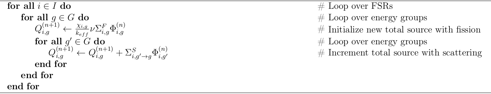

.. _eigenvalue_calculations:

=======================
Eigenvalue Calculations
=======================

An eigenvalue calculation, also referred to as a criticality calculation, is a
transport simulation wherein the source of neutrons includes a fissionable material. Some common eigenvalue calculations include the simulation of nuclear reactors, spent fuel pools, nuclear weapons, and other fissile systems. The reason they are called *eigenvalue* calculations is that the transport equation becomes an eigenvalue equation if a fissionable source is present since then the source of neutrons will depend on the flux of neutrons itself.

This section will explore the theory behind and implementation of eigenvalue
calculations in OpenMOC by outlining the algorithms used to iteratively solve the MOC equations for the eigenvalue :math:`k_{eff}` and eigenvector :math:`\Phi_{g,i} \;\; \forall \; g,i`.

.. _moc-iteration-scheme:

MOC Iteration Scheme
====================

The MOC algorithm for the OpenMOC code uses a nested iteration scheme to solve for the source and scalar flux. The inner iteration solves for an approximate scalar flux assuming a fixed source. The outer iteration computes an updated source based on the inner iteration's approximation to the flux that results from the fixed source. The remainder of this section develops the methodology for this nested iteration scheme.

First, define vectors of the scalar flux and source in each energy group and flat source region:

.. math::
   :label: vector-scalar-flux

   \mathbf{\Phi} = \left[\Phi_{1,1}, \Phi_{1,2}, ..., \Phi_{1,G}, \Phi_{2,1}, ..., \Phi_{I,G}\right]^T

.. math::
   :label: vector-source

   \mathbf{Q} = \left[Q_{1,1}, Q_{1,2}, ..., Q_{1,G}, Q_{2,1}, ..., Q_{I,G}\right]^T

The generalized eigenvalue equation in reactor physics criticality calculations is given by the following:

.. math::
   :label: generalized-eigenvalue-eqn

   \mathcal{M}\mathbf{\Phi} = \frac{1}{k_{eff}}\mathcal{F}\mathbf{\Phi}

The operator :math:`\mathcal{M}` can be split into two components: :math:`\mathcal{A}` to represent streaming and absorption and :math:`\mathcal{S}` to represent in-scattering of neutrons. Equation :eq:`generalized-eigenvalue-eqn` can now be expressed as follows:

.. math::
   :label: split-generalized-eigenvalue-eqn

   \left(\mathcal{A} - \mathcal{S}\right)\mathbf{\Phi} = \frac{1}{k_{eff}}\mathcal{F}\mathbf{\Phi}

This is rearranged such that the scattering component is on the right hand side:

.. math::
   :label: rearrange-generalized-eigenvalue-eqn

   \mathcal{A}\mathbf{\Phi} = \frac{1}{k_{eff}}\mathcal{F}\mathbf{\Phi} + \mathcal{S}\mathbf{\Phi}

The right hand side is recognized to be equivalent to the total neutron source :math:`\mathbf{Q}`:

.. math::
   :label: generalized-eigenvalue-source

   \mathcal{A}\mathbf{\Phi} = \mathbf{Q}

An iterative scheme can be applied to solve this equation, where :math:`n` is used to denote the outer iteration number. The outer iteration is used to compute the source based on the scalar flux approximation from the previous iteration:

.. math::
   :label: moc-source-iteration

   \mathbf{Q}^{(n+1)} = \frac{1}{k_{eff}^{(n)}}\mathbf{F}\mathbf{\Phi}^{(n)} + \mathcal{S}\mathbf{\Phi}^{(n)}

Next, an inner iteration applies the inverse operator :math:`\mathcal{A}^{-1}` to solve a fixed source problem for the flux resulting from the source :math:`\mathbf{Q}^{(n+1)}`:

.. math::
   :label: moc-flux-iteration

   \mathbf{\Phi}^{(n+1)} = \mathcal{A}^{-1}\mathbf{Q}^{(n+1)}

Finally, the ratio of the :math:`L_2` norm of the area-integrated fission source production to absorption and leakage (streaming) loss from iteration :math:`n` is used to compute the neutron multiplication factor for iteration :math:`n+1`:

.. math::
   :label: moc-keff-iteration

   k_{eff}^{(n+1)} = \frac{||\mathcal{F}\mathbf{\Phi}^{(n+1)}||_2}{||(\mathcal{A-S})\mathbf{\Phi}^{(n+1)}||_2}

These equations define the iterative MOC methodology applied in the OpenMOC code. :ref:`Section 3.2 <source-update-algorithm>` presents the source update algorithm used by the outer iteration to solve :eq:`moc-source-iteration`. :ref:`Section 3.3 <transport-sweep-algorithm>` presents OpenMOC's transport sweep algorithm used for the inner fixed source iteration defined by :eq:`moc-flux-iteration`.

.. _source-update-algorithm:

Source Update Algorithm
=======================

The outer iteration updates the source according to :eq:`moc-source-iteration` from the fixed source flux approximation computed by :eq:`moc-flux-iteration`. This process is methodically described by :ref:`Algorithm 1 <figure-source-update>`:

.. _figure-source-update:

   **Algorithm 1**: FSR source update.

.. _transport-sweep-algorithm:

Transport Sweep Algorithm
=========================

The inner iteration in OpenMOC solves the fixed source problem given in :eq:`moc-flux-iteration`. The fixed source flux is solved through the MOC formulation by integrating the angular flux across the geometry for each track. The OpenMOC solver implementation performs this integration to compute the scalar flux for each FSR in each group. By default, OpenMOC guesses a uniform incoming angular flux for each track, normalized to the total source:

.. math::
   :label: incoming-angular-flux

   \forall \; k, g, p \;\;\;\;\;\;\; \Psi_{k,g,p}^{(n+1)}(0) = \frac{1}{||\mathbf{Q}^{(n)}||_{2}}

A single inner iteration to compute :math:`\Phi_{g,i}` for all FSRs and energy groups will henceforth be termed a *transport sweep*. Each transport sweep integrates the flux (from the previous iteration) along each track for each energy group while tallying a new flux contribution to each flat source region. A single transport sweep involves five nested loops over azimuthal angles, tracks for each azimuthal angle, segments for each track, energy groups and polar angles. The sets of all azimuthal angles, tracks, track segments, FSRs, energy groups and polar angles are denoted by :math:`M`, :math:`K`, :math:`S`, :math:`I`, :math:`G` and :math:`P`, respectively. For notational simplicity, the subset of tracks for azimuthal angle :math:`m` is denoted by :math:`K(m)`, the subset of segments for track :math:`k` is given by :math:`S(k)`, and the FSR for segment :math:`s` is represented as :math:`I(s)`. The leakage tally for vacuum boundary conditions is designated as :math:`L`. A description of the OpenMOC solver's transport sweep is given by :ref:`Algorithm 2 <figure-transport-sweep-algorithm>`.

.. _figure-transport-sweep-algorithm:

   **Algorithm 2**: Transport sweep algorith.

:ref:`Figure 1 <figure-transport-sweep>` illustrates OpenMOC's sequential approach to sweeping across a sequence of 12 tracks for four azimuthal angles. It is noted that each track represents two azimuthal angles for both *forward* and *reverse* directions which necessarily halves the memory requirements for track storage.

.. _figure-transport-sweep:

   **Figure 1**: Track sweeping order in OpenMOC.

.. _source-convergence-criterion:

Source Convergence Criterion
============================

The spatial shape and energy distribution of the flux across FSRs are iteratively solved for by transport sweeps (:ref:`Algorithm 2 <figure-transport-sweep>`) and source updates (:ref:`Algorithm 2 <figure-source-update>`) until the total source for each FSR has converged. The default criterion used in OpenMOC for determining whether the source distribution has fully converged is given below:

.. math::
   :label: source-convergence-criterion

   res \;\; = \;\; \frac{1}{|G||I|}\sqrt{\displaystyle\sum\limits_{i=1}^{I}\displaystyle\sum\limits_{g=1}^{G}\left(\frac{Q_{i,g}^{(n+1)} - Q_{i,g}^{(n)}}{Q_{i,g}^{(n+1)}}\right)^{2}} \;\;\;\; < \;\;\;\; tol

The tolerance is generally assigned to the range :math:`tol = [10^{-6}, 10^{-4}]`. Other convergence criterion choices are to compute the residual with the scalar flux or with the fission source only instead. The overall iterative scheme with inner transport sweep iterations and outer source update iterations, including the source distribution convergence check, is outlined by :ref:`Algorithm 3 <figure-overall-iterative-scheme>`.

.. _figure-overall-iterative-scheme:

   **Algorithm 3**: Overal MOC iteration scheme.

.. _exponential-evaluation:

Exponential Evaluation Method
=============================

The algorithms described in this section require a number of floating point operations, including addition, subtraction, multiplication and division. The most expensive operation, however, is the exponential evaluation needed to compute :math:`e^{-\tau_{k,i,g,p}}`. All mainstream compilers provide a library with intrinsic mathematical routines, including an exponential evaluator. One method of avoiding the computational cost of explicitly evaluating exponentials is through the use of a linear interpolation table. A sequence of linear approximations to a simple exponential is illustrated in :ref:`Figure 2 <figure-exponential-tangent>`. In addition to reducing the flop count for an exponential evaluation, the table may be constructed to fit completely in :math:`L1` cache and as a result, can improve the memory performance of the MOC transport sweep algorithm.

#NOTE
The linear interpolation tables were first replaced by quadratic interpolation tables, and those are now superseded by rational fraction approximations, which are faster to compute and more accurate. See [Giudicelli-2019]_ for more details.

.. _figure-exponential-tangent:

   **Figure 2**: Linear interpolation of an exponential.

The OpenMOC code incorporates an option to evaluate exponentials using either the compiler's exponential intrinsic function or a linear interpolation table. The following expression for the maximum approximation error :math:`\epsilon` for the linear interpolation method was discussed and validated by [Yamamoto-2004]_:

.. math::
   :label: exponential-error

   \epsilon = \frac{1}{8}\frac{l^2}{N^2} + O\left(\frac{1}{N^2}\right) \approx \frac{1}{8}\frac{l^2}{N^2}

In this equation, :math:`l` represents the maximum argument (power) for the exponential and :math:`N` is the number of values in the interpolation table. With respect to the MOC algorithm, :math:`\tau_{max} = \displaystyle\max_{k,i,g}(\tau_{k,i,g}) = \displaystyle\max_{k,i,g}\left(\Sigma_{i,g}^Tl_{k,i}\right)`, where the segment length :math:`l_{k,i}` is kept in the 2D azimuthal plane for reasons that will follow.

The interpolation table is constructed as follows. First, :eq:`exponential-error` can be rearranged such that :math:`\epsilon` becomes a selectable parameter for the algorithm to achieve an arbitrarily small approximation error:

.. math::
   :label: exponential-num-values

   N = \frac{\tau_{max}}{\sqrt{8\epsilon}}

The argument to the exponential is then subdivided into :math:`N` intervals with equal spacing :math:`\Delta_{N}` in logarithmic space:

.. math::
   :label: exponential-spacing

   \Delta_{N} = \frac{\tau_{max}}{N}

The final step is to compute the slope :math:`q_{n}` and y-intercept :math:`b_{n}` for the linear approximation to the exponential for a polar angle :math:`\theta_{p}` within each interval :math:`n \in \{0, 1, 2, ..., N-1\}`:

.. math::
   :label: exponential-slope

   q_n = \frac{\mathrm{d}}{\mathrm{d}(\tau)}\exp\left(-\frac{\tau}{\sin\theta_p}\right)\bigg|_{\tau=(n+0.5)\Delta_{N}} = -\frac{\exp\left(-\frac{(n + 0.5)\Delta_{N}}{\sin\theta_p}\right)}{\sin\theta_{p}}

.. math::
   :label: exponential-intercept

   b_n = \exp\left(-\frac{(n+0.5)\Delta_{N}}{\sin\theta_{p}}\right)\left[1 + \frac{(n+0.5)\Delta_{N}}{\sin\theta_{p}}\right]

The exponential is computed at the midpoint of each interval, :math:`(n+0.5)\Delta_{N}`, to minimize the error in approximating the exponential for the values in the interval. OpenMOC modifies this process by computing array values for each polar angle quadrature point :math:`\theta_{p}` which results in a table with :math:`PN` values instead of just :math:`N`. The reason for this is cache efficiency: at each :math:`n \in \{1, 2, ..., N\}` the values for the exponential with argument :math:`(n+0.5)\Delta_{N}` at each polar angle are contiguously stored in the table. Since the innermost loop in the transport sweep (:ref:`Algorithm 2 <figure-transport-sweep-algorithm>`) is over polar angles, the exponential values for each polar angle in the table are pre-fetched and stored in the cache on the first iteration of the loop. Finally, since both a slope and a y-intercept must be stored for each point, the total size of the table is :math:`2PN`. The procedure to construct the linear interpolation table is outlined by :ref:`Algorithm 4 <figure-exponential-interpolation-table>`.

.. _figure-exponential-interpolation-table:

   **Algorithm 4**: Exponential linear interpolation table construction.

To compute a linear approximation to an exponential, the following procedure is applied in OpenMOC. First, an index into the table must be computed for a track :math:`k` with segment of length :math:`l_{k,i}` in FSR :math:`i` at energy group :math:`g` using the floor function:

.. math::
   :label: exponential-index

   n = 2P\lfloor\frac{\Sigma^T_{i,g}l_{k,i}}{\Delta_{N}}\rfloor

Next, the slope and y-intercept for polar angle :math:`p` are extracted from the table:

.. math::
   :label: exponential-slope-lookup

   q_{n,p} = t[n+2p]

.. math::
   :label: exponential-intercept-lookup

   b_{n,p} = t[n+2p+1]

Finally, the approximation to the exponential is computed using linear interpolation from table :math:`t` at polar angle :math:`p`,

.. math::
   :label: exponential-approx

   e^{-\tau_{k,i,g,p}} \;\; \approx \;\; q_{n,p}\tau_{k,i,g,p} - b_{n,p}

References
==========

.. [Giudicelli-2019] Giudicelli G., Forget B. and Smith K., Adding a third level of parallelism to OpenMOC, an open-source deterministic neutron transport solver, M&C 2019

.. [Yamamoto-2004] Yamamoto A., Kitamura Y. and Yamane Y., Computational efficiencies of approximated exponential functions for transport calculations of the characteristics method, Annals of Nuclear Energy, vol. 30, 2004

