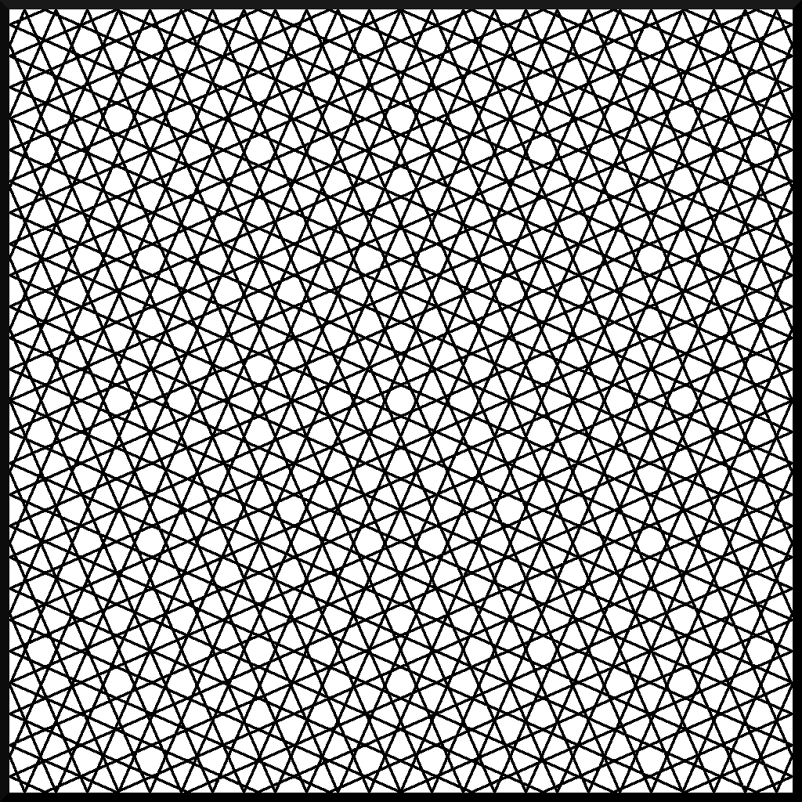
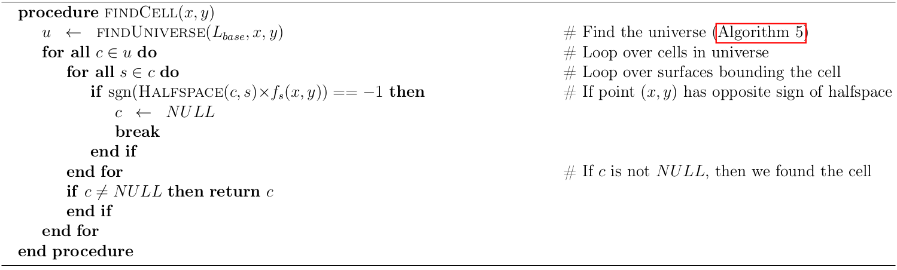

.. _track_generation:

================
Track Generation
================

The method of characteristics uses tracks across the geometry to discretize the azimuthal and polar angle domains as well as the spatial domain. The way in which an MOC code generates tracks affects the quadrature weights :math:`w_{p}`, :math:`w_{m}`, and :math:`w_{k}` used to compute the angular and spatial integrals in the transport equation. This section describes the methodology used to generate tracks in OpenMOC and the corresponding angular and spatial quadrature weights.

.. _cyclic-tracks:

Cyclic Tracks
=============

OpenMOC uses *global tracking* such that each track spans the entire extent of the simulation domain. By symmetry, tracks only need to be represented for azimuthal angles in the range :math:`\phi \in [0, \pi]` since a track with angle :math:`\phi` will have the same start and end points as a track with angle :math:`\phi + \pi`. *Complementary angles* are pairs of angles :math:`(\phi, \alpha)` in the azimuthal quadrature where :math:`\alpha = \pi - \phi`. Tracks for complementary angles have a *track spacing* such that they intersect at the boundaries of the geometry and form closed cycles. An illustration of OpenMOC's track layout for eight azimuthal angles is given in :ref:`Figure 1 <figure-cyclic-tracks>`.

.. _figure-cyclic-tracks:

   **Figure 1**: Global cyclic tracks across a square.

Cyclic tracking is important since it allows for a simple treatment of reflective boundary conditions. Boundary conditions must be respected for the track outgoing fluxes at each iteration. Vacuum boundary conditions on a surface can be implemented for the MOC formulation by ensuring that each track originating along that surface has zero incoming flux, while tallying outgoing flux as leakage. Reflective boundary conditions are easily implemented since complementary angles guarantee that tracks wrap around the geometry in closed cycles. No approximations need to be made for each track's incoming flux since it is exactly the outgoing flux of another track in the cycle.

The key parameters necessary for track generation in an OpenMOC simulation are the number of azimuthal angles :math:`n_{a}`, the spacing between tracks :math:`t_{s}`, and the total width and height of the geometry, :math:`w` and :math:`h`, respectively. OpenMOC computes the appropriate azimuthal angles to form cyclic tracks prior to track generation and ray tracing. The algorithm used by OpenMOC attempts to divide up the azimuthal space :math:`\phi \in [0, 2\pi]` as evenly as possible. In particular, for index :math:`m \in \{1, 2, ..., M\}`, the desired azimuthal angle :math:`\phi_{m}` is the following:

.. math::
   :label: desired-azim-angle

   \phi_{m} = \frac{2\pi}{n_{a}}(m - 0.5)

This angle is then used to compute the number of tracks :math:`n_{y}` and :math:`n_{x}` for angle :math:`m` originating from the left and bottom boundaries of the geometry using the floor function:

.. math::
   :label: num-tracks-bottom

   n_{y} = \left\lfloor\frac{w}{t_{s}}|\sin\phi_{m}|\right\rfloor + 1

.. math::
   :label: num-tracks-left

   n_{x} = \left\lfloor{\frac{h}{t_{s}}|\cos\phi_{m}|}\right\rfloor + 1

Given :math:`n_{y}` and :math:`n_{x}`, an *effective angle* :math:`\phi_{m,eff}` is computed as a correction to the desired azimuthal angle :math:`\phi_{m}` to ensure cyclic track wrapping:

.. math::
   :label: effective-azim-angle

   \phi_{m,eff} = \tan^{-1}\left(\frac{hn_{x}}{wn_{y}}\right)

Although OpenMOC will abide by a user's request for the number of azimuthal angles, an *effective spacing* :math:`t_{s,m,eff}` must be computed and used instead of that specified by the user in order for the tracks wrap around the geometry. The effective spacing is unique for each azimuthal angle :math:`m`, and is computed as follows:

.. math::
   :label: effective-spacing

   t_{s,m,eff} = \frac{w}{n_{x}}\sin\phi_{m,eff}

The reader should note that this method for computing the effective track spacing in OpenMOC ensures that the following condition is always true:

.. math::
   :label: effective-spacing-criterion

   t_{s,m,eff} \;\;\; \le \;\;\; t_{s}

.. _modular_ray_tracing:

Modular Ray Tracing
===================

For domain decomposed situations, all domains have the same shape and are treated independently by the track generator. By cutting ray tracing into similar modules, tracks naturally line up between neighboring domains. Track fluxes are then transferred naturally during the transport sweep from one domain to another along each track. :ref:`Figure 2 <modular_rt>` illustrates this.

.. _modular_rt:

.. figure:: ../../img/ray-tracing-2d_periodic_track_cycles.png
   :align: center
   :figclass: align-center
   :width: 600px

   **Figure 2**: Modular ray tracing in the four domains ensures the track line up at each boundary

.. _azimuthal-angle-quadrature:

Azimuthal Angle Quadrature
==========================

OpenMOC uses a product quadrature set that uncouples the azimuthal angle quadrature from the polar angle quadrature. The azimuthal angle quadrature set is computed based on the fraction of azimuthal angular space "owned" by each azimuthal angle. In this section, the variable transformation :math:`\phi_{m} \gets \phi_{m,eff}` has been made such that the effective azimuthal angle is used throughout. The azimuthal angle quadrature weight specification is given in :eq:`azimuthal-quadrature-1`, :eq:`azimuthal-quadrature-2`, and :eq:`azimuthal-quadrature-3`.

.. math::
   :label: azimuthal-quadrature-1

   w_{m} = \frac{1}{2\pi}\left[\frac{\phi_{m+1} - \phi_{m}}{2} + \phi_{m}\right] & \;\; \text{if} \;\;\; m = 1

.. math::
   :label: azimuthal-quadrature-2

   w_{m} = \frac{1}{2\pi}\left[\frac{\phi_{m+1} - \phi_{m}}{2} + \frac{\phi_{m} - \phi_{m-1}}{2}\right] & \;\; \text{if} \;\;\; 1 < m < M

.. math::
   :label: azimuthal-quadrature-3

   w_{m} = \frac{1}{2\pi}\left[2\pi - \phi_{m} + \frac{\phi_{m} - \phi_{m-1}}{2}\right] & \;\; \text{if} \;\;\; m = M

.. _polar-angle-quadrature:

Polar Angle Quadrature
======================

In OpenMOC, there are five polar quadrature sets that couple with the standard constant-angle azimuthal quadrature set. These include equal angles, equal weights, Gauss Legendre, Leonard, and Tabuchi Yamamoto polar quadrature sets. The formulas for computing the angles and weights of the equal angles and equal weights quadrature sets, given below, are described in the Handbook of Nuclear Engineering [Cacuci]_. The angles and weights for the Gauss Legendre, Leonard, and Tabuchi Yamamoto quadrature sets were taken from reference without modification [Yamamoto]_, [Cacuci]_.

For the equal angles and equal weights quadrature sets, the user inputs the number of polar angles in :math:`[0,\frac{\pi}{2}]`, P, and then the angles and corresponding weights are computed. The relations for computing the angles, :math:`\theta_p`, and corresponding weights are given as equations :eq:`equal-angles-quad-1`, :eq:`equal-angles-quad-2`, and :eq:`equal-angles-quad-3`. The angle boundaries used to compute the angles and weights start at :math:`\bar{\theta}_p = 0`.

.. math::
   :label: equal-angles-quad-1

   \bar{\theta}_p = \bar{\theta}_{p-1} + \frac{\pi}{2 \cdot P}

.. math::
   :label: equal-angles-quad-2

   \theta_p = cos^{-1} \bigg\{ \frac{1}{2} \Big[ cos \big(\bar{\theta}_p\big) + cos \big(\bar{\theta}_{p-1}\big) \Big] \bigg\}

.. math::
   :label: equal-angles-quad-3

   w_p = cos \big(\theta_{p-1}\big) - cos \big(\theta_p\big)

The equations for the equal weights quadrature set are the same as the equations for the equal angles quadrature set, except for the recursion relation for the angle boundaries, which is given in :eq:`equal-weights-quad-1`. The angle boundaries also start at :math:`\bar{\theta}_p = 0`.

.. math::
   :label: equal-weights-quad-1

   \bar{\theta}_p = cos^{-1} \bigg\{ cos \big(\bar{\theta}_{p-1}\big) - \frac{1}{P} \bigg\}

Users can also input a custom polar quadrature set by manually setting the weights and sines of the polar angles. The quadrature recommended by [Yamamoto]_ is used by default for the polar angles and weights in OpenMOC. Example code on how to instantiate the different polar quadrature objects is provided in the :ref:`Users Guide <usersguide>`.

.. _spatial-quadrature:

Spatial Quadrature
==================

Track segments are used to approximate the area integral across each flat source region. In particular, the effective track spacing :math:`t_{s,m,eff}` defines the quadrature weights used in the spatial integral in the transport equation.

.. math::
   :label:

   \forall \; m \in \{1, ..., M\} \;\;,\;\; \forall \; k \in K(m) \;\;\;\; w_{k} = t_{s,m,eff}

.. _ray-tracing:

Ray Tracing
===========

Ray tracing is a technique for computing the intersection points of trajectories with surfaces. The image processing and graphics communities have been the primary users and developers of ray tracing techniques over the years, and a subset of these algorithms have been applied to neutron transport. In the case of the method of characteristics, ray tracing is used to intersect characteristic tracks with the surfaces used to make up a model. In particular, ray tracing is used to compute the length :math:`l_{k,i}` of a segment for track :math:`k` across each flat source region :math:`i`.

The primary computation in ray tracing for MOC is to take a track segment's starting location :math:`(x,y)` and direction vector :math:`\hat{u}` and compute the distance that the track spans across a given cell. The *track segmentation* process repeatedly performs this computation for each track from its start to end point on the boundaries of the geometry. There are four primary operations that one must be able to perform to ray trace a track across the geometry:

* Determine which universe the starting point :math:`(x,y)` resides in
* Determine which cell the starting point :math:`(x,y)` resides in
* Determine the distance to the nearest surface in the cell
* Determine the intersection point with the nearest surface

The following four sections describe each of the algorithms used to perform each of these four ray tracing operations in OpenMOC.

.. _universe-finding-algorithm:

--------------------------
Universe-Finding Algorithm
--------------------------

The first algorithm needed for track segmentation is the ability to find the universe corresponding to a given location :math:`(x,y)`. The universe-finding algorithm used in OpenMOC is described in :ref:`Algorithm 1 <algorithm-find-universe>`. This algorithm requires the location :math:`(x,y)` input along with the outermost lattice :math:`L` in the model. The algorithm computes the lattice cell in which :math:`(x,y)` resides and either returns the universe filling that lattice cell, or recursively calls itself using the lattice filling the lattice cell. In the latter case, the coordinates of the location :math:`(x,y)` must first be translated to the *local coordinate system* within the lattice cell, as reflected in :ref:`Algorithm 1 <algorithm-find-universe>`. The algorithm completes by returning the universe along with the coordinates of the location within the universe's local coordinate system.

.. _algorithm-find-universe:

   **Algorithm 1**: Universe-finding algorithm.

:ref:`Figure 3 <figure-nested-lattice-coordinates>` illustrates one possible model with two *nested lattices* and the local coordinate transformations made using this algorithm. Here, :math:`n_{x}` and :math:`n_{y}` represent the number of lattice cells along the :math:`x` and :math:`y` axes, while :math:`h` and :math:`w` represent the total height and width of the lattice, respectively. Numerical subscripts are used to identify the appropriate lattice level.

.. _figure-nested-lattice-coordinates:

   **Figure 3**: Local coordinates within nested lattices.

The reader should note that this algorithm assumes that :math:`(x,y)` is within the bounds of the lattice. In practice, a significant amount of error checking is involved to ensure that this algorithm is robust to user input as well as floating point roundoff errors from the coordinate transformations at each recursive call.

.. _cell-finding-algorithm:

----------------------
Cell-Finding Algorithm
----------------------

The second algorithm needed for track segmentation is the ability to find the cell corresponding to a given location :math:`(x,y)`. The cell-finding algorithm is described in :ref:`Algorithm 2 <algorithm-find-cell>`. The algorithm first finds the universe :math:`u` in which :math:`(x,y)` resides using :ref:`Algorithm 1 <algorithm-find-universe>`. Next, the algorithm loops over all cells in the universe :math:`c \in u`. For each cell :math:`c`, the algorithm iterates over each surface :math:`s \in c` and multiplies the halfspace of the surface in the cell :math:`Hf(c,s) = \pm 1` with the potential function evaluated at the point of interest :math:`f_{s}(x,y)`. There are three possible outcomes from this computation:

.. math::
   :label: halfspace-evaluation-1

   sgn(Hf(c,s) \times f_{s}(x,y)) = +1 & \; \Rightarrow \;\; \text{$(x,y)$ is in the halfspace}

.. math::
   :label: halfspace-evaluation-2

   sgn(Hf(c,s) \times f_{s}(x,y)) = 0 & \; \Rightarrow \;\; \text{$(x,y)$ is on the surface}

.. math::
   :label: halfspace-evaluation-3

   sgn(Hf(c,s) \times f_{s}(x,y)) = -1 & \; \Rightarrow \;\; \text{$(x,y)$ is in the opposite halfspace}

For simplicity, the assumption is made that the point :math:`(x,y)` is not on any surface in the geometry, or more formally, :math:`\forall \; s \;\; f_{s}(x,y) \neq 0`. If any cell is found in which the potential evaluated at :math:`(x,y)` and the halfspace of the corresponding surface each have the same sign for all surfaces in the cell, then the point :math:`(x,y)` uniquely resides in the cell and it is returned by the algorithm.

The reader should note that :math:`L_{base}` in the following algorithm refers to the base lattice or universe that is used to encapsulate the outermost level of the geometry.

.. _algorithm-find-cell:

   **Algorithm 2**: Cell-finding algorithm.

.. _surface-distance-algorithm:

-------------------------------------
Distance-to-Nearest Surface Algorithm
-------------------------------------

The third algorithm that is needed for ray tracing is used to find the distance to the nearest surface to :math:`(x,y)` along the trajectory vector :math:`\hat{n}`. This algorithm builds upon each of the previous two as it only evaluates surfaces bounding the cell in which :math:`(x,y)` resides.

The distance-to-nearest surface algorithm is described in :ref:`Algorithm 3 <algorithm-minimum-surface-distance>`. The algorithm simply iterates over each surface :math:`s` in the cell :math:`c` and solves for the distance(s) to the surface. The algorithm keeps track of the minimum distance :math:`d_{min}` it has evaluated to a surface at each step and returns the final value after iterating through all of the surfaces.

.. _algorithm-minimum-surface-distance:

   **Algorithm 3**: Minimum surface distance algorithm.

.. _next-intersection-point-algorithm:

---------------------------------
Next Intersection Point Algorithm
---------------------------------

The final algorithm needed for ray tracing is to compute the intersection point of a point :math:`(x,y)` along a trajectory vector :math:`\hat{u}` with the nearest surface. The preceding algorithm is used to compute the parametrized distance to the intersection. This algorithm simply adds the parametrized distance multiplied by the trajectory vector to :math:`(x,y)` as described in :ref:`Algorithm 4 <algorithm-next-intersection-point>`.

.. _algorithm-next-intersection-point:

   **Algorithm 4**: Find nearest surface intersection point algorithm.

.. _track-segmentation:

----------------------------
Track Segmentation Algorithm
----------------------------

Each of the preceding algorithms collectively define all of the logic that is necessary for ray tracing in the constructive solid geometry formulation. :ref:`Algorithm 5 <algorithm-ray-tracing>` defines the complete process of track segmentation for each track in the geometry. The algorithm defines a nested loop over all azimuthal angles :math:`m` and tracks :math:`k`. For each track, the algorithm begins with the track starting location and trajectory vector and ray traces across the geometry by computing intersection points with each surface along the trajectory's path. At each step, the length of each track segment in each cell (FSR) is computed and a pair of the segment length :math:`l_{k,i}` and flat source region index :math:`i` is appended to an ordered list of track segments within the track.

This algorithm relies upon the use of a small numerical parameter :math:`\epsilon` which is typically chosen to be :math:`10^{-6}` for single precision and :math:`10^{-12}` for double precision floating point numbers. This parameter allows the end point for each track segment to be perturbed slightly to force it to lie within the adjacent cell in order to meet the assumption that no point lies directly on a surface (declared in order for :ref:`Algorithm 5 <algorithm-find-cell>` to perform properly).

.. _algorithm-ray-tracing:

   **Algorithm 5**: Track segmentation algorithm.

.. _otf-ray-tracing:

On-The-Fly Ray Tracing
======================

Most MOC solvers generate tracks & segments, save them in memory, then solve the MOC equations over the segments. For 3D simulations, the memory cost would be prohibitive. OpenMOC proposes two On-The-Fly approaches to 3D track generation. 3D tracks are generated from a corresponding 2D track as show in :ref:`Figure 4<OTF_RT>`. Only the segment information from the 2D track and the index of the 3D track is required to generate the 3D track on-the-fly and find its intersections with the geometry to form segments. One approach generates a full 3D track, which crosses the entire geometry, then solves the MOC equations along it, and the other generates a full 3D stack of tracks before solving the MOC equations.

Stacked tracks can be generated when the geometry is axially extruded, which means that all cell surfaces are either parallel or perpendicular to the Z-direction. This particular configuration simplifies ray tracing, allowing for increased performance.

.. _OTF_RT:

.. figure:: ../../img/ray-tracing-3d-track_cycles.png
   :align: center
   :figclass: align-center
   :width: 400px

   **Figure 4**: 3D tracks generated from a 2D track

More details on On-The-Fly ray tracing can be found in `G. Gunow PhD Thesis`_.

References
==========

.. [Cacuci] D. Cacuci, et. al. "Handbook of Nuclear Engineering" *Springer Science+Business Media*, New York, NY, pp. 1111-1113 (2010).

.. [G. Gunow PhD Thesis] G. Gunow "Full Core 3D Neutron Transport Simulation Using the Method of Characteristics with Linear Sources", PhD Thesis, Massachusetts Institute of Technology (2018).
