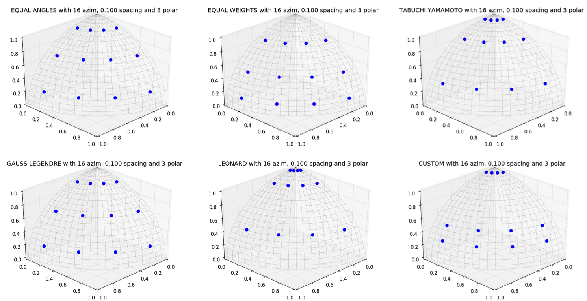

.. _usersguide_input:

==========================
Writing Python Input Files
==========================

OpenMOC is provided to users as a Python API. As a result, there are not strict constraints on how an input file is written for an OpenMOC simulation as there are in many other scientific simulation codes. Instead, users may write a Python script or program and import OpenMOC and simply use the classes or routines which are necessary for a particular simulation. The :file:`OpenMOC/sample-input/` directory in the OpenMOC folder includes many example scripts for simulations ranging in complexity from a simple `pin cell`_ to the `C5G7 benchmark problem`_.

The following sections describe the essential portions of the OpenMOC API needed for reactor eigenvalue calculations. For more detail on the full extent of OpenMOC capabilities, users should reference the :ref:`OpenMOC API documentation <api>`.

.. note:: It is highly suggested that users acquire a basic understanding of Python before developing OpenMOC simulations. For users familiar with basic programming constructs such as loops and conditionals, the official `Python Tutorial`_ is an excellent place to learn Python basics. For users new to programming, the `Code Academy Python Course`_ provides an introduction to both programming essentials and the Python language.

.. _simulation_params:

---------------------
Simulation Parameters
---------------------

The full power of Python is available to users designing OpenMOC simulations. As a result, simulation parameters may easily be defined and redefined in a Python script for one or more simulations at a user's discretion. However, some simulation parameters are best defined at runtime, including the number of azimuthal angles, azimuthal track spacing, number of threads, etc.

The ``openmoc.options`` module provides functionality to parse arguments defined on the command line at runtime. The full list of options available in OpenMOC are itemized and described in :ref:`Runtime Options <runtime_options>`. The following code snippet illutrates how to instantiate an ``Options`` object and extract data from command line arguments. Domain decomposition is specified with the Geometry class.

.. code-block:: python

    import openmoc.options

    # Instantiate and Options object
    options = openmoc.options.Options()

    # Retrieve runtime options parsed in by the Options object
    num_threads = options.num_omp_threads
    azim_spacing = options.azim_spacing
    num_azim = options.num_azim
    tolerance = options.tolerance
    max_iters = options.max_iters
    ...

:ref:`Table 1 <table_log_levels>` below itemizes each of the runtime options and the corresponding command line arguments and Options class property attributes in the ``openmoc.options`` module.

.. _table_runtime_options:

=============================  =============================================  ======================================================
Runtime Option                 Command Line Argument                          Options Class Property Attribute
=============================  =============================================  ======================================================
Help                           :option:`-h`, :option:`--help`                 N/A
No. Azimuthal Angles           :option:`-a`, :option:`--num-azim=`            num_azim
Track Spacing [cm]             :option:`-s`, :option:`--azim-spacing=`        azim_spacing
No. Polar Angles (3D)          :option:`-p`, :option:`--num-polar=`           num_polar
Track Axial Spacing [cm] (3D)  :option:`-l`, :option:`--z-spacing=`           z_spacing
Max. No. Transport Sweeps      :option:`-i`, :option:`--max-iters=`           max_iters
Convergence Tolerance          :option:`-c`, :option:`--tolerance=`           tolerance
No. OpenMP Threads             :option:`-t`, :option:`--num-omp-threads=`     num_omp_threads
No. CUDA Thread Blocks         :option:`-b`, :option:`--num-thread-blocks=`   num_thread_blocks
No. CUDA Threads per Block     :option:`-g`, :option:`--num-gpu-threads=`     num_threads_per_block
=============================  =============================================  ======================================================

**Table 1**: Runtime options and command line arguments supported by the ``openmoc.options`` module.

--------------------
Simulation Log Files
--------------------

The ``openmoc.log`` module provides routines for printing output to the console as well as to log files. Output is reported in real-time to the console as well as stored in a persistent log file. By default, the log file name encapsulates a timestamp for the simulation starting time and is stored in the ``/OpenMOC/log`` directory (*e.g.*, :file:`OpenMOC/log/openmoc-MM-DD-YYYY--HH:MM:SS.log`).

The OpenMOC logging module uses **verbosity throttling** which allows for coarse-grained control of the type and amount of messages reported to the user at runtime. Each message is designated a **log level**, and each level is prioritized with respect to other levels. At runtime, a log level is specified for a simulation and only those messages designated at that log level or a higher priority log level are printed to the console and log file. The log levels available in OpenMOC are presented in :ref:`Table 2 <table_log_levels>`.

.. _table_log_levels:

===================   =======================================================
Log Level             Note
===================   =======================================================
:envvar:`DEBUG`       A debugging message
:envvar:`INFO`        An informational but verbose message
:envvar:`NORMAL`      A brief progress update on run progress
:envvar:`SEPARATOR`   A message of a single line of characters
:envvar:`HEADER`      A message centered within a single line of characters
:envvar:`TITLE`       A message between two lines of characters
:envvar:`WARNING`     A message to warn the user
:envvar:`CRITICAL`    A message to warn of critical program conditions
:envvar:`RESULT`      A message containing program results
:envvar:`ERROR`       A message reporting error conditions
===================   =======================================================

**Table 2**: Log levels in OpenMOC in order of increasing precedence.

Informative messages using the logging module are embedded into both the C/C++ and Python source code in OpenMOC. In addition, code users may add their own messages to the output stream in Python input files. The API documentation provides a detailed accounting of the routines available in the `logging module`_.

The following code snippet illustrates how to import the logging module into Python, set the lowest log level to :envvar:`DEBUG`, and print messages for each level to the screen.

.. code-block:: python

    import openmoc.log as log

    # Set the lowest acceptable log level to DEBUG mode
    log.set_log_level('DEBUG')

    # Print some exaple messages to the console and log file
    log.py_printf('DEBUG', 'This is a DEBUG message')
    log.py_printf('INFO', 'This is an INFO message')
    log.py_printf('NORMAL', 'This is a NORMAL message')
    log.py_printf('SEPARATOR', 'This is a SEPARATOR message')
    log.py_printf('HEADER', 'This is a HEADER message')
    log.py_printf('TITLE', 'This is a TITLE message')
    log.py_printf('WARNING', 'This is a WARNING message')
    log.py_printf('CRITICAL', 'This is a CRITICAL message')
    log.py_printf('ERROR', 'This is an ERROR message')

And the following is the output displayed to the console and recorded in the log file::

  [  DEBUG  ]  This is a DEBUG message
  [  INFO   ]  This is an INFO message
  [  NORMAL ]  This is a NORMAL message
  [SEPARATOR]  *******************************************************************
  [  HEADER ]  *******************  This is a HEADER message  ********************
  [  TITLE  ]  *******************************************************************
  [  TITLE  ]                        This is a TITLE message
  [  TITLE  ]  *******************************************************************
  [ WARNING ]  This is a WARNING message
  [ CRITICAL]  This is a CRITICAL message
  [  ERROR  ]  This is an ERROR message

It should be noted that the ``py_printf(...)`` routine in the logging module is based on the printf_ routine in C/C++ and accepts a variable number of arguments. In particular, this is intended to accept `formatted data`_ to embed formatted integers, floats, strings, etc. in the output message. An example of this feature in use is given below:

.. code-block:: python

    import openmoc.log as log

    # Set the lowest acceptable log level to NORMAL mode
    log.set_log_level('NORMAL')

    # Initialize some string, integer and float variables
    name = 'Will Boyd'
    age = 26
    pi = 3.141593

    # Print example messages using formatted output arguments
    # to the console and log file
    log.py_printf('NORMAL', 'Hello World! My name is %s', name)
    log.py_printf('NORMAL', 'I am %d years old. My favorite # is %f', age, pi)

This will result in the following output messages to be printed to the console and stored to the log file::

  [  NORMAL ]  Hello World! My name is Will Boyd
  [  NORMAL ]  I am 26 years old. My favorite # is 3.141593

.. note:: By default, the logging module will split log messages into multiple lines of 80 characters or less each. Users may alternatively set a custom maximum line length for log messages may at runtime using the ``set_line_length(...)`` routine.

-----------------------------------------------------------
Specifying Materials and Geometry with OpenMC's MGXS module
-----------------------------------------------------------

OpenMOC uses multi-group macroscopic nuclear cross sections. There are multiple ways to obtain those when one knows the material composition of a nuclear system, and most are complex, they involve taking into account resonance and spatial self shielding effects, Dancoff effects and others. OpenMOC currently does not provide pre-made scripts for this purpose. Instead, if a user only knows materials isotopic concentrations, they can use OpenMC to generate the macroscopic cross sections. OpenMC's MGXS module seamlessly creates the required tallies, and after an OpenMC simulation, allows to transfer the Materials, their cross sections, and the Geometry if required.

The users should refer themselves to `OpenMC's user manual`_ to create the OpenMC inputs. An example of how to transfer a multi-group cross section library and geometry from OpenMC to OpenMOC is also available in that documentation. The advantages, techniques and remaining approximations of generating cross sections this way are summarized in `[Boyd 2019]`_ and `[Boyd 2019-2]`_.

-------------------------------
OpenMOC Materials Specification
-------------------------------

Alternatively, users can provide cross sections to OpenMOC directly through Python.

OpenMOC uses multi-group macroscopic nuclear cross sections, provided by the user. OpenMOC does not perform self-shielding or depletion calculations, so isotopic concentrations are not used. In OpenMOC, cross section data is encapsulated by the ``Material`` class in the main ``openmoc`` Python module. A ``Material`` class may be instantiated in Python and cross sections may be loaded into it using NumPy_ data arrays as illustrated by the following code snippet:

.. code-block:: python

   import openmoc
   import numpy

   # Initialize material cross sections using NumPy data arrays
   num_groups = 8
   sigma_t = numpy.array([0.1,0.15,0.2,0.25,0.35,0.4,0.45,0.5])
   sigma_f = numpy.array([0.05,0.1,0.15,0.2,0.25,0.3,0.35,0.4])
   ...

   # Instantiate an OpenMOC Material class object with an optional string name
   material = openmoc.Material(name='test material')

   # Set the number of energy groups in the material
   material.setNumEnergyGroups(num_groups)

   # Load the cross section data into the material
   material.setSigmaT(sigma_t)
   material.setSigmaF(sigma_f)
   ...

For many simulations, defining the nuclear data cross sections by hand in a Python script is cumbersome and error-prone. As a result, OpenMOC includes the ``openmoc.materialize`` module for importing nuclear data cross sections from an HDF5_ binary file. The ``load_from_hdf5(...)`` routine is used to import data and instantiate ``Material`` objects returned via a Python dictionary_. The use of the ``openmoc.materialize`` module to import HDF5 binary files is illustrated in the following snippet:

.. code-block:: python

    import openmoc
    import openmoc.materialize as materialize

    # Import cross section data from an HDF5 file. This instantiates
    # objects for each material and returns them in a dictionary
    # indexed by a string name or integer ID
    hdf5_materials = materialize.load_from_hdf5(filename='materials-data.h5',
                                                directory='/home/myuser')

    # Retrieve the material called 'moderator' in the HDF5 file
    moderator = hdf5_materials['moderator']

The ``openmoc.materialize`` module defines a standard for cross section data stored in binary files. First, HDF5 files must include a ``'# groups'`` attribute with the integer number of groups in the top level of the file hierarchy. Second, the string domain type - ``'material'`` or ``'cell'`` - must be specified in the top level of the file hierarchy. This must match the ``domain_type`` keyword argument passed to ``load_from_hdf5(...)`` which can be either ``'material'`` (default) or ``'cell'``. The ``domain_type`` keyword argument is discussed in more detail at the end of this section. Finally, multi-group cross sections to assign by material or cell must be defined as an `HDF5 group`_ with a string name or integer ID to identify the material or cell. The material group must contain the following floating point `HDF5 datasets`_ of multi-group cross section data:

  - ``'total'`` or ``'transport'`` or ``'nu-transport'``
  - ``'nu-scatter matrix'`` or ``'scatter matrix'``
  - ``'chi'``
  - ``'nu-fission'``
  - ``'fission'`` (optional)

Each dataset should be a 1D array of floating point values ordered by increasing energy group (*i.e.*, from highest to lowest energies). This includes the scattering matrix which should be inner strided by outgoing energy group and outer strided by incoming energy group.

To better understand the necessary HDF file structure, it may be useful to visualize the ``OpenMOC/sample-input/c5g7-mgxs.h5`` HDF5 file using the HDFView_ graphical tool. The following code snippet illustrates the use of the h5py_ Python HDF5 interface to write an HDF5 file with material cross section data adhering to the standard expected by the ``openmoc.materialize`` module:

.. code-block:: python

   import numpy
   import h5py

   # Create an HDF5 file to store multi-groups cross sections
   f = h5py.File('materials-data.h5')

   # Set the number of energy groups
   f.attrs['# groups'] = 8

   # Material 1

   # Create an HDF5 group for this material
   material_group = f.create_group('Material 1')

   # Initialize cross sections as NumPy data arrays
   sigma_t = numpy.array([0.1,0.15,0.2,0.25,0.35,0.4,0.45,0.5])
   nu_sigma_f = numpy.array([0.05,0.1,0.15,0.2,0.25,0.3,0.35,0.4])
   ...

   # Create datasets for each cross section type
   material_group.create_dataset('total', data=sigma_t)
   material_group.create_dataset('nu-fission', data=nu_sigma_f)
   ...

   # Material 2
   ...

   # Close and save the HDF5 file
   f.close()

Lastly, the ``'domain_type'`` parameter may be specified in conjuction with the optional ``geometry`` keyword argument. The ``load_from_hdf5(...)`` routine may be used to load multi-group cross sections directly into a pre-existing OpenMOC ``Geometry`` constructed with ``Materials`` with the same string names *or* integer IDs used as keys in the HDF5 binary file. Likewise, the ``load_from_hdf5(...)`` routine may be used to load multi-group cross sections directly into a pre-existing OpenMOC ``Geometry`` constructed with ``Cells`` with the same string names *or* integer IDs used as keys in the HDF5 binary file. The latter case may be useful when multiple ``Cells`` share the same ``Materials``. This is illustrated with the following code snippet:

.. code-block:: python

    import openmoc
    import openmoc.materialize as materialize

    # Build an OpenMOC Geommetry with Materials, Surfaces, Cells, etc.
    # The Cells must have the same IDs as those used in the HDF5 file
    ...
    geometry = openmoc.Geometry()
    ...

    # Import cross section data from an HDF5 file. This instantiates
    # objects for each material and returns them in a dictionary
    # indexed by a string name or integer ID
    hdf5_materials = materialize.load_from_hdf5(filename='materials-data.h5',
                                                directory='/home/myuser',
						domain_type='cell',
						geometry=geometry)

In this case there is no need to assign the ``Materials`` in the ``hdf5_materials`` dictionary to ``Cells`` since they are already incorporated into the ``Geometry``.

.. note:: If datasets for both ``'transport'`` and ``'total'`` are defined for a material in the HDF5 file, ``openmoc.materialize`` will give precedence to the ``'transport'`` dataset and assign it as the total multi-group cross section.

.. note:: If datasets for both ``'nu-scatter matrix'`` and ``'scatter matrix'`` are defined for a material in the HDF5 file, ``openmoc.materialize`` will give precedence to the ``'nu-scatter matrix'`` dataset and assign it as the multi-group scattering matrix cross section.

.. note:: Users should note that OpenMOC will assign a minimum value of 1E-10 to all total cross sections assigned to a ``Material`` object. This prevents numerical divide-by-zero issues in the ``Solver``, and is a useful sanity check when modeling (nearly) void regions - *e.g.*, a fuel pin cell "gap."

------------------------------
OpenMOC Geometry Specification
------------------------------

The geometry in OpenMOC is described using constructive solid geometry (CSG_),
also sometimes referred to as combinatorial geometry. CSG allows a user to
create complex objects using Boolean operators on a set of simpler surfaces. In
the geometry model, each unique closed volume is defined by its bounding
surfaces. The CSG formulation used in OpenMOC is described in more detail in :ref:`Constructive Solid Geometry <constructive_solid_geometry>`.

The following sections detail how to create surfaces, cells, universes and lattices to construct a simple 4 :math:`\times` 4 pin cell lattice.

Surfaces
--------

In most cases, the first step towards building a reactor geometry is to create the surfaces defining boundaries between distinct regions. The CSG formulation for surfaces in OpenMOC is described in detail in :ref:`Surfaces and Halfspaces <surfaces-halfspaces>`. For LWRs, the most typical surfaces needed to model 2D rectangular lattices are the ``ZCylinder``, ``XPlane``, and ``YPlane`` classes. The following code snippet illustrates how to create a circle to represent a fuel pin and reflective boundary planes to surround a 4 :math:`\times` 4 lattice.

.. code-block:: python

    # Initialize circular fuel pin surface with an optional string name
    circle = openmoc.ZCylinder(x=0.0, y=0.0, radius=0.45, name='fuel radius')

    # Initialize the planar surfaces bounding the entire geometry
    # with optional string names
    left = openmoc.XPlane(x=-2.52, name='left')
    right = openmoc.XPlane(x=2.52, name='right')
    bottom = openmoc.YPlane(y=-2.52, name='bottom')
    top = openmoc.YPlane(y=2.52, name='top')

    # Set the boundary conditions for the bounding planes
    left.setBoundaryType(openmoc.REFLECTIVE)
    right.setBoundaryType(openmoc.REFLECTIVE)
    bottom.setBoundaryType(openmoc.REFLECTIVE)
    top.setBoundaryType(openmoc.REFLECTIVE)

Regions
-------

Surfaces may be combined into complex spatial regions represented by the abstract ``Region`` class. The ``Halfspace`` is the simplest ``Region`` subclass, and is designed to represent a single side of a ``Surface``. The ``Region``'s ``Union``, ``Intersection`` and ``Complement`` subclasses represent union and intersection boolean operations between one or more ``Region`` "nodes", including ``Halfspace`` objects. The ``Complement`` class represents a unary operation with a single ``Region`` object. The ``Union``, ``Intersection`` and ``Complement`` classes can be arbitrarily and recursively constructed from the fundamental ``Halfspace`` objects which serve as "building blocks" for more complicated structures. The following code snippet illustrates the assembly of regions to represent the moderator and fuel for a simple LWR fuel pin cell:

.. code-block:: python

    # Initialize circular fuel pin surface with an optional string name
    circle = openmoc.ZCylinder(x=0.0, y=0.0, radius=0.45, name='fuel radius')

    # Initialize planar bounding surfaces for a single fuel pin cell
    left = openmoc.XPlane(x=-0.63, name='left')
    right = openmoc.XPlane(x=0.63, name='right')
    bottom = openmoc.YPlane(y=-0.63, name='bottom')
    top = openmoc.YPlane(y=0.63, name='top')

    # Initialize halfspaces for each surface
    inner_halfspace = openmoc.Halfspace(+1, circle)
    outer_halfspace = openmoc.Halfspace(-1, circle)
    left_halfspace = openmoc.Halfspace(+1, left)
    right_halfspace = openmoc.Halfspace(-1, right)
    bottom_halfspace = openmoc.Halfspace(+1, bottom)
    top_halfspace = openmoc.Halfspace(-1, top)

    # Initialize intersection region for the fuel
    fuel_region = openmoc.Intersection()
    fuel_region.addNode(circle_inner)

    # Initialize intersection region for the moderator
    moderator_region = openmoc.Intersection()
    moderator_region.addNode(circle_outer)
    moderator_region.addNode(left_halfspace)
    moderator_region.addNode(right_halfspace)
    moderator_region.addNode(top_halfspace)
    moderator_region.addNode(bottom_halfspace)

The regions are supplied to define the spatial bounds of ``Cell`` objects as discussed in the following section.

.. note:: The ``RectangularPrism`` class is a special-purpose subclass of the ``Intersection`` class. The ``RectangularPrism`` represents an infinitely long rectangular prism aligned with the :math:`z`-axis, a shape commonly used in geometric models of LWR fuel pin cells.

Cells and Universes
-------------------

The next step to create a geometry is to instantiate cells which represent unique geometric shapes and use them to construct universes. The CSG formulations for cells and universes in OpenMOC are discussed in further detail in :ref:`Cells <cells>` and :ref:`Universes <universes>`, respectively. OpenMOC provides the ``Cell`` class for regions of space filled by a ``Material`` or ``Universe``. The following code snippet illustrates how to create cells filled by the fuel and moderator materials. Next, the script assigns the ``Region`` instances created in the preceding section to each cell.

.. code-block:: python

    # Retrieve the fuel and moderator materials
    uo2 = materials['UO2']
    water = materials['Water']

    # Initialize the cells for the fuel pin and moderator
    # with optional string names
    fuel = openmoc.Cell(name='fuel cell')
    moderator = openmoc.Cell(name='moderator cell')

    # Assign the appropriate materials to fill each cell
    fuel.setFill(uo2)
    moderator.setFill(water)

    # Assign a spatial region to each cell
    fuel.setRegion(fuel_region)
    moderator.setRegion(moderator_region)

.. note:: It can be convenient to directly assign a surface halfspace to a ``Cell`` with the ``Cell::addSurface(halfspace, surface)`` method. This method instantiates a ``Halfspace`` object for the surface, and an ``Intersection`` object to combine the halfspace with any prior ``Region`` which may have been assigned to the cell.

Each universe is comprised of one or more cells. A ``Universe`` can be instantiated and each of the previously created cells added to it as shown in the following snippet.

.. code-block:: python

    # Initialize a universe with an optional string name
    pin_univ = openmoc.Universe(name='pin universe')

    # Add each cell to the universe
    pin_univ.addCell(fuel)
    pin_univ.addCell(moderator)

The OpenMOC ``Cell`` class may not only be filled with materials, but universes as well. As a result, a geometry may be constructed of a hierarchy of nested cells/universes. A hierarchichal geometry permits a simple treatment of repeating geometric structures on multiple length scales (*e.g.*, rectangular arrays of fuel pins and fuel assemblies).

OpenMOC does not place a limit on the hierarchical depth - or number of nested universe levels - that a user may define in constructing a geometry. The only limitation is that at the top of the hierarchy, a *root* cell must encapsulate the entire geometry in a *root* universe. The following code snippet illustrates the creation of a ``Cell`` which is filled by a lattice constructed in the next section. The appropriate halfspaces for the planes defined in the preceding section are added to the cell to enforce boundaries on the portion of the root universe relevant to the geometry.

.. code-block:: python

    # Initialize a cell filled by a nested lattice with an optional
    # string name. This cell resides within the root universe.
    root_cell = openmoc.Cell(name='root cell')
    root_cell.setFill(lattice)

    # Add the bounding planar surfaces to the root cell
    root_cell.addSurface(halfspace=+1, surface=left)
    root_cell.addSurface(halfspace=-1, surface=right)
    root_cell.addSurface(halfspace=+1, surface=bottom)
    root_cell.addSurface(halfspace=-1, surface=top)

Rings and Sectors
-----------------

The spatial discretization_ of the geometry is a key determining factor in the accuracy of OpenMOC's simulation results. This is especially important since OpenMOC presently uses the :ref:`Flat Source Region Approximation <flat-source-region-approximation>`.  The spatial discretization is most relevant in regions where the flux gradient is greatest. In LWRs composed of cylindrical fuel pins, the flux gradient is largely determined by the distance to the center of the nearest fuel pin and the angle formed between the center of the fuel pin and the point of interest (*i.e.*, `polar coordinates`_). As a result, discretization along the radial coordinate using cylindrical **rings**, and along the angular coordinate using angular **sectors** is the most applicable way to discretize the geometry to capture the flux gradient.

This type of discretization is particularly useful for codes which can make use of an `unstructured mesh`_, such as OpenMOC with its general :ref:`Constructive Solid Geometry <constructive_solid_geometry>` formulation. To subdivide cylindrical fuel pins into rings and sectors in an LWR model would require a substantial amount of work for the user to create the necessary ``ZCylinder`` and/or ``Plane`` objects. Since this is a commonly needed feature for many users, OpenMOC includes the ability to automatically subdivide cells that contain at least one ``ZCylinder`` surface into rings and equally spaced angular sectors. In particular, OpenMOC uses **cell cloning** to create clones (or copies) of a ``Cell`` object and differentiates each one with ``ZCylinder`` or ``Plane`` objects to subdivide the pin cell.

There are three cases where rings can be created in a cell:

1. A ``Cell`` contains one ``ZCylinder`` with a negative halfspace.
2. A ``Cell`` contains one ``ZCylinder`` with a negative halfspace and one ``ZCylinder`` with a positive halfspace.
3. A ``Cell`` contains one ``ZCylinder`` with a positive halfspace.

Rings for cases 1 and 2 are create such that each ring is of **equal volume**. Rings for cases 3 are created with equal **ring spacing**, where :math:`(R_{outer} - R_{inner})` is the same for all rings. The outer bounding ring for case 3 is set to the distance from the center of the universe that the cell is in to the corner of the parent lattice cell or, if one doesn't exist, the geometry bounding box. The rings for case 3 are chosen to have **equal spacing** instead of **equal volume** so that the inner ring (often a moderator ring next to a fuel pin) has a relatively small radius in order to capture the sharp flux gradient outside a fuel pin. The figure below shows a plot for the materials and plots of the cells for cases 1, 2, and 3 where 3 rings have been created for the corresponding cell in each case:

.. _figure_annular_pin_rings:

.. table::

   +------------------------------------------------+--------------------------------------------------+-------------------------------------------------+----------------------------------------------------+
   | .. _figure_annular_pin_rings_a:                | .. _figure_annular_pin_rings_b:                  | .. _figure_annular_pin_rings_c:                 | .. _figure_annular_pin_rings_d:                    |
   |                                                |                                                  |                                                 |                                                    |
   | .. image:: ../../img/annular_pin_materials.png | .. image:: ../../img/annular_pin_inner_rings.png | .. image:: ../../img/annular_pin_fuel_rings.png | .. image:: ../../img/annular_pin_outer_rings.png   |
   |   :width: 90 %                                 |   :width: 90 %                                   |   :width: 90 %                                  |   :width: 90 %                                     |
   |   :align: left                                 |   :align: left                                   |   :align: left                                  |   :align: left                                     |
   +------------------------------------------------+--------------------------------------------------+-------------------------------------------------+----------------------------------------------------+

The following code snippet illustrates how a user may designate a positive integral number of rings and sectors for fuel pin ``Cells`` and a positive integral number of sectors with no rings for moderator ``Cells`` using the ``Cell.setNumRings(...)`` and ``Cell.setNumSectors(...)`` class methods.

.. code-block:: python

    # Subdivide the fuel region into 3 rings and 12 angular sectors
    fuel.setNumRings(3)
    fuel.setNumSectors(12)

    # Subdivide the moderator region into 4 angular sectors
    moderator.setNumSectors(4)

The plots shown below illustrate the pin cell material layout (left) and flat source region layout (right) where the flat source regions have been discretized using 3 equal volume rings and 12 sectors in the fuel and 16 sectors in the moderator.

.. _figure_pin_cell_fsrs:

.. table::

   +--------------------------------------------------------+--------------------------------------------------------+
   | .. _figure_pin_cell_fsrs_a:                            | .. _figure_pin_cell_fsrs_b:                            |
   |                                                        |                                                        |
   | .. image:: ../../img/pin-cell-materials.png            | .. image:: ../../img/pin-cell-fsrs.png                 |
   |   :width: 50 %                                         |   :width: 50 %                                         |
   |   :align: right                                        |   :align: left                                         |
   +--------------------------------------------------------+--------------------------------------------------------+

As seen in the figure above, the sector divisions start along the plane :math:`\pi/4` radians clockwise of the horizontal plane. The user may wish to capture gradients in the moderator by adding rings in the moderator. The following code snippet repeats the scenario above, but with 2 rings in the moderator.

.. code-block:: python

    # Subdivide the fuel region into 3 rings and 12 angular sectors
    fuel.setNumRings(3)
    fuel.setNumSectors(12)

    # Subdivide the moderator region into 2 rings and 16 angular sectors
    moderator.setNumRings(2)
    moderator.setNumSectors(16)

Again, the pin cell materials are illustrated below on the left, while the flat source regions are displayed on the right with 2 rings now present in the moderator.

.. _figure_pin_cell_fsrs_moderator_rings:

.. table::

   +--------------------------------------------------------+--------------------------------------------------------+
   | .. _figure_pin_cell_fsrs_moderator_rings_a:            | .. _figure_pin_cell_fsrs_moderator_rings_b:            |
   |                                                        |                                                        |
   | .. image:: ../../img/pin-cell-materials.png            | .. image:: ../../img/pin-cell-fsrs-moderator-rings.png |
   |   :width: 50 %                                         |   :width: 50 %                                         |
   |   :align: right                                        |   :align: left                                         |
   +--------------------------------------------------------+--------------------------------------------------------+

Lastly, the rings and sectors can be used to discretize regions between 2 ``ZCylinder`` objects, such as annular fuel. The following code snippet discretizes annular fuel into 3 rings and 12 sectors with the inner coolant and outer moderator both discretized into 8 sectors with no rings.

.. code-block:: python

    # Subdivide the inner coolant region into 8 angular sectors
    inner_coolant.setNumSectors(8)

    # Subdivide the annular fuel region into 3 rings and 12 sectors
    fuel.setNumRings(3)
    fuel.setNumSectors(12)

    # Subdivide the outer moderator region into 8 angular sectors
    outer_moderator.setNumSectors(8)

The annular pin cell materials are illustrated below on the left, with the resulting fuel and moderator discretization presented on the right.

.. _figure_pin_cell_fsrs_moderator_annular:

.. table::

   +--------------------------------------------------------+--------------------------------------------------------+
   | .. _figure_pin_cell_fsrs_moderator_annular_a:          | .. _figure_pin_cell_fsrs_moderator_annular_b:          |
   |                                                        |                                                        |
   | .. image:: ../../img/pin-cell-materials-annular.png    | .. image:: ../../img/pin-cell-fsrs-annular.png         |
   |   :width: 50 %                                         |   :width: 50 %                                         |
   |   :align: right                                        |   :align: left                                         |
   +--------------------------------------------------------+--------------------------------------------------------+

.. note:: Rings may **only** be used in ``Cell`` objects that contain a ``ZCylinder`` surface, such as a fuel pin.

.. note:: Each subdivided region will be filled by the **same Material** as the ``Cell`` object created by the user in the Python script.

Lattices
--------

Once the cells for the geometry have been created, OpenMOC's ``Lattice`` class may be used to represent repeating patterns of the cells on a rectangular array. The CSG formulation for lattices is described further in :ref:`Lattices <lattices>`. In OpenMOC, the ``Lattice`` class is a subclass of the ``Universe`` class. The following code snippet illustrates the creation of a 4 :math:`\times` 4 lattice with each lattice cell filled by the pin universe created earlier. The total width of the lattice in :math:`x` and :math:`y` are defined as parameters when the lattice is initialized. The lattice dimensions are used to define the rectangular region of interest centered at the origin of the ``Universe`` filling each lattice cell.

.. code-block:: python

    # Initialize the lattice for the geometry
    lattice = openmoc.Lattice(name='4x4 pin lattice')
    lattice.setWidth(width_x=5.04, width_y=5.04)

    # Assign each lattice cell a universe ID
    lattice.setUniverses([[pin_univ, pin_univ, pin_univ, pin_univ],
                          [pin_univ, pin_univ, pin_univ, pin_univ],
                          [pin_univ, pin_univ, pin_univ, pin_univ],
                          [pin_univ, pin_univ, pin_univ, pin_univ]])

Non-uniform lattices can also be specified.

.. code-block:: python

    # Initialize the lattice for the geometry
    lattice = openmoc.Lattice(name='4x4x2 pin lattice')
    lattice.setWidthsX([1.26, 1.12, 1.12, 1.26])
    lattice.setWidthsY([1.26, 1.12, 1.12, 1.26])
    lattice.setWidthsZ([1, 2])

Geometry
--------

The final step in creating a geometry is to instantiate OpenMOC's ``Geometry`` class. The ``Geometry`` class is the *root* node in a tree data structure which encapsulates all ``Materials``, ``Surfaces``, ``Cells``, ``Universes`` and ``Lattices``. The following code snippet illustrates the creation of a *root* ``Cell`` and ``Universe`` as well as a ``Geometry`` object. Next, the root universe is registered with the geometry. The last line of the script is called once all primitives have been registered and is used to traverse the CSG hierarchy and index the flat source regions in the geometry.

.. code-block:: python

    # Initialize the root universe object
    root_univ = openmoc.Universe(name='root universe')
    root_univ.addCell(root_cell)

    # Initialize an empty geometry object
    geometry = openmoc.Geometry()

    # Register the root universe with the geometry
    geometry.setRootUniverse(root_univ)

Using domain symmetries
-----------------------

If the domain is symmetric along one or more of the Cartesian axis, OpenMOC can cut the computational domain in half/four/eight by introducing reflective boundary conditions at the center of the geometry.

.. code-block:: python

    # Use symmetry in X and Z to reduce computation domain
    geometry.useSymmetry(True, False, True)

Domain decomposition
--------------------

In order to run OpenMOC on more than one node of a computing cluster, distributed parallelism using MPI has to be used.

.. code-block:: python

    from mpi4py import MPI
    # Initialize MPI, the library thread support should be at least MPI_THREAD_SERIALIZED
    MPI.Init_thread()

    # Use a 2x2x3 domain decomposition
    geometry.setDomainDecomposition(2,2,3)

In the console, one then needs to call mpirun with as many processes as there are domains. Multiple processes can be placed on a single node, and an usually optimal strategy is to bind them to sockets. For example here on 4 nodes with 2 sockets each, the command below can be run in a PBS job.

.. code-block:: guess 

    mpirun -n 8 --bind-to socket -npersocket 1 python run_script.py

----------------
Track Generation
----------------

Once the geometry has been initialized for a simulation, the next step is to perform ray tracing for track generation. The track generation process and algorithms in OpenMOC are described in more detail in :ref:`Track Generation <track_generation>`. This step requires the instantiation of a ``TrackGenerator`` object and a function call to generate the tracks as illustrated in the following code snippet.

.. code-block:: python

    # Initialize the track generator after the geometry has been
    # constructed. Use 64 azimuthal angles and 0.05 cm track spacing.
    track_generator = openmoc.TrackGenerator(geometry, num_azim=64, \
                                             azim_spacing=0.05)

    # Generate tracks using ray tracing across the geometry
    track_generator.generateTracks()

..warning:: Flat source regions must be initialized (geometry.initializeFlatSourceRegions()) before tracks are generated

3D Track Generation
-------------------

For 3D geometries, a ``TrackGenerator3D`` object is used instead, as shown below. The number of polar angles and the axial spacing of rays now have to be specified. The ray tracing method can also be specified.

.. code-block:: python

    # Initialize the track generator after the geometry has been constructed
    track_generator = openmoc.TrackGenerator3D(geometry, num_azim=64,\
                                               num_polar=10, azim_spacing=0.05,\
                                               z_spacing=0.75)

    # Choose a ray tracing method (optional)
    track_generator.setSegmentFormation(openmoc.OTF_STACKS)

    # Choose axial segmentation heights (optional)
    track_generator.setSegmentationZones([0, 10, 30])

    # Generate tracks using ray tracing across the geometry
    track_generator.generateTracks()

--------------------
MOC Source Iteration
--------------------

One of OpenMOC's ``Solver`` subclasses may be initialized given the ``TrackGenerator`` objects discussed in the preceding section. The most commonly used subclasses for OpenMOC simulations are itemized below:

  * ``CPUSolver``   - multi-core CPUs, memory efficient, good parallel scaling [CPUs]_
  * ``CPULSSolver`` - CPUSolver but with a linear source approximation, allowing for a lower FSR discretization
  * ``GPUSolver``   - GPUs, can be 30-50 :math:`\times` faster than CPUs [GPUs]_

Criticality Calculations
------------------------

The following code snippet illustrates the instantiation of the ``CPUSolver`` for multi-core CPUs. The code assigns runtime parameters to the solver and calls the ``computeEigenvalue(...)`` routine to execute the :ref:`MOC Source Iteration Algorithm <figure-overall-iterative-scheme>`.

.. code-block:: python

    # Initialize a solver for the simulation and set the number of
    # threads and source convergence threshold
    solver = openmoc.CPUSolver(track_generator)
    solver.setNumThreads(4)
    solver.setConvergenceThreshold(1E-5)

    # Converge the source with up to a maximum of 1000 source iterations
    solver.computeEigenvalue(1000)

    # Print a report of the time to solution
    solver.printTimerReport()

Fixed Source Calculations
-------------------------

It is also possible to add a fixed source to any region in OpenMOC. During computation of the total source, a fixed source is added together with the calculated scattering source and fission source for each flat source region. By default, the fixed source is set to zero everywhere. The ``setFixedSourceByFSR(...)`` routine allows the user to set the fixed source in a given flat source region using its unique ID. For most calcuations, setting the fixed source for every flat source region of interest individually can be cumbersome. In addition, this would require retreiving the unique ID for every flat source region in which the user desires to set the fixed source. Therefore, the ``setFixedSourceByCell(...)`` routine allows the user to set the fixed source for every flat source region within a cell to a common value. An example is given below for setting the fixed source of a ``Cell`` with a point source of unity in the first energy group.

.. code-block:: python

  # Set the fixed source inside the source cell in group 1 to unity
  solver.setFixedSourceByCell(source_cell, 1, 1.0)

The equivalent code for setting the point source of all flat source regions within the source cell using ``setFixedSourceByFSR(...)`` is given below.

.. code-block:: python

  # Get the unique ID of the cell containing the point source
  point_source_cell_id = source_cell.getId()

  # Loop over all FSRs and test if the FSR is within the point source cell
  for fsr_id in range(solver.getGeometry().getNumFSRs()):
    cell = solver.getGeometry().findCellContainingFSR(fsr_id)

    # If the FSR is within the point source cell, set the fixed source
    if cell.getId() == point_source_cell_id:
      solver.setFixedSourceByFSR(fsr_id, 1, 1.0)

In this case, it is far simpler to set the fixed source by ``Cell``. However, there may be cases where the user may wish to set the fixed source within a ``Cell`` to different values. For instance, if the user wishes to model a continuously varying fixed source and there are multiple flat source regions within some ``Cell``, then for each flat source region within the cell the fixed source would need to be set individually.

For instance, if the user desires to input a source based on the location within the geometry, setting the source with ``setFixedSourceByFSR(...)`` could be useful. In particular if a user has defined a fucntion ``source_distribution`` which provides the source over the flat source regions that depends on the coordinates within the geometry and the energy group, the following code will set the source to the appropriate values.

.. code-block:: python

  # Set the source every cell to the desired distribution
  for fsr_id in range(solver.getGeometry().getNumFSRs()):

    # Get the coordinates of some point within the FSR
    pt = solver.getGeometry().getFSRPoint(fsr_id)
    x_pt = pt.getX()
    y_pt = pt.getY()

    # Set the FSR source for every group
    L = num_x * width_x / 2
    H = num_y * width_y / 2
    for g in range(materials['Water'].getNumEnergyGroups()):
      group = g + 1
      source_value = source_distribution(x_pt, y_pt, group)
      solver.setFixedSourceByFSR(fsr_id, group, source_value)

The OpenMOC ``Solver`` has other solution options in addition to the eigenvalue solver which can be very useful for fixed source calculations. Specifically, the ``computeFlux(...)`` and ``computeSource(...)`` routines solve neutron transport over the problem without computing an eigenvalue.

.. note:: The fixed source can **only** be set **after** ``TrackGenerator`` has generated tracks

Flux Calculations
-----------------

For many fixed source calculations, there is no fissionable material in the problem and the user simply desires the flux distribution within the specified geometry. For these problems the ``computeFlux(...)`` routine calculates the flux distribution within the geometry without computing any sources. Only the fixed source specified by the user is used to determine the total source distribution. This mode can be useful for solving problems where the user already knows the total neutron source distribution.

To illustrate the effect of this solver, a fixed source problem is chosen. This problem involves a :math:`200 \times 200` grid of water cells with a cell in the upper left filled with a fixed source in the first group. A code snippet is presented below showing the initialization of the source and solver for this problem.

.. code-block:: python

  # Initialize the OpenMOC solver
  solver = openmoc.CPUSolver(track_generator)
  solver.setNumThreads(num_threads)
  solver.setConvergenceThreshold(tolerance)

  # Set the flux in the source cell to unity and compute the flux
  solver.setFixedSourceByCell(source_cell, 1, 1.0)
  solver.computeFlux(max_iters)

The first group flux is plotted below. All other flux plots are zero throughout the entire geometry because the scattering source is not accounted for in ``computeFlux(...)`` and neutrons are always born in the first group. By using the ``computeFlux(...)`` routine, OpenMOC is directed to only use the provided fixed source and not to update for fission or scattering. Notice that there are prominent ray effects since there is no scattering in this problem, an inherent characteristic of MOC solvers. The MOC solver is defined with 4 azimuthal angles for the figure on the left and 32 azimuthal angles for the figure on the right. As the number of angles increases, the effect is not as noticeable but is still present.

.. _figure_fixed_source_flux_calc:

.. table::

   +--------------------------------------------------------+--------------------------------------------------------+
   | .. _figure_fixed_source_flux_calc_a:                   | .. _figure_fixed_source_flux_calc_b:                   |
   |                                                        |                                                        |
   | .. image:: ../../img/fs-flux-calc-4-angles-group-1.png | .. image:: ../../img/fs-flux-calc-32-angles-group-1.png|
   |   :width: 50 %                                         |   :width: 50 %                                         |
   |   :align: right                                        |   :align: left                                         |
   +--------------------------------------------------------+--------------------------------------------------------+

While this case seems ill-suited for the ``computeFlux(...)`` routine, ``computeFlux(...)`` is very useful for cases where the total source is known and can be defined by the user. For instance, if the total source :math:`S_g` for energy group :math:`g` is defined to be a cosine distribution such as

.. math::
  S_g(x,y) = S_g(0,0) \cos{\frac{x}{L}} \cos{\frac{y}{H}}

where the geometry spans :math:`x \in (-L, L)` and :math:`y \in (-H, H)`. The source can be set using ``setFixedSourceByFSR(...)`` as described above. If the geometry is filled entirely with water and the ``computeFlux(...)`` routine is used to resolve the flux, the solver accurately computes the flux distribution as plotted below.

.. _figure_cosine_flux_distribution:

Source Calculations
-------------------

In other problems, the source distribution is desired for a set eigenvalue. For this case, the ``computeSource(...)`` routine can be used, which calculates the total source (including any fixed source) in each flat source region iteratively. At the end of each transport sweep, the eigenvalue is reset to the eigenvalue set by the user. By default this value is 1.0. Returning to the first problem discussed using the ``computeFlux(...)`` routine where a fixed source was placed in a geometry filled with water, the ``computeFlux(...)`` routine could not account for scattering. Since the ``computeSource(...)`` routine computes both scattering and fission sources during transport sweeps, it is able to account for scattering and compute the correct flux distribution. The line below shows how the ``computeSource(...)`` routine can be called.

.. code-block:: python

  solver.computeSource(max_iters)

The resulting flux distribution in the third energy group (which previously was calculated to be zero everywhere) is shown below using 4 azimuthal angles in the figure to the left and 32 azimuthal angles in the figure to the right. Notice that ray effects are still present when a low number of azimuthal angles are used, but the effects are far less extreme than observed with ``computeFlux(...)`` due to scattering and with 32 azimuthal angles, the ray effects have largely disappeared.

.. _figure_fixed_source_calc:

.. table::

   +--------------------------------------------------------+--------------------------------------------------------+
   | .. _figure_fixed_source_calc_a:                        | .. _figure_fixed_source_calc_b:                        |
   |                                                        |                                                        |
   | .. image:: ../../img/fs-4-angles-group-3.png           | .. image:: ../../img/fs-32-angles-group-3.png          |
   |   :width: 50 %                                         |   :width: 50 %                                         |
   |   :align: right                                        |   :align: left                                         |
   +--------------------------------------------------------+--------------------------------------------------------+

.. warning:: This calculation mode has not yet been thoroughly tested

SuperHomogenization Factors calculation
---------------------------------------

Using an OpenMC multi group cross section library, OpenMOC can determine SPH factors that make it match OpenMC reaction rates. More details can be found in the sample inputs.

Convergence Options
-------------------

There are a variety of convergence options available in OpenMOC. These options can be set in the ``res_type`` optional parameter of the ``computeEigenvalue(...)`` and ``computeSource(...)`` solvers. The options for ``res_type`` are:

- **SCALAR_FLUX** - Sets the convergence based on the enegy-integrated scalar flux by each flat source region. This is the convergence criteria for ``computeFlux(...)``.
- **TOTAL_SOURCE** - Sets the convergence based on the energy-integrated total source by each flat source region. This is the default for ``computeSource(...)``.
- **FISSION_SOURCE** - Sets the convergence based on the energy-integrated fission source by each flat source region. This is the default for ``computeEigenvalue(...)``.

An example of setting the convergence option of a criticality calculation to the scalar flux is given below.

.. code-block:: python

  # Compute the eigenvlaue with a maximum of 1000 source iterations
  # and converge by the scalar flux
  solver.computeEigenvalue(1000, res_type=openmoc.SCALAR_FLUX)

Polar Quadrature
----------------

In OpenMOC, there are five included polar quadrature sets that couple with the standard constant-angle azimuthal quadrature set. These include equal angles, equal weights, Gauss Legendre, Leonard, and Tabuchi Yamamoto polar quadrature sets. Users can also input a custom polar quadrature set by manually setting the weights and sines of the polar angles. Example code on how to create the 6 polar quadrature sets is included below.

.. code-block:: python

   import openmoc
   import numpy as np

   ...

   # Create a Tabuchi Yamamoto PolarQuad object with 3 polar angles
   ty_polar_quad = openmoc.TYPolarQuad()
   ty_polar_quad.setNumPolarAngles(3)

   # Create a Gauss Legendre PolarQuad object with 3 polar angles
   gl_polar_quad = openmoc.GLPolarQuad()
   gl_polar_quad.setNumPolarAngles(3)

   # Create a Leonard PolarQuad object with 3 polar angles
   leonard_polar_quad = openmoc.LeonardPolarQuad()
   leonard_polar_quad.setNumPolarAngles(3)

   # Create an Equal Weights PolarQuad object with 3 polar angles
   ew_polar_quad = openmoc.EqualWeightsPolarQuad()
   ew_polar_quad.setNumPolarAngles(3)

   # Create an Equal Angles PolarQuad object with 3 polar angles
   ea_polar_quad = openmoc.EqualAnglesPolarQuad()
   ea_polar_quad.setNumPolarAngles(3)

   # Create a Custom PolarQuad object with 3 polar angles
   custom_polar_quad = openmoc.EqualAnglesPolarQuad()
   custom_polar_quad.setNumPolarAngles(3)
   thetas = np.array([np.pi/20.0, np.pi/3.0, np.pi/2.5])
   weights = np.array([0.2, 0.4, 0.4])
   sin_thetas = np.sin(thetas)
   custom_polar_quad.setSinThetas(sin_thetas)
   custom_polar_quad.setWeights(weights)
   ...

In order for a user specified quadrature set to be used in solving an MOC problem, it needs to be given to the Solver object. Example code on how to assign a polar quadrature set to a Solver and plot the polar quadrature set associated with the Solver is included below.

.. code-block:: python

   import openmoc

   ...

   # Create a Leonard PolarQuad object with 3 polar angles
   leonard_polar_quad = openmoc.LeonardPolarQuad()
   leonard_polar_quad.setNumPolarAngles(3)

   # Create a CPUSolver and give it the Leonard PolarQuad object
   solver = openmoc.CPUSolver(track_generator)
   solver.setPolarQuadrature(leonard_polar_quad)
   solver.computeEigenvalue()

   # Plot the quadrature set used in the solver
   openmoc.plotter.plot_quadrature(solver)
   ...

Plots of the six quadrature sets with 3 polar angles and 16 azimuthal angles are shown in :ref:`Figure 4 <figure-polar-quads>`.

.. _figure-polar-quads:

   **Figure 4**: Polar quadrature sets with 3 polar angles and 16 azimuthal angles.

The quadrature recommended by [Yamamoto]_ is used by default for the polar angles and weights in OpenMOC.

FSR Volume Correction
---------------------

This feature is not implemented yet. When volumes determined by integration with OpenMOC differ too much from the real geometric volumes, it can be important to adjust track lengths to simulate the real volume.

-----------------
CMFD Acceleration
-----------------

OpenMOC has an integrated CMFD acceleration framework that allows users to greatly accelerate the convergence of their neutron transport problems and achieve run-time time improvements of over 30 times. The CMFD acceleration framework is implemented in one class, ``Cmfd``. Running a simulation with CMFD acceleration is quite easy and requires only a few additional lines of code in your input file and one command line option. The following code snippet illustrates the instantiation of the ``Cmfd`` class used to generate the CMFD mesh for your problem and give that mesh to the geometry.

.. code-block:: python

    # Initialize the Cmfd object
    cmfd = Cmfd()
    cmfd.setLatticeStructure(17,17)

    # Optional CMFD parameters
    cmfd.setGroupStructure([1,4,8])
    cmfd.setSORRelaxationFactor(1.5)
    cmfd.setCMFDRelaxationFactor(0.7)
    cmfd.setConvergenceThreshold(1.E-8)
    cmfd.setFluxUpdateOn(True)

    # Initialize the Geometry object
    geometry = Geometry()
    geometry.setCmfd(cmfd)
    ...

These lines of code should be placed in your input file at the location where the geometry object would be initialize had your problem been set up without CMFD acceleration. In this code, the cmfd object is initialized and the CMFD mesh lattice structure is set. In is generally best to have the CMFD mesh overlap with either the assembly or pincell mesh of the problem, but OpenMOC is designed to accept any regular mesh structure. The optional parameters are described below:

  * ``setFluxUpdateOn`` (default: True) - This function is included to give the users the option to overlay the CMFD mesh, but toggle the CMFD update. If the CMFD mesh breaks up any parts of the geometry, this function be can be used to overlay the CMFD mesh for segmentation, but not perform a CMFD solve and flux update after each MOC iteration. This is useful in comparing runs with and without CMFD and ensuring the exact same segments are used.
  * ``setGroupStructure`` (default: same as MOC group structure) - OpenMOC is able to perform CMFD on a coarse energy group structure to allow fine energy group problems to be accelerated with CMFD without incurring a significant computational overhead for CMFD. This function takes a python list as input with the first value of 1 (to indicate the first energy group) followed by an increasing values ending with the number of energy groups plus 1. In the example above, a 7 group MOC problem is broken up into 2 energy groups for CMFD.
  * ``setSORRelaxationFactor`` (default: 1.5) - As described in the Theory and Methodology section, OpenMOC use the successive over-relaxation method (SOR) to solve the CMFD diffusion eigenvalue problem. The SOR method can use an over-relaxation factor to speed up the convergence of problems. Valid input for the SOR relaxation factor are values between 0 and 2.
  * ``setCMFDRelaxationFactor`` (default: 0.7) - As described in the Theory and Methodology section, OpenMOC use correction diffusion coefficients to make CMFD match the MOC neutron balance. These coefficients can be damped using relaxation to improve the stability of CMFD.
  * ``setConvergenceThreshold`` (default: 1.E-7) - This method is used to set the convergence of the root-mean-square-error on the region and group wise fission source of the CMFD diffusion eigenvalue problem. By default, the convergence threshold is set at 1.E-7 and is sufficient for most problems.

With those few additional lines of code, you should be able to create an input file for any problem and utilize CMFD acceleration. The input file ``c5g7-cmfd.py`` provides a good example of how an input file is constructed that uses CMFD acceleration.

..note:: The CMFD needs to be added to the geometry before tracks are generated

Non-uniform CMFD mesh
---------------------

If the system geometry is not arranged along a regular mesh, using a regular CMFD mesh will split many source regions and create an unnecessary computational burden. For example, in a PWR, the fuel pins are positioned in an irregular lattice, since the pin pitch is different at the assembly edges because of the water gap between assemblies. It is possible in OpenMOC to input a non-uniform CMFD mesh, by specifying the widths directly.

.. code-block:: python

    # Create the widths array, adapted to the geometry
    widths = [[1.31, 1.25984, 1.31], [1.31, 1.25984, 1.31], 
          [2 for i in range(230)]]

    # Initialize the Cmfd object
    cmfd = Cmfd()
    cmfd.setWidths(widths)
    ...

.. _logging module: http://mit-crpg.github.io/OpenMOC/doxygen/html/log_8h.html
.. _printf: http://www.cplusplus.com/reference/cstdio/printf/
.. _formatted data: http://www.cplusplus.com/reference/cstdio/printf/
.. _CSG: http://en.wikipedia.org/wiki/Constructive_solid_geometry
.. _Python Tutorial: http://docs.python.org/2/tutorial/
.. _Code Academy Python Course: http://www.codecademy.com/tracks/python
.. _pin cell: https://github.com/mit-crpg/OpenMOC/tree/master/sample-input/pin-cell
.. _C5G7 benchmark problem: https://github.com/mit-crpg/OpenMOC/tree/master/sample-input/benchmarks/c5g7
.. _NumPy: http://www.numpy.org/
.. _HDF5: http://www.hdfgroup.org/HDF5/
.. _dictionary: http://docs.python.org/2/tutorial/datastructures.html#dictionaries
.. _HDFView: http://www.hdfgroup.org/products/java/hdfview/
.. _h5py: http://www.h5py.org/
.. _HDF5 group: http://docs.h5py.org/en/latest/high/group.html
.. _HDF5 datasets: http://docs.h5py.org/en/latest/high/dataset.html
.. _discretization: http://en.wikipedia.org/wiki/Discretization
.. _polar coordinates: http://en.wikipedia.org/wiki/Polar_coordinate_system
.. _unstructured mesh: http://en.wikipedia.org/wiki/Unstructured_grid
.. _OpenMC's user manual: https://openmc.readthedocs.io/en/latest/index.html

----------
References
----------
.. [Boyd 2019] William Boyd, Adam Nelson, Paul K. Romano, Samuel Shaner, Benoit Forget & Kord Smith "Multigroup Cross-Section Generation with the OpenMC Monte Carlo Particle Transport Code", Nuclear Technology, 205, (2019)

.. [Boyd 2019-2] William Boyd, Benoit Forget & Kord Smith, "A single-step framework to generate spatially self-shielded multi-group cross sections from Monte Carlo transport simulations", Annals of Nuclear Energy, (2019)

.. [CPUs] William Boyd, Kord Smith, Benoit Forget, and Andrew Siegel, "Parallel Performance Results for the OpenMOC Method of Characteristics Code on Multi-Core Platforms." *Submitted to the Proceedings of PHYSOR*, Kyoto, Japan (2014).

.. [GPUs] William Boyd, Kord Smith, and Benoit Forget, "A Massively Parallel Method of Characteristic Neutral Particle Transport Code for GPUs." *Proc. Int'l Conf. Math. and Comp. Methods Appl. to Nucl. Sci. and Eng.*, Sun Valley, ID, USA (2013).

.. [Yamamoto] A. Yamamoto, M. Tabuchi, N. Sugimura, T. Ushio and M. Mori, "Derivation of Optimum Polar Angle Quadrature Set for the Method of Characteristics Based on Approximation Error for the Bickley Function." *Journal of Nuclear Science and Engineering*, **44(2)**, pp. 129-136 (2007).
