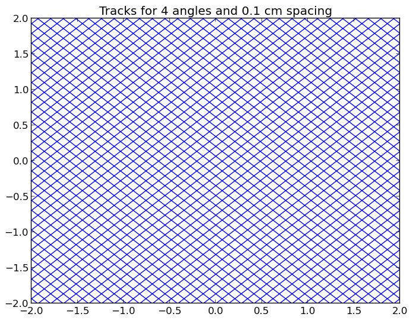
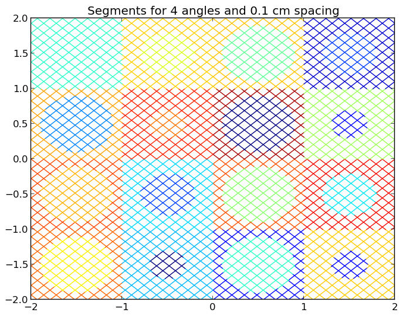
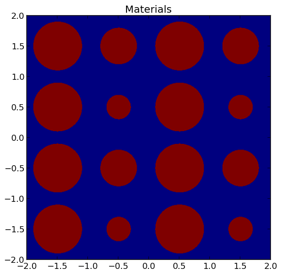
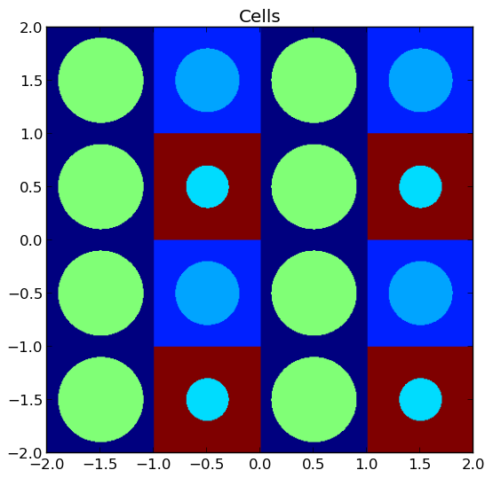
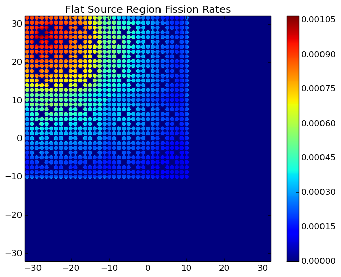
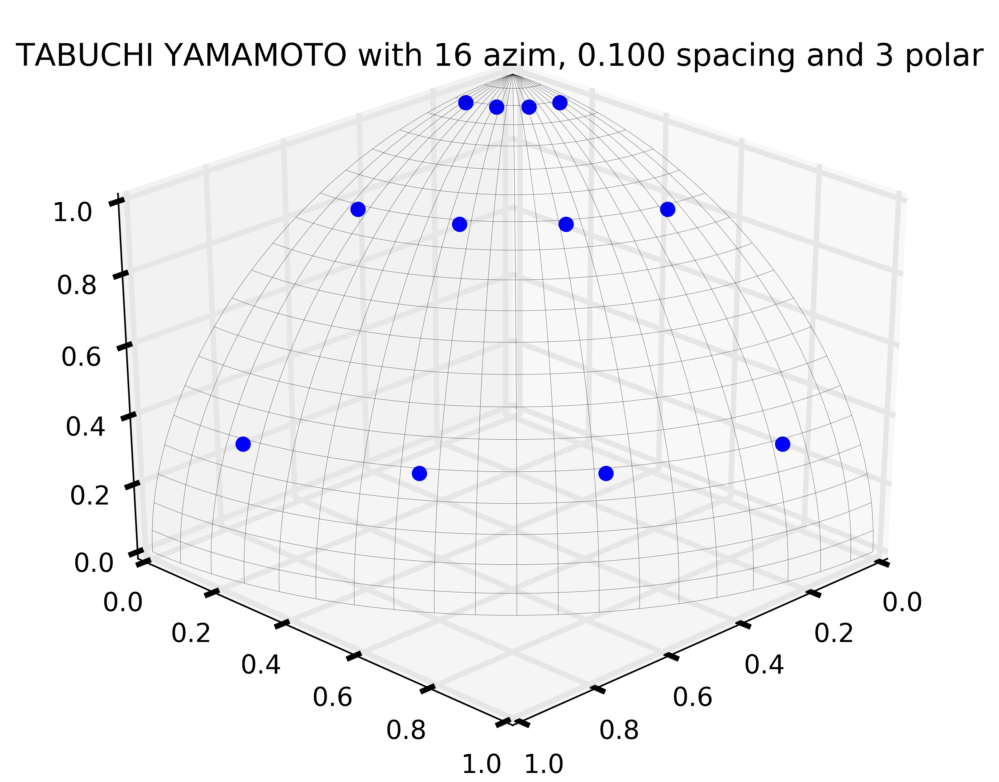

.. _usersguide_processing:

=================================
Data Processing and Visualization
=================================

This section is intended to explain in detail the recommended procedures for carrying out common tasks with OpenMOC. While several utilities of varying complexity are provided to help automate the process, in many cases it will be extremely beneficial to do some coding in Python to quickly obtain results. In these cases, and for many of the provided utilities, it is necessary for your Python installation to contain:

* `Numpy <http://www.numpy.org/>`_ - Required for array-based data manipulation and processing
* `h5py <http://www.h5py.org/>`_ - Required only if reading/writing HDF5_ data files
* `Matplotlib <http://matplotlib.org/>`_ - Optional for plotting utilities

Each of these are easily obtainable in Ubuntu through the package manager.

-------------------------
Exporting Simulation Data
-------------------------

OpenMOC's ``openmoc.process`` module provides the ``store_simulation_state(...)`` routine to export simulation data to binary output files. The only required parameter for the routine is a ``Solver`` object. Optional parameters may be used to indicate whether to store the data in HDF5_ or as a Python pickle_ file (default), store the fluxes, sources, fission rates and more. All of the supported parameters are listed in :ref:`Table 1 <table_store_simulation_state>`, and the output variables stored in the binary file are tabulated in :ref:`Table 2 <table_output_variables>`.

.. _table_store_simulation_state:

=================  ==================  ====================  ==========  ====================================
Parameter          Type                Default               Optional    Note
=================  ==================  ====================  ==========  ====================================
``solver``         ``Solver`` object   None                  No
``fluxes``         boolean             False                 Yes         Whether to store the FSR fluxes
``sources``        boolean             False                 Yes         Whether to store the FSR sources
``fission_rates``  boolean             False                 Yes         Whether to store the fission rates
``use_hdf5``       boolean             False (pickle file)   Yes         Whether to use HDF5_
``filename``       string              'simulation-state'    Yes         The filename for storage
``directory``      string              'simulation-states'   Yes         The directory for storage
``append``         boolean             True                  Yes         Append to a file or create a new one
``note``           string              None                  Yes         Any comment on the simulation
=================  ==================  ====================  ==========  ====================================

**Table 1**: Parameters for the ``openmoc.proces.store_simulation_state(...)`` routine.

.. _table_output_variables:

=========================  ==============  =========================================
Output Variable            Type            Note
=========================  ==============  =========================================
solver type                string          'CPUSolver', 'GPUSolver', etc.
# FSRs                     integer
# materials                integer
# energy groups            integer
# tracks                   integer
# segments                 integer
track spacing [cm]         float
# azimuthal angles         integer
# polar angles             integer
# iterations               integer
source residual threshold  float
exponential                string          'exp intrinsic' or 'linear interpolation'
CMFD                       boolean         True if CMFD is in use, False otherwise
floating point             string          'double' or 'single'
time [sec]                 float           Total time to converge the source
keff                       float
note                       string          If requested by user
# threads                  integer         For solvers on multi-core CPUs
# threads per block        integer         For solvers on GPUs
FSR scalar fluxes          float array     If requested by user
FSR sources                float array     If requested by user
fission rates              float array(s)  If requested by user
=========================  ==============  =========================================

**Table 2**: Output variables in a binary file created by the ``openmoc.proces.store_simulation_state(...)`` routine.

The code snippet below illustrates one possible configuration of parameters to the routine.

.. code-block:: python

    import openmoc.process

    # Setup and run simulation
    ...

    # Export the simulation data to an output file
    openmoc.process.store_simulation_state(solver, use_hdf5=True)

--------------------------
Retrieving Simulation Data
--------------------------

Exporting simulation data is only useful if there is a straightforward means to retrieve it for data processing at a later time. OpenMOC's ``restore_simulation_state(...)`` routine in the ``openmoc.process`` module can be used for this purpose. This routine takes a binary data file created by the ``store_simulation_state(...)`` routine, parses the file and catalogues the data in a Python dictionary_, which it returns to the user. The parameters accepted by the routine are described in :ref:`Table 3 <table_restore_simulation_states>`, while the dictionary keys are identical to the output variables given in :ref:`Table 2 <table_output_variables>`.

.. _table_restore_simulation_states:

==============  =======  ======================  ========
Parameter       Type     Default                 Optional
==============  =======  ======================  ========
``filename``    string   'simulation-state.pkl'  Yes
``directory``   string   'simulation-states'     Yes
==============  =======  ======================  ========

**Table 3**: Parameters for the ``openmoc.process.restore_simulation_state(...)`` routine.

The code snippet below illustrates one possible configuration of parameters to the routine.

.. code-block:: python

    import openmoc.process

    # Retrieve the simulation state(s) stored in the 'states.h5' file
    # and returns the data in a Python dictionary
    simulation_state = openmoc.process.restore_simulation_state(filename='states.h5')

------------------------
Computing Reaction Rates
------------------------

Reaction Rates By Tally Mesh
----------------------------

The ``openmoc.process`` module supports reaction rate through structured Cartesian mesh tallies, similar to how one might compute such quantities in a Monte Carlo code such as MCNP, Serpent or OpenMC. The ``Mesh`` class allows one to tally a reaction rate in each of its structured cells. :ref:`Table 4 <table_mesh_params>` below itemizes each of the property attributes of the ``Mesh`` class which can be used to tally reaction rates.

.. _table_mesh_params:

========================  ===================  ==========  ==========================================================
Property                  Type                 Default     Note
========================  ===================  ==========  ==========================================================
``dimension``             list of integers     None        The number of mesh cells in each direction
``lower_left``            list of floats       None        The lower-left corner of the structured mesh
``upper_right``           list of floats       None        The upper-right corner of the structrued mesh
``width``                 list of floats       None        The width of mesh cells in each direction (centimeters)
========================  ===================  ==========  ==========================================================

**Table 4**: The ``Mesh`` class property attributes for tallying reaction rates.

.. note:: The ``Mesh`` is assumed to be perfectly coincident with the FSR mesh used in the OpenMOC calculation.

The ``Mesh.tally_fission_rates(...)`` class method is designed to compute fission rates using the ``'fission'`` cross section in each ``Material`` in a simulation. The parameters accepted by this method are described in :ref:`Table 5 <table_mesh_fiss_rates>`.

.. _table_mesh_fiss_rates:

=============  ===========  ==============  ========
Parameter      Type         Default         Optional
=============  ===========  ==============  ========
``solver``     ``Solver``   None            No
``volume``     string       'integrated'    Yes
=============  ===========  ==============  ========

**Table 5**: Parameters for the ``Mesh.tally_fission_rates(...)`` method.

The code snippet below illustrates how one may compute a mesh fission rate tally for the :file:`/OpenMOC/sample-input/simple-lattice.py` file. The fission rates are returned as a ``numpy.ndarray`` indexed by FSR.

.. code-block:: python

    import openmoc.process

    # Setup and run simulation
    ...

    # Create OpenMOC Mesh on which to tally fission rates
    mesh = openmoc.process.Mesh()
    mesh.dimension = [4, 4]
    mesh.lower_left = [-2., -2.]
    mesh.upper_right = [2., 2.]
    mesh.width = [1., 1.]

    # Tally OpenMOC fission rates on the Mesh and return NumPy array
    fiss_rates = mesh.tally_fission_rates(solver)

.. note:: The ``'fission'`` cross section must be supplied to each ``Material`` to compute fission rates even though it is *not* needed to perform a simulation.

The ``Mesh.tally_on_mesh(...)`` class method is designed to compute reaction rates more generally from a user-specified mapping of coefficients (*e.g.*, cross sections) to each material, cell or FSR.  The parameters accepted by this method are described in :ref:`Table 6 <table_mesh_rxn_rates>`.

.. _table_mesh_rxn_rates:

======================  ===========  ==============  ========
Parameter               Type         Default         Optional
======================  ===========  ==============  ========
``solver``              ``Solver``   None            No
``domains_to_coeffs``   ``dict``     None            No
``domain_type``         string       'fsr'           Yes
``volume``              string       'integrated'    Yes
``energy``              string       'integrated'    Yes
======================  ===========  ==============  ========

**Table 6**: Parameters for the ``Mesh.tally_on_mesh(...)`` method.

The code snippet below illustrates how one may compile the groupwise coefficients (total cross sections) for each ``Material`` in a Python ``dict`` to supply to ``Mesh.tally_on_mesh(...)`` to compute a total reaction rate tally for the :file:`/OpenMOC/sample-input/simple-lattice.py` file. The reaction rates are returned as a ``numpy.ndarray`` indexed by FSR.

.. code-block:: python

    import openmoc.process
    import numpy as np

    # Setup and run simulation
    ...

    # Retrieve the Materials and number of groups from the geometry
    materials = geometry.getAllMaterials()
    num_groups = geometry.getNumEnergyGroups()

    # Aggregate the total cross sections for each Material
    # into a dictionary to pass to the mesh tally
    domains_to_coeffs = {}
    for material_id in materials:
        domains_to_coeffs[material_id] = np.zeros(num_groups)
        for group in range(num_groups):
            domains_to_coeffs[material_id][group] = \
                materials[material_id].getSigmaTByGroup(group+1)

    # Tally volume-averaged OpenMOC total rates on the Mesh
    tot_rates = mesh.tally_on_mesh(solver, domains_to_coeffs)

Fission Rates by Universe Level
-------------------------------

The ``compute_fission_rates(...)`` routine in the ``openmoc.process`` module  computes the fission rate for each ``Universe`` in the ``Geometry`` by summing up the fission rates in each ``Cell`` in the ``Universe``. In most cases, a ``Universe`` is replicated in many places throughout the ``Geometry``. To account for this, the routine will separately compute the fission rates for each unique placement of that ``Universe`` in the ``Geometry``. By default, the fission rates will be exported to a Python pickle_ file, but may alternatively be exported to an HDF5_ binary file. Each fission rate will be indexed by a string representing the "path" of ``Universes``, ``Lattices`` and ``Lattice`` cell indices traversed through the ``Geometry`` to reach the flat source region of interest. :ref:`Table 7 <table_fission_rates>` describes the parameters accepted by the routine.

.. _table_fission_rates:

============  ==================  ========  =========
Parameter     Type                Default   Optional
============  ==================  ========  =========
``solver``    ``Solver`` object   None      No
``use_hdf5``  boolean             False     Yes
============  ==================  ========  =========

**Table 7**: Parameters for the ``openmoc.process.compute_fission_rates(...)`` routine.

The code snippet below illustrates one possible configuration of parameters to the routine.

.. code-block:: python

    import openmoc.process

    # Setup and run simulation
    ...

    # Compute and export the flat source region fission rates
    openmoc.process.compute_fission_rates(solver, use_hdf5=True)

.. note:: The fission rates are computed for each nested universe level in the hierarchical geometry model.
.. note:: The fission rates are not normalized in any way - this is left to the user's discretion during data processing.

Non-uniform meshes
------------------

Non-uniform Cartesian meshes can be defined using a different mesh class, defined on the C++ side but callable from Python. They can be defined by defining the non-uniform widths in each direction, as shown below,

.. code-block:: python

    import openmoc

    # Setup and run simulation
    ...

    # Create a non-uniform lattice, with no offset
    lattice = openmoc.Lattice()
    lattice.setNumX(4)
    lattice.setNumX(4)
    lattice.setNumZ(1)
    lattice.setWidthsX([1,2,2,1])
    lattice.setWidthsY([2,1,2,2])
    lattice.setWidthsZ([4])
    lattice.computeSizes()

    # Create OpenMOC Mesh on which to tally fission rates
    mesh = openmoc.Mesh()
    mesh.setLattice(lattice)

    # Tally OpenMOC fission rates on the Mesh and return NumPy array
    fiss_rates = mesh.getReactionRates(openmoc.FISSION_RX, volume_average=False)

----------------------
Geometry Visualization
----------------------

Plotting Tracks
---------------

To plot the tracks crossing the geometry, use the ``plot_tracks(...)`` routine in the ``openmoc.plotter`` module. The parameters accepted by this routine are described in :ref:`Table 8 <table_plot_tracks>`.

.. _table_plot_tracks:

===================  =========================  =========  =========  ===========================================
Parameter            Type                       Default    Optional   Note
===================  =========================  =========  =========  ===========================================
``track_generator``  ``TrackGenerator``         None       No         The tracks of interest
``get_figure``       boolean                    False      Yes        Whether to return the Matplotlib ``Figure``
``plot_3D``          boolean                    False      Yes        Whether to plot 2D (default) or 3D tracks
===================  =========================  =========  =========  ===========================================

**Table 8**: Parameters for the ``openmoc.plotter.plot_tracks(...)`` routine.

The code snippet below illustrates the use of this routine.

.. code-block:: python

    import openmoc.plotter

    # Setup geometry and generate tracks
    ...

    openmoc.plotter.plot_tracks(geometry)

A depiction of the tracks for the :file:`/OpenMOC/sample-input/simple-lattice.py` example input file with 4 azimuthal angles and 0.1 cm track spacing is illustrated in :ref:`Figure 1 <figure_tracks>`.

.. _figure_tracks:

   **Figure 1**: The tracks crossing a a 4 :math:`\times` 4 lattice.

.. note:: The runtime required by the plotting routine scales with the number of tracks, which is proportional to the number of azimuthal angles and inversely proportional the track spacing.

Plotting Segments
-----------------

To plot the segments crossing the geometry color-coded by flat source region, use the ``plot_segments(...)`` routine in the ``openmoc.plotter`` module. The parameters accepted by this routine are described in :ref:`Table 9 <table_plot_segments>`.

.. _table_plot_segments:

===================  =========================  =========  =========  ===========================================
Parameter            Type                       Default    Optional   Note
===================  =========================  =========  =========  ===========================================
``track_generator``  ``TrackGenerator``         None       No         The tracks of interest
``get_figure``       boolean                    False      Yes        Whether to return the Matplotlib ``Figure``
``plot_3D``          boolean                    False      Yes        Whether to plot 2D (default) or 3D segments
===================  =========================  =========  =========  ===========================================

**Table 9**: Parameters for the ``openmoc.plotter.plot_segments(...)`` routine.

The code snippet below illustrates the use of this routine.

.. code-block:: python

    import openmoc.plotter

    # Setup geometry and generate tracks
    ...

    openmoc.plotter.plot_segments(geometry)

A depiction of the segments for the :file:`/OpenMOC/sample-input/simple-lattice.py` example input file with 4 azimuthal angles and 0.1 cm track spacing is illustrated in :ref:`Figure 2 <figure_segments>`.

.. _figure_segments:

   **Figure 2**: The segments crossing a a 4 :math:`\times` 4 lattice.

.. warning:: This routine will require a long time for large geometries or fine track discretization. In addition, Matplotlib consumes a substantial amount of memory to plot the segments and may throw a `segmentation fault`_ for large geometries.
.. note:: The runtime required by the plotting routine scales with the number of segments, which is proportional to the number of flat source regions and number of azimuthal angles and inversely proportional the track spacing.

Plotting by Material
--------------------

To plot the geometry color-coded by the material ID's throughout the geometry, use the ``plot_materials(...)`` routine in the ``openmoc.plotter`` module. The parameters accepted by this routine are described in :ref:`Table 10 <table_plot_materials>`.

.. _table_plot_materials:

===============  ===============  =============  =========  ========================================================
Parameter        Type             Default        Optional   Note
===============  ===============  =============  =========  ========================================================
``geometry``     ``Geometry``     None           No         The ``Geometry`` of interest
``gridsize``     integer          250            Yes        The pixel resolution
``xlim``         2-tuple          None           Yes        The min/max :math:`x`-coordinates to plot
``ylim``         2-tuple          None           Yes        The min/max :math:`y`-coordinates to plot
``zlim``         2-tuple          None           Yes        The min/max :math:`z`-coordinates to plot
``plane``        string           :math:`xy`     Yes        Which plane to plot in (:math:`xy`, :math:`xz`, :math:`yz`)
``offset``       float            0              Yes        The level along the remaining axis to plot at
``get_figure``   boolean          False          Yes        Whether to return the Matplotlib ``Figure``
``library``      string           'matplotlib'   Yes        The plotting library to use ('matplotlib' or 'pil')
===============  ===============  =============  =========  ========================================================

**Table 10**: Parameters for the ``openmoc.plotter.plot_materials(...)`` routine.

The code snippet below illustrates one possible configuration of parameters to the routine.

.. code-block:: python

    import openmoc.plotter

    # Setup geometry
    ...

    # Plot a 500 x 500 pixel image of the materials
    openmoc.plotter.plot_materials(geometry, gridsize=500)

A depiction of the materials for the :file:`/OpenMOC/sample-input/simple-lattice.py` example input file is illustrated in :ref:`Figure 3 <figure_materials>`.

.. _figure_materials:

   **Figure 3**: A 4 :math:`\times` 4 lattice color-coded by material.

.. note:: The runtime required by the plotting routine scales with the number of pixels in the image (the square of the ``gridsize`` parameter).

Plotting by Cell
----------------
To plot the geometry color-coded by the cell ID's throughout the geometry, use the ``plot_cells(...)`` routine in the ``openmoc.plotter`` module. The parameters accepted by this routine are described in :ref:`Table 11 <table_plot_cells>`.

.. _table_plot_cells:

===============  ===============  =============  =========  ========================================================
Parameter        Type             Default        Optional   Note
===============  ===============  =============  =========  ========================================================
``geometry``     ``Geometry``     None           No         The ``Geometry`` of interest
``gridsize``     integer          250            Yes        The pixel resolution
``xlim``         2-tuple          None           Yes        The min/max :math:`x`-coordinates to plot
``ylim``         2-tuple          None           Yes        The min/max :math:`y`-coordinates to plot
``zlim``         2-tuple          None           Yes        The min/max :math:`z`-coordinates to plot
``plane``        string           :math:`xy`     Yes        Which plane to plot in (:math:`xy`, :math:`xz`, :math:`yz`)
``offset``       float            0              Yes        The level along the remaining axis to plot at
``get_figure``   boolean          False          Yes        Whether to return the Matplotlib ``Figure``
``library``      string           'matplotlib'   Yes        The plotting library to use ('matplotlib' or 'pil')
===============  ===============  =============  =========  ========================================================

**Table 11**: Parameters for the ``openmoc.plotter.plot_cells(...)`` routine.

The code snippet below illustrates one possible configuration of parameters to the routine.

.. code-block:: python

    import openmoc.plotter

    # Setup geometry
    ...

    # Plot a 500 x 500 pixel image of the cells
    openmoc.plotter.plot_cells(geometry, gridsize=500)

A depiction of the cells for the :file:`/OpenMOC/sample-input/simple-lattice.py` example input file is illustrated in :ref:`Figure 4 <figure_cells>`.

.. _figure_cells:

   **Figure 4**: A 4 :math:`\times` 4 lattice color-coded by cell.

.. note:: The runtime required by the plotting routine scales with the number of pixels in the image (the square of the ``gridsize`` parameter).

Plotting by FSR
---------------

To plot the geometry color-coded by the flat source region ID's throughout the geometry, use the ``plot_flat_source_regions(...)`` routine in the ``openmoc.plotter`` module. The parameters accepted by this routine are described in :ref:`Table 12 <table_plot_fsrs>`.

.. _table_plot_fsrs:

=================  ===============  =============  =========  ========================================================
Parameter          Type             Default        Optional   Note
=================  ===============  =============  =========  ========================================================
``geometry``       ``Geometry``     None           No         The ``Geometry`` of interest
``gridsize``       integer          250            Yes        The pixel resolution
``xlim``           2-tuple          None           Yes        The min/max :math:`x`-coordinates to plot
``ylim``           2-tuple          None           Yes        The min/max :math:`y`-coordinates to plot
``zlim``           2-tuple          None           Yes        The min/max :math:`z`-coordinates to plot
``plane``          string           :math:`xy`     Yes        Which plane to plot in (:math:`xy`, :math:`xz`, :math:`yz`)
``offset``         float            0              Yes        The level along the remaining axis to plot at
``centroids``      boolean          False          Yes        Whether to plot the FSR centroids
``marker_type``    string           ``'o'``        Yes        The marker type to use for FSR centroids
``marker_size``    integer          2              Yes        The marker size to use for FSR centroids
``get_figure``     boolean          False          Yes        Whether to return the Matplotlib ``Figure``
``library``        string           'matplotlib'   Yes        The plotting library to use ('matplotlib' or 'pil')
=================  ===============  =============  =========  ========================================================

**Table 12**: Parameters for the ``openmoc.plotter.plot_flat_source_regions(...)`` routine.

The code snippet below illustrates one possible configuration of parameters to the routine.

.. code-block:: python

    import openmoc.plotter

    # Setup geometry
    ...

    # Plot a 500 x 500 pixel image of the flat source regions
    openmoc.plotter.plot_flat_source_regions(geometry, gridsize=500)

A depiction of the flat source regions for the :file:`/OpenMOC/sample-input/simple-lattice.py` example input file is illustrated in :ref:`Figure 5 <figure_flat_source_regions>`.

.. _figure_flat_source_regions:

.. figure:: ../../img/flat-source-regions.png
   :align: center
   :figclass: align-center
   :width: 400px

   **Figure 5**: A 4 :math:`\times` 4 lattice color-coded by flat source region.

.. note:: The runtime required by the plotting routine scales with the number of pixels in the image (the square of the ``gridsize`` parameter).

Plotting by CMFD Cell
---------------------

To plot the geometry color-coded by the CMFD cells throughout the geometry, use the ``plot_cmfd_cells(...)`` routine in the ``openmoc.plotter`` module. The parameters accepted by this routine are described in :ref:`Table 13 <table_plot_cmfd_cells>`.

.. _table_plot_cmfd_cells:

===============  ===============  =============  =========  ========================================================
Parameter        Type             Default        Optional   Note
===============  ===============  =============  =========  ========================================================
``geometry``     ``Geometry``     None           No         The ``Geometry`` of interest
``gridsize``     integer          250            Yes        The pixel resolution
``xlim``         2-tuple          None           Yes        The min/max :math:`x`-coordinates to plot
``ylim``         2-tuple          None           Yes        The min/max :math:`y`-coordinates to plot
``zlim``         2-tuple          None           Yes        The min/max :math:`z`-coordinates to plot
``plane``        string           :math:`xy`     Yes        Which plane to plot in (:math:`xy`, :math:`xz`, :math:`yz`)
``offset``       float            0              Yes        The level along the remaining axis to plot at
``get_figure``   boolean          False          Yes        Whether to return the Matplotlib ``Figure``
``library``      string           'matplotlib'   Yes        The plotting library to use ('matplotlib' or 'pil')
===============  ===============  =============  =========  ========================================================

**Table 13**: Parameters for the ``openmoc.plotter.plot_cmfd_cells(...)`` routine.

The code snippet below illustrates one possible configuration of parameters to the routine.

.. code-block:: python

    import openmoc.plotter

    # Setup geometry and cmfd
    ...

    # Plot a 500 x 500 pixel image of the CMFD cells
    openmoc.plotter.plot_cmfd_cells(geometry, cmfd, gridsize=500)

A depiction of the flat source regions and CMFD cells for the :file:`/OpenMOC/sample-input/benchmarks/c5g7/c5g7-cmfd.py` example input file is illustrated in :ref:`Figure 6 <figure_cmfd_cells>`.

.. _figure_cmfd_cells:

.. table::

   +------------------------------------------+---------------------------------------------+
   | .. _figure_cmfd_cells_a:                 | .. _figure_cmfd_cells_b:                    |
   |                                          |                                             |
   | .. image:: ../../img/c5g7-fsrs.png       | .. image:: ../../img/c5g7-cmfd-cells.png    |
   |   :width: 70 %                           |   :width: 64 %                              |
   |   :align: center                         |   :align: center                            |
   +------------------------------------------+---------------------------------------------+

**Figure 6**: The flat source regions and CMFD cells for the C5G7 benchmark problem.

.. note:: The runtime required by the plotting routine scales with the number of pixels in the image (the square of the ``gridsize`` parameter).

------------------
Flux Visualization
------------------

The ``openmoc.plotter`` module includes routines to plot the scalar flux in space and energy, as detailed in the following sections.

Flux in Space
-------------

To plot the flat source region scalar fluxes in space, use the ``plot_spatial_fluxes(...)`` routine in the ``openmoc.plotter`` module. The parameters accepted by this routine are described in :ref:`Table 14 <table_plot_fluxes_space>`.

.. _table_plot_fluxes_space:

==================  ===============  =============  =========  ========================================================
Parameter           Type             Default        Optional   Note
==================  ===============  =============  =========  ========================================================
``solver``          ``Solver``       None           No         The ``Solver`` used to converge the source
``energy_groups``   list             [1]            No         Create separate plots for each energy group
``norm``            boolean          False          Yes        Whether to normalize fluxes to the mean
``gridsize``        integer          250            Yes        The pixel resolution
``xlim``            2-tuple          None           Yes        The min/max :math:`x`-coordinates to plot
``ylim``            2-tuple          None           Yes        The min/max :math:`y`-coordinates to plot
``zlim``            2-tuple          None           Yes        The min/max :math:`z`-coordinates to plot
``plane``           string           :math:`xy`     Yes        Which plane to plot in (:math:`xy`, :math:`xz`, :math:`yz`)
``offset``          float            None           Yes        The level along the remaining axis to plot at
``get_figure``      boolean          False          Yes        Whether to return the Matplotlib ``Figure``
``library``         string           'matplotlib'   Yes        The plotting library to use ('matplotlib' or 'pil')
==================  ===============  =============  =========  ========================================================

**Table 14**: Parameters for the ``openmoc.plotter.plot_spatial_fluxes(...)`` routine.

The code snippet below illustrates one possible configuration of parameters to the routine.

.. code-block:: python

    import openmoc.plotter

    # Setup geometry and generate tracks
    ...

    # Setup solver and converge the source
    ...

    # Plot the fluxes for energy groups 1 and 7 in 500 x 500 pixel images
    openmoc.plotter.plot_spatial_fluxes(solver, energy_groups=[1,7], gridsize=500)

A depiction of the group 1 and 7 fluxes for the C5G7 benchmark (:file:`/OpenMOC/sample-input/benchmarks/c5g7`) is illustrated in :ref:`Figure 7 <figure_spatial_fluxes>`.

.. _figure_spatial_fluxes:

.. table::

   +------------------------------------------+-----------------------------------------+
   | .. _figure_spatial_fluxes_a:             | .. _figure_spatial_fluxes_b:            |
   |                                          |                                         |
   | .. image:: ../../img/flux-group-1.png    | .. image:: ../../img/flux-group-7.png   |
   |   :width: 72 %                           |   :width: 75 %                          |
   |   :align: center                         |   :align: center                        |
   +------------------------------------------+-----------------------------------------+

**Figure 7**: The fast and thermal fluxes in the C5G7 benchmark problem.

.. note:: The runtime required by the plotting routine scales with the number of pixels in the image (the square of the ``gridsize`` parameter).

Flux in Energy
--------------

To plot the flux in energy for one or more flat source regions, use the ``plot_energy_fluxes(...)`` routine in the ``openmoc.plotter`` module. The parameters accepted by this routine are described in :ref:`Table 15 <table_plot_fluxes_energy>`.

.. _table_plot_fluxes_energy:

=================  ===================  =========  =========  ============================================
Parameter          Type                 Default    Optional   Note
=================  ===================  =========  =========  ============================================
``solver``         ``Solver`` object    None       No         The ``Solver`` used to converge the source
``fsrs``           list                 None       No         The flat source region IDs of interest
``group_bounds``   list                 None       Yes        The sequential bounds for each energy group
``norm``           boolean              True       Yes        Whether to normalize the flux across energy
``loglog``         boolean              True       Yes        Whether to use a log-log plotting scale
``get_figure``     boolean              False      Yes        Whether to return the Matplotlib ``Figure``
=================  ===================  =========  =========  ============================================

**Table 15**: Parameters for the ``openmoc.plotter.plot_energy_fluxes(...)`` routine.

The code snippet below illustrates one possible configuration of parameters to the routine.

.. code-block:: python

    import openmoc.plotter

    # Setup geometry and generate tracks
    ...

    # Setup solver and converge the source
    ...

    # Plot the fluxes vs. energy for flat source regions 0 and 1
    openmoc.plotter.plot_energy_fluxes(solver, fsrs=[0,1])

A depiction of the normalized 7-group fluxes for the sample pin cell problem (:file:`/OpenMOC/sample-input/pin-cell/pin-cell.py`) is illustrated in :ref:`Figure 8 <figure_energy_fluxes>`.

.. _figure_energy_fluxes:

.. table::

   +------------------------------------------+-----------------------------------------+
   | .. _figa:                                | .. _figb:                               |
   |                                          |                                         |
   | .. image:: ../../img/flux-fsr-0.png      | .. image:: ../../img/flux-fsr-1.png     |
   |   :width: 72 %                           |   :width: 75 %                          |
   |   :align: center                         |   :align: center                        |
   +------------------------------------------+-----------------------------------------+

**Figure 8**: The normalized moderator and fuel flux for a simple PWR pin cell problem.

--------------------------
Fission Rate Visualization
--------------------------

The ``openmoc.plotter`` module includes routines to plot the energy-integrated fission rates in each flat source region. To plot the fission rates, use the ``plot_fission_rates(...)`` routine in the ``openmoc.plotter`` module. The parameters accepted by this routine are described in :ref:`Table 16 <table_plot_fission_rates>`.

.. _table_plot_fission_rates:

======================  ===================  =============  =========  =====================================================
Parameter               Type                 Default        Optional   Note
======================  ===================  =============  =========  =====================================================
``solver``              ``Solver``           None           No         The ``Solver`` used to converge the source
``norm``                boolean              False          Yes        Whether to normalize fluxes to the mean
``transparent_zeros``   boolean              True           Yes        Whether to make all non-fissionable FSRs transparent
``gridsize``            integer              250            Yes        The pixel resolution
``xlim``                2-tuple              None           Yes        The min/max :math:`x`-coordinates to plot
``ylim``                2-tuple              None           Yes        The min/max :math:`y`-coordinates to plot
``zlim``                2-tuple              None           Yes        The min/max :math:`z`-coordinates to plot
``plane``               string               :math:`xy`     Yes        Which plane to plot in (:math:`xy`, :math:`xz`, :math:`yz`)
``offset``              float                0              Yes        The level along the remaining axis to plot at
``get_figure``          boolean              False          Yes        Whether to return the Matplotlib ``Figure``
``library``             string               'matplotlib'   Yes        The plotting library to use ('matplotlib' or 'pil')
======================  ===================  =============  =========  =====================================================

**Table 16**: Parameters for the ``openmoc.plotter.plot_fission_rates(...)`` routine.

The code snippet below illustrates one possible configuration of parameters to the routine.

.. code-block:: python

    import openmoc.plotter

    # Setup geometry and generate tracks
    ...

    # Setup solver and converge the source
    ...

    # Plot the fission rates in each FSR in a 500 x 500 pixel image
    openmoc.plotter.plot_fission_rates(solver, gridsize=500)

A depiction of the energy-integrated FSR fission rates for the C5G7 benchmark (:file:`/OpenMOC/sample-input/benchmarks/c5g7`) is illustrated in :ref:`Figure 9 <figure_fission_rates>`.

.. _figure_fission_rates:

**Figure 9**: The energy-integrated FSR fission rates in the C5G7 benchmark problem.

.. note:: The runtime required by the plotting routine scales with the number of pixels in the image (the square of the ``gridsize`` parameter).

-----------------------------
Flux eigenmodes Visualization
-----------------------------

The ``openmoc.plotter`` module includes routines to plot the eigenmodes of the flux in each flat source region. To plot the eigenmodes, use the ``plot_eigenmode_fluxes(...)`` routine in the ``openmoc.plotter`` module. The parameters accepted by this routine are described in :ref:`Table 16 <table_plot_eigenmode_fluxes>`.

.. _table_plot_eigenmode_fluxes:

======================  ===================  =============  =========  =====================================================
Parameter               Type                 Default        Optional   Note
======================  ===================  =============  =========  =====================================================
``solver``              ``IRAMSolver``       None           No         The ``IRAMSolver`` used to converge the flux modes
``eigenmodes``          list                 None           No         Create separate plots for each eigenmode
``energy_groups``       list                 [1]            Yes        Create separate plots for each energy group
``norm``                boolean              False          Yes        Whether to normalize the fission rates
``gridsize``            integer              250            Yes        The pixel resolution
``xlim``                2-tuple              None           Yes        The min/max :math:`x`-coordinates to plot
``ylim``                2-tuple              None           Yes        The min/max :math:`y`-coordinates to plot
``zlim``                2-tuple              None           Yes        The min/max :math:`z`-coordinates to plot
``plane``               string               :math:`xy`     Yes        Which plane to plot in (:math:`xy`, :math:`xz`, :math:`yz`)
``offset``              float                0              Yes        The level along the remaining axis to plot at
``get_figure``          boolean              False          Yes        Whether to return the Matplotlib ``Figure``
``library``             string               'matplotlib'   Yes        The plotting library to use ('matplotlib' or 'pil')
======================  ===================  =============  =========  =====================================================

**Table 16**: Parameters for the ``openmoc.plotter.plot_eigenmode_fluxes(...)`` routine.

The code snippet below illustrates one possible configuration of parameters to the routine.

.. code-block:: python

    import openmoc.plotter

    # Setup geometry and generate tracks
    ...

    # Setup IRAMSolver and converge the eigenmodes
    ...

    # Plot the eigenmodes in each FSR in a 500 x 500 pixel image
    openmoc.plotter.plot_eigenmode_fluxes(IRAMSolver, eigenmodes=[1], gridsize=500)

.. note:: The runtime required by the plotting routine scales with the number of pixels in the image (the square of the ``gridsize`` parameter).

---------------------------------
Generalized Spatial Visualization
---------------------------------

The ``openmoc.plotter`` module includes a generalized method to plot spatially-varying indexed by ``Material``, ``Cell``, or FSR. For general spatial plotting, use the ``plot_spatial_data(...)`` routine in the ``openmoc.plotter`` module. The parameters accepted by this routine are described in :ref:`Table 17 <table_general_plotting>`.

.. _table_general_plotting:

======================  =====================================================  =============  =========  ============================================================
Parameter               Type                                                   Default        Optional   Note
======================  =====================================================  =============  =========  ============================================================
``domains_to_data``     ``dict``, ``numpy.ndarray``, or ``pandas.DataFrame``   None           No         Spatial domains-to-data mapping
``plot_params``         boolean                                                None           No         Plotting parametetrs
``get_figure``          boolean                                                False          Yes        Whether to return the Matplotlib ``Figure``
======================  =====================================================  =============  =========  ============================================================

**Table 17**: Parameters for the ``openmoc.plotter.plot_spatial_data(...)`` routine.

:ref:`Table 18 <table_general_plotting>` below itemizes each of the property attributes of the ``PlotParams`` class which can be used to customize images with generalized spatial plotting.

.. _table_plot_params:

========================  ========================  ==========================  ==========================================================
Property                  Type                      Default                     Note
========================  ========================  ==========================  ==========================================================
``geometry``              ``Geometry``              None                        The Geometry to query when generating the spatial map
``domain_type``           string                    'fsr'                       The domain type used to map spatial data to the geometry
``filename``              string                    None                        The filename string
``extension``             string                    '.png'                      The image file extension (e.g., '.png')
``library``               string                    'matplotlib'                The plotting library to use ('matplotlib' or 'pil')
``zcoord``                float                     0                           The level along the :math:`z`-axis to plot
``gridsize``              integer                   250                         The pixel resolution
``xlim``                  2-tuple                   None                        The min/max :math:`x`-coordinates to plot
``ylim``                  2-tuple                   None                        The min/max :math:`y`-coordinates to plot
``zlim``                  2-tuple                   None                        The min/max :math:`z`-coordinates to plot
``plane``                 string                    :math:`xy`                  Which plane to plot in (:math:`xy`, :math:`xz`, :math:`yz`)
``offset``                float                     0                           The level along the remaining axis to plot at
``title``                 string                    None                        The minor title string
``suptitle``              string                    None                        The major title string
``norm``                  boolean                   False                       Normalize the plotted data to unity
``transparent_zeros``     boolean                   False                       Make zeros in the data appear transparent
``interpolation``         string                    None                        Interpolation used between points (e.g., 'nearest')
``colorbar``              boolean                   False                       Include a colorbar to the right of the plot
``cmap``                  ``matplotlib.colormap``   ``cmap('nipy_spectral')``   A Matplotlib colormap for the plot
``vmin``                  float                     None                        The minimum value used in colormapping the data
``vmax``                  float                     None                        The maximum value used in colormapping the data
========================  ========================  ==========================  ==========================================================

**Table 18**: The ``PlotParams`` class property attributes for plot customization.

The generalied spatial plotter may be applied in a myriad of ways to create spatial plots of the geometry with user-defined data mapped to materials, cells or FSRs. The following code snippet illustrates the generation of three plots for three columns of randomized data mapped by FSR in a Pandas_ ``DataFrame``:

.. code-block:: python

    import numpy as np
    import pandas as pd

    # Initialize a Pandas DataFrame with normally distributed random data
    num_fsrs = geometry.getNumFSRs()
    df = pd.DataFrame(np.random.randn(num_fsrs,3), columns=list('ABC'))

    # Initialize a PlotParams object
    plot_params = openmoc.plotter.PlotParams()
    plot_params.geometry = geometry
    plot_params.suptitle = 'Pandas DataFrame'
    plot_params.filename = 'pandas-df'
    plot_params.colorbar = True

    # Enforce consistent color scheme across figures
    plot_params.vmin = df.values.min()
    plot_params.vmax = df.values.max()

    openmoc.plotter.plot_spatial_data(df, plot_params)

.. _figure_general_plotting:

.. table::

   +-------------------------------------+-------------------------------------+--------------------------------------+
   | .. _figure_spatials_a:              | .. _figure_spatial_b:               |  .. _figure_spatial_c:               |
   |                                     |                                     |                                      |
   | .. image:: ../../img/spatial-a.png  | .. image:: ../../img/spatial-b.png  |  .. image:: ../../img/spatial-c.png  |
   |   :width: 85 %                      |   :width: 85 %                      |     :width: 85 %                     |
   |   :align: center                    |   :align: center                    |     :align: center                   |
   +-------------------------------------+-------------------------------------+--------------------------------------+

**Figure 10**: The randomized spatial data for each of the three columns in a Pandas DataFrame for the C5G7 benchmark problem.

--------------------------------
Angular Quadrature Visualization
--------------------------------

To plot the angular quadrature deployed by a ``Solver`` in an MOC simulation, use the ``plot_quadrature(...)`` routine in the ``openmoc.plotter`` module. The parameters accepted by this routine are described in :ref:`Table 19 <table_plot_quadrature>`.

.. _table_plot_quadrature:

===================  =========================  =========  =========  ===============================================
Parameter            Type                       Default    Optional   Note
===================  =========================  =========  =========  ===============================================
``solver``           ``Solver``                 None       No         The ``Solver`` with the quadrature of interest
``get_figure``       boolean                    False      Yes        Whether to return the Matplotlib ``Figure``
===================  =========================  =========  =========  ===============================================

**Table 19**: Parameters for the ``openmoc.plotter.plot_quadrature(...)`` routine.

The code snippet below illustrates the use of this routine.

.. code-block:: python

    import openmoc.plotter

    # Setup geometry and generate tracks
    ...

    # Setup solver
    ...

    openmoc.plotter.plot_quadrature(solver)

A depiction of the Tabuchi-Yamamoto polar quadrature used by default (for 2D simulations, Gauss Legendre in 3D) in OpenMOC is illustrated in :ref:`Figure 11 <figure_quadrature>`.

.. _figure_quadrature:

   **Figure 11**: The Tabuchi-Yamamoto polar quadrature used as the default in 2D OpenMOC simulations.

.. _dictionary: http://docs.python.org/2/library/stdtypes.html#mapping-types-dict
.. _pickle: http://docs.python.org/2/library/pickle.html
.. _HDF5: http://www.hdfgroup.org/HDF5/
.. _segmentation fault: http://en.wikipedia.org/wiki/Segmentation_fault
.. _Pandas: http://pandas.pydata.org/
