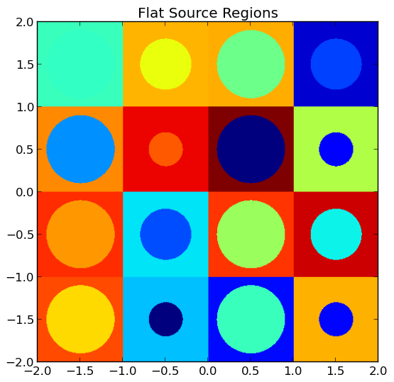

.. _usersguide_processing:

=================================
Data Processing and Visualization
=================================

This section is intended to explain in detail the recommended procedures for carrying out common tasks with OpenMOC. While several utilities of varying complexity are provided to help automate the process, in many cases it will be extremely beneficial to do some coding in Python to quickly obtain results. In these cases, and for many of the provided utilities, it is necessary for your Python installation to contain:

* `Numpy <http://www.numpy.org/>`_ - Required for array-based data manipulation and processing
* `h5py <http://www.h5py.org/>`_ - Required only if reading/writing HDF5_ data files
* `Matplotlib <http://matplotlib.org/>`_ - Optional for plotting utilities

Each of these are easily obtainable in Ubuntu through the package manager.

-------------------------
Exporting Simulation Data
-------------------------

OpenMOC's ``openmoc.process`` module provides the ``store_simulation_state(...)`` routine to export simulation data to binary output files. The only required parameter for the routine is a ``Solver`` object. Optional parameters may be used to indicate whether to store the data in HDF5_ or as a Python pickle_ file (default), store the fluxes, sources, fission rates and more. All of the supported parameters are listed in :ref:`Table 1 <table_store_simulation_state>`, and the output variables stored in the binary file are tabulated in :ref:`Table 2 <table_output_variables>`.

.. _table_store_simulation_state:

=================  ==================  ====================  ==========  ====================================
Parameter          Type                Default               Optional    Note
=================  ==================  ====================  ==========  ====================================
``solver``         ``Solver`` object   None                  No
``fluxes``         boolean             False                 Yes         Whether to store the FSR fluxes
``sources``        boolean             False                 Yes         Whether to store the FSR sources
``fission_rates``  boolean             False                 Yes         Whether to store the fission rates
``use_hdf5``       boolean             False (pickle file)   Yes         Whether to use HDF5_
``filename``       string              'simulation-state'    Yes         The filename for storage
``directory``      string              'simulation-states'   Yes         The directory for storage
``append``         boolean             True                  Yes         Append to a file or create a new one
``note``           string              None                  Yes         Any comment on the simulation
=================  ==================  ====================  ==========  ====================================

**Table 1**: Parameters for the ``openmoc.proces.store_simulation_state(...)`` routine.

.. _table_output_variables:

=========================  ==============  =========================================
Output Variable            Type            Note
=========================  ==============  =========================================
solver type                string          'CPUSolver', 'GPUSolver', etc.
# FSRs                     integer
# materials                integer
# energy groups            integer
# tracks                   integer
# segments                 integer
track spacing [cm]         float
# azimuthal angles         integer
# polar angles             integer
# iterations               integer
source residual threshold  float
exponential                string          'exp intrinsic' or 'linear interpolation'
CMFD                       boolean         True if CMFD is in use, False otherwise
floating point             string          'double' or 'single'
time [sec]                 float           Total time to converge the source
keff                       float
note                       string          If requested by user
# threads                  integer         For solvers on multi-core CPUs
# threads per block        integer         For solvers on GPUs
FSR scalar fluxes          float array     If requested by user
FSR sources                float array     If requested by user
fission rates              float array(s)  If requested by user
=========================  ==============  =========================================

**Table 2**: Output variables in a binary file created by the ``openmoc.proces.store_simulation_state(...)`` routine.

The code snippet below illustrates one possible configuration of parameters to the routine.

.. code-block:: python

    import openmoc.process as proc

    # Setup and run simulation
    ...

    # Export the simulation data to an output file
    proc.store_simulation_state(solver, use_hdf5=True)

--------------------------
Retrieving Simulation Data
--------------------------

Exporting simulation data is only useful if there is a straightforward means to retrieve it for data processing at a later time. OpenMOC's ``restore_simulation_state(...)`` routine in the ``openmoc.process`` module can be used for this purpose. This routine takes a binary data file created by the ``store_simulation_state(...)`` routine, parses the file and catalogues the data in a Python dictionary_, which it returns to the user. The parameters accepted by the routine are described in :ref:`Table 3 <table_restore_simulation_states>`, while the dictionary keys are identical to the output variables given in :ref:`Table 2 <table_output_variables>`.

.. _table_restore_simulation_states:

==============  =======  ======================  ========
Parameter       Type     Default                 Optional
==============  =======  ======================  ========
``filename``    string   'simulation-state.pkl'  Yes
``directory``   string   'simulation-states'     Yes
==============  =======  ======================  ========

**Table 3**: Parameters for the ``openmoc.process.restore_simulation_state(...)`` routine.

The code snippet below illustrates one possible configuration of parameters to the routine.

.. code-block:: python

    import openmoc.process as proc

    # Retrieve the simulation state(s) stored in the 'states.h5' file
    # and returns the data in a Python dictionary
    simulation_state = proc.restore_simulation_state(filename='states.h5')

-----------------------
Computing Fission Rates
-----------------------

In some cases, a user may wish to only compute and export the fission rates in each flat source region for a simulation. In this case, the ``compute_fission_rates(...)`` routine in the ``openmoc.process`` module  may be used. The routine takes in a ``Solver`` subclass (e.g., ``CPUSolver``, ``VectorizedSolver``, ``GPUSolver``, etc.) and computes the fission rate for each ``Universe`` in the ``Geometry`` by summing up the fission rates in each ``Cell`` in the ``Universe``. In most cases, a ``Universe`` is replicated in many places throughout the ``Geometry``. To account for this, the routine will separately compute the fission rates for each unique placement of that ``Universe`` in the ``Geometry``. By default, the fission rates will be exported to a Python pickle_ file, but may alternatively be exported to an HDF5_ binary file. Each fission rate will be indexed by a string representing the "path" of ``Universes``, ``Lattices`` and ``Lattice`` cell indices traversed through the ``Geometry`` to reach the flat source region of interest. :ref:`Table 4 <table_fission_rates>` describes the parameters accepted by the routine.

.. _table_fission_rates:

============  ==================  ========  =========
Parameter     Type                Default   Optional
============  ==================  ========  =========
``solver``    ``Solver`` object   None      No
``use_hdf5``  boolean             False     Yes
============  ==================  ========  =========

**Table 4**: Parameters for the ``openmoc.process.compute_fission_rates(...)`` routine.

The code snippet below illustrates one possible configuration of parameters to the routine.

.. code-block:: python

    import openmoc.process as proc

    # Setup and run simulation
    ...

    # Compute and export the flat source region fission rates
    proc.compute_fission_rates(solver, use_hdf5=True)

.. note:: The fission rates are computed for each nested universe level in the hierarchical geometry model.
.. note:: The fission rates are not normalized in any way - this is left to the user's discretion during data processing.

----------------------
Geometry Visualization
----------------------

Plotting Tracks
---------------

To plot the tracks crossing the geometry, use the ``plot_tracks(...)`` routine in the ``openmoc.plotter`` module. The parameters accepted by this routine are described in :ref:`Table 5 <table_plot_tracks>`.

.. _table_plot_tracks:

===================  =========================  =========  =========  ===========================================
Parameter            Type                       Default    Optional   Note
===================  =========================  =========  =========  ===========================================
``track_generator``  ``TrackGenerator``         None       No         The tracks of interest
``get_figure``       boolean                    False      Yes        Whether to return the Matplotlib ``Figure``
===================  =========================  =========  =========  ===========================================

**Table 5**: Parameters for the ``openmoc.plotter.plot_tracks(...)`` routine.

The code snippet below illustrates the use of this routine.

.. code-block:: python

    import openmoc.plotter as plot

    # Setup geometry and generate tracks
    ...

    plot.plot_tracks(geometry)

A depiction of the tracks for the :file:`/OpenMOC/sample-input/large-lattice.py` example input file with 4 azimuthal angles and 0.1 cm track spacing is illustrated in :ref:`Figure 1 <figure_tracks>`.

.. _figure_tracks:

   **Figure 1**: The tracks crossing a a 4 :math:`\times` 4 lattice.

.. note:: The runtime required by the plotting routine scales with the number of tracks, which is proportional to the number of azimuthal angles and inversely proportional the track spacing.

Plotting Segments
-----------------

To plot the segments crossing the geometry color-coded by flat source region, use the ``plot_segments(...)`` routine in the ``openmoc.plotter`` module. The parameters accepted by this routine are described in :ref:`Table 6 <table_plot_segments>`.

.. _table_plot_segments:

===================  =========================  =========  =========  ===========================================
Parameter            Type                       Default    Optional   Note
===================  =========================  =========  =========  ===========================================
``track_generator``  ``TrackGenerator``         None       No         The tracks of interest
``get_figure``       boolean                    False      Yes        Whether to return the Matplotlib ``Figure``
===================  =========================  =========  =========  ===========================================

**Table 6**: Parameters for the ``openmoc.plotter.plot_segments(...)`` routine.

The code snippet below illustrates the use of this routine.

.. code-block:: python

    import openmoc.plotter as plot

    # Setup geometry and generate tracks
    ...

    plot.plot_segments(geometry)

A depiction of the segments for the :file:`/OpenMOC/sample-input/large-lattice.py` example input file with 4 azimuthal angles and 0.1 cm track spacing is illustrated in :ref:`Figure 2 <figure_segments>`.

.. _figure_segments:

   **Figure 2**: The segments crossing a a 4 :math:`\times` 4 lattice.

.. warning:: This routine will require a long time for large geometries or fine track discretization. In addition, Matplotlib consumes a substantial amount of memory to plot the segments and may throw a `segmentation fault`_ for large geometries.
.. note:: The runtime required by the plotting routine scales with the number of segments, which is proportional to the number of flat source regions and number of azimuthal angles and inversely proportional the track spacing.

Plotting by Material
--------------------

To plot the geometry color-coded by the material ID's throughout the geometry, use the ``plot_materials(...)`` routine in the ``openmoc.plotter`` module. The parameters accepted by this routine are described in :ref:`Table 7 <table_plot_materials>`.

.. _table_plot_materials:

===============  ===============  =============  =========  ============================================================
Parameter        Type             Default        Optional   Note
===============  ===============  =============  =========  ============================================================
``geometry``     ``Geometry``     None           No         The ``Geometry`` of interest
``gridsize``     integer          250            Yes        The pixel resolution
``xlim``         2-tuple          None           Yes        The min/max :math:`x`-coordinates to plot
``ylim``         2-tuple          None           Yes        The min/max :math:`y`-coordinates to plot
``zcoord``       float            None           Yes        The level along the :math:`z`-axis to plot
``get_figure``   boolean          False          Yes        Whether to return the Matplotlib ``Figure``
``library``      string           'matplotlib'   Yes        The plotting library to use (``'matplotlib'`` or ``'pil'``)
===============  ===============  =============  =========  ============================================================

**Table 7**: Parameters for the ``openmoc.plotter.plot_materials(...)`` routine.

The code snippet below illustrates one possible configuration of parameters to the routine.

.. code-block:: python

    import openmoc.plotter as plot

    # Setup geometry
    ...

    # Plot a 500 x 500 pixel image of the materials
    plot.plot_materials(geometry, gridsize=500)

A depiction of the materials for the :file:`/OpenMOC/sample-input/large-lattice.py` example input file is illustrated in :ref:`Figure 3 <figure_materials>`.

.. _figure_materials:

.. figure:: ../../img/materials.png
   :align: center
   :figclass: align-center
   :width: 400px

   **Figure 3**: A 4 :math:`\times` 4 lattice color-coded by material.

.. note:: The runtime required by the plotting routine scales with the number of pixels in the image (the square of the ``gridsize`` parameter).

Plotting by Cell
----------------
To plot the geometry color-coded by the cell ID's throughout the geometry, use the ``plot_cells(...)`` routine in the ``openmoc.plotter`` module. The parameters accepted by this routine are described in :ref:`Table 8 <table_plot_cells>`.

.. _table_plot_cells:

===============  ===============  =============  =========  ============================================================
Parameter        Type             Default        Optional   Note
===============  ===============  =============  =========  ============================================================
``geometry``     ``Geometry``     None           No         The ``Geometry`` of interest
``gridsize``     integer          250            Yes        The pixel resolution
``xlim``         2-tuple          None           Yes        The min/max :math:`x`-coordinates to plot
``ylim``         2-tuple          None           Yes        The min/max :math:`y`-coordinates to plot
``zcoord``       float            None           Yes        The level along the :math:`z`-axis to plot
``get_figure``   boolean          False          Yes        Whether to return the Matplotlib ``Figure``
``library``      string           'matplotlib'   Yes        The plotting library to use (``'matplotlib'`` or ``'pil'``)
===============  ===============  =============  =========  ============================================================

**Table 8**: Parameters for the ``openmoc.plotter.plot_cells(...)`` routine.

The code snippet below illustrates one possible configuration of parameters to the routine.

.. code-block:: python

    import openmoc.plotter as plot

    # Setup geometry
    ...

    # Plot a 500 x 500 pixel image of the cells
    plot.plot_cells(geometry, gridsize=500)

A depiction of the cells for the :file:`/OpenMOC/sample-input/large-lattice.py` example input file is illustrated in :ref:`Figure 4 <figure_cells>`.

.. _figure_cells:

   **Figure 4**: A 4 :math:`\times` 4 lattice color-coded by cell.

.. note:: The runtime required by the plotting routine scales with the number of pixels in the image (the square of the ``gridsize`` parameter).

Plotting by FSR
---------------

To plot the geometry color-coded by the flat source region ID's throughout the geometry, use the ``plot_flat_source_regions(...)`` routine in the ``openmoc.plotter`` module. The parameters accepted by this routine are described in :ref:`Table 9 <table_plot_fsrs>`.

.. _table_plot_fsrs:

=================  ===============  =============  =========  ============================================================
Parameter          Type             Default        Optional   Note
=================  ===============  =============  =========  ============================================================
``geometry``       ``Geometry``     None           No         The ``Geometry`` of interest
``gridsize``       integer          250            Yes        The pixel resolution
``xlim``           2-tuple          None           Yes        The min/max :math:`x`-coordinates to plot
``ylim``           2-tuple          None           Yes        The min/max :math:`y`-coordinates to plot
``centroids``      boolean          False          Yes        Whether to plot the FSR centroids
``marker_type``    string           ``'o'``        Yes        The marker type to use for FSR centroids
``marker_size``    integer          2              Yes        The marker size to use for FSR centroids
``get_figure``     boolean          False          Yes        Whether to return the Matplotlib ``Figure``
``library``        string           'matplotlib'   Yes        The plotting library to use (``'matplotlib'`` or ``'pil'``)
=================  ===============  =============  =========  ============================================================

**Table 9**: Parameters for the ``openmoc.plotter.plot_flat_source_regions(...)`` routine.

The code snippet below illustrates one possible configuration of parameters to the routine.

.. code-block:: python

    import openmoc.plotter as plot

    # Setup geometry
    ...

    # Plot a 500 x 500 pixel image of the flat source regions
    plot.plot_flat_source_regions(geometry, gridsize=500)

A depiction of the flat source regions for the :file:`/OpenMOC/sample-input/large-lattice.py` example input file is illustrated in :ref:`Figure 5 <figure_flat_source_regions>`.

.. _figure_flat_source_regions:

   **Figure 5**: A 4 :math:`\times` 4 lattice color-coded by flat source region.

.. note:: The runtime required by the plotting routine scales with the number of pixels in the image (the square of the ``gridsize`` parameter).

Plotting by CMFD Cell
---------------------

To plot the geometry color-coded by the CMFD cells throughout the geometry, use the ``plot_cmfd_cells(...)`` routine in the ``openmoc.plotter`` module. The parameters accepted by this routine are described in :ref:`Table 10 <table_plot_cmfd_cells>`.

.. _table_plot_cmfd_cells:

===============  ===============  =============  =========  ============================================================
Parameter        Type             Default        Optional   Note
===============  ===============  =============  =========  ============================================================
``geometry``     ``Geometry``     None           No         The ``Geometry`` of interest
``gridsize``     integer          250            Yes        The pixel resolution
``xlim``         2-tuple          None           Yes        The min/max :math:`x`-coordinates to plot
``ylim``         2-tuple          None           Yes        The min/max :math:`y`-coordinates to plot
``get_figure``   boolean          False          Yes        Whether to return the Matplotlib ``Figure``
``library``      string           'matplotlib'   Yes        The plotting library to use (``'matplotlib'`` or ``'pil'``)
===============  ===============  =============  =========  ============================================================

**Table 10**: Parameters for the ``openmoc.plotter.plot_cmfd_cells(...)`` routine.

The code snippet below illustrates one possible configuration of parameters to the routine.

.. code-block:: python

    import openmoc.plotter as plot

    # Setup geometry and cmfd
    ...

    # Plot a 500 x 500 pixel image of the CMFD cells
    plot.plot_cmfd_cells(geometry, cmfd, gridsize=500)

A depiction of the flat source regions and CMFD cells for the :file:`/OpenMOC/sample-input/benchmarks/c5g7/c5g7-cmfd.py` example input file is illustrated in :ref:`Figure 6 <figure_cmfd_cells>`.

.. _figure_cmfd_cells:

.. table::

   +------------------------------------------+---------------------------------------------+
   | .. _figure_cmfd_cells_a:                 | .. _figure_cmfd_cells_b:                    |
   |                                          |                                             |
   | .. image:: ../../img/c5g7-fsrs.png       | .. image:: ../../img/c5g7-cmfd-cells.png    |
   |   :width: 70 %                           |   :width: 64 %                              |
   |   :align: center                         |   :align: center                            |
   +------------------------------------------+---------------------------------------------+

**Figure 6**: The flat source regions and CMFD cells for the C5G7 benchmark problem.

.. note:: The runtime required by the plotting routine scales with the number of pixels in the image (the square of the ``gridsize`` parameter).

------------------
Flux Visualization
------------------

The ``openmoc.plotter`` module includes routines to plot the scalar flux in space and energy, as detailed in the following sections.

Flux in Space
-------------

To plot the flat source region scalar fluxes in space, use the ``plot_spatial_fluxes(...)`` routine in the ``openmoc.plotter`` module. The parameters accepted by this routine are described in :ref:`Table 11 <table_plot_fluxes_space>`.

.. _table_plot_fluxes_space:

==================  ===============  =============  =========  ============================================================
Parameter           Type             Default        Optional   Note
==================  ===============  =============  =========  ============================================================
``solver``          ``Solver``       None           No         The ``Solver`` used to converge the source
``energy_groups``   list             [1]            No         Create separate plots for each energy group
``norm``            boolean          False          Yes        Whether to normalize fluxes to the mean
``gridsize``        integer          250            Yes        The pixel resolution
``xlim``            2-tuple          None           Yes        The min/max :math:`x`-coordinates to plot
``ylim``            2-tuple          None           Yes        The min/max :math:`y`-coordinates to plot
``get_figure``      boolean          False          Yes        Whether to return the Matplotlib ``Figure``
``library``         string           'matplotlib'   Yes        The plotting library to use (``'matplotlib'`` or ``'pil'``)
==================  ===============  =============  =========  ============================================================

**Table 11**: Parameters for the ``openmoc.plotter.plot_spatial_fluxes(...)`` routine.

The code snippet below illustrates one possible configuration of parameters to the routine.

.. code-block:: python

    import openmoc.plotter as plot

    # Setup geometry and generate tracks
    ...

    # Setup solver and converge the source
    ...

    # Plot the fluxes for energy groups 1 and 7 in 500 x 500 pixel images
    plot.plot_spatial_fluxes(solver, energy_groups=[1,7], gridsize=500)

A depiction of the group 1 and 7 fluxes for the C5G7 benchmark (:file:`/OpenMOC/sample-input/benchmarks/c5g7`) is illustrated in :ref:`Figure 7 <figure_spatial_fluxes>`.

.. _figure_spatial_fluxes:

.. table::

   +------------------------------------------+-----------------------------------------+
   | .. _figure_spatial_fluxes_a:             | .. _figure_spatial_fluxes_b:            |
   |                                          |                                         |
   | .. image:: ../../img/flux-group-1.png    | .. image:: ../../img/flux-group-7.png   |
   |   :width: 72 %                           |   :width: 75 %                          |
   |   :align: center                         |   :align: center                        |
   +------------------------------------------+-----------------------------------------+

**Figure 7**: The fast and thermal fluxes in the C5G7 benchmark problem.

.. note:: The runtime required by the plotting routine scales with the number of pixels in the image (the square of the ``gridsize`` parameter).

Flux in Energy
--------------

To plot the flux in energy for one or more flat source regions, use the ``plot_energy_fluxes(...)`` routine in the ``openmoc.plotter`` module. The parameters accepted by this routine are described in :ref:`Table 12 <table_plot_fluxes_energy>`.

.. _table_plot_fluxes_energy:

=================  ===================  =========  =========  ============================================
Parameter          Type                 Default    Optional   Note
=================  ===================  =========  =========  ============================================
``solver``         ``Solver`` object    None       No         The ``Solver`` used to converge the source
``fsrs``           list                 None       No         The flat source region IDs of interest
``group_bounds``   list                 None       Yes        The sequential bounds for each energy group
``norm``           boolean              True       Yes        Whether to normalize the flux across energy
``loglog``         boolean              True       Yes        Whether to use a log-log plotting scale
``get_figure``     boolean              False      Yes        Whether to return the Matplotlib ``Figure``
=================  ===================  =========  =========  ============================================

**Table 12**: Parameters for the ``openmoc.plotter.plot_energy_fluxes(...)`` routine.

The code snippet below illustrates one possible configuration of parameters to the routine.

.. code-block:: python

    import openmoc.plotter as plot

    # Setup geometry and generate tracks
    ...

    # Setup solver and converge the source
    ...

    # Plot the fluxes vs. energy for flat source regions 0 and 1
    plot.plot_energy_fluxes(solver, fsrs=[0,1])

A depiction of the normalized 7-group fluxes for the sample pin cell problem (:file:`/OpenMOC/sample-input/pin-cell/pin-cell.py`) is illustrated in :ref:`Figure 8 <figure_energy_fluxes>`.

.. _figure_energy_fluxes:

.. table::

   +------------------------------------------+-----------------------------------------+
   | .. _figa:                                | .. _figb:                               |
   |                                          |                                         |
   | .. image:: ../../img/flux-fsr-0.png      | .. image:: ../../img/flux-fsr-1.png     |
   |   :width: 72 %                           |   :width: 75 %                          |
   |   :align: center                         |   :align: center                        |
   +------------------------------------------+-----------------------------------------+

**Figure 8**: The normalized moderator and fuel flux for a simple PWR pin cell problem.

--------------------------
Fission Rate Visualization
--------------------------

The ``openmoc.plotter`` module includes routines to plot the energy-integrated fission rates in each flat source region. To plot the fission rates, use the ``plot_fission_rates(...)`` routine in the ``openmoc.plotter`` module. The parameters accepted by this routine are described in :ref:`Table 11 <table_plot_fission_rates>`.

.. _table_plot_fission_rates:

======================  ===================  =============  =========  ============================================================
Parameter               Type                 Default        Optional   Note
======================  ===================  =============  =========  ============================================================
``solver``              ``Solver``           None           No         The ``Solver`` used to converge the source
``norm``                boolean              False          Yes        Whether to normalize fluxes to the mean
``transparent_zeros``   boolean              True           Yes        Whether to make all non-fissionable FSRs transparent
``gridsize``            integer              250            Yes        The pixel resolution
``xlim``                2-tuple              None           Yes        The min/max :math:`x`-coordinates to plot
``ylim``                2-tuple              None           Yes        The min/max :math:`y`-coordinates to plot
``get_figure``          boolean              False          Yes        Whether to return the Matplotlib ``Figure``
``library``             string               'matplotlib'   Yes        The plotting library to use (``'matplotlib'`` or ``'pil'``)
======================  ===================  =============  =========  ============================================================

**Table 11**: Parameters for the ``openmoc.plotter.plot_fission_rates(...)`` routine.

The code snippet below illustrates one possible configuration of parameters to the routine.

.. code-block:: python

    import openmoc.plotter as plot

    # Setup geometry and generate tracks
    ...

    # Setup solver and converge the source
    ...

    # Plot the fission rates in each FSR in a 500 x 500 pixel image
    plot.plot_fission_rates(solver, gridsize=500)

A depiction of the energy-integrated FSR fission rates for the C5G7 benchmark (:file:`/OpenMOC/sample-input/benchmarks/c5g7`) is illustrated in :ref:`Figure 9 <figure_fission_rates>`.

.. _figure_fission_rates:

**Figure 9**: The energy-integrated FSR fission rates in the C5G7 benchmark problem.

.. note:: The runtime required by the plotting routine scales with the number of pixels in the image (the square of the ``gridsize`` parameter).

.. _dictionary: http://docs.python.org/2/library/stdtypes.html#mapping-types-dict
.. _pickle: http://docs.python.org/2/library/pickle.html
.. _HDF5: http://www.hdfgroup.org/HDF5/
.. _segmentation fault: http://en.wikipedia.org/wiki/Segmentation_fault
